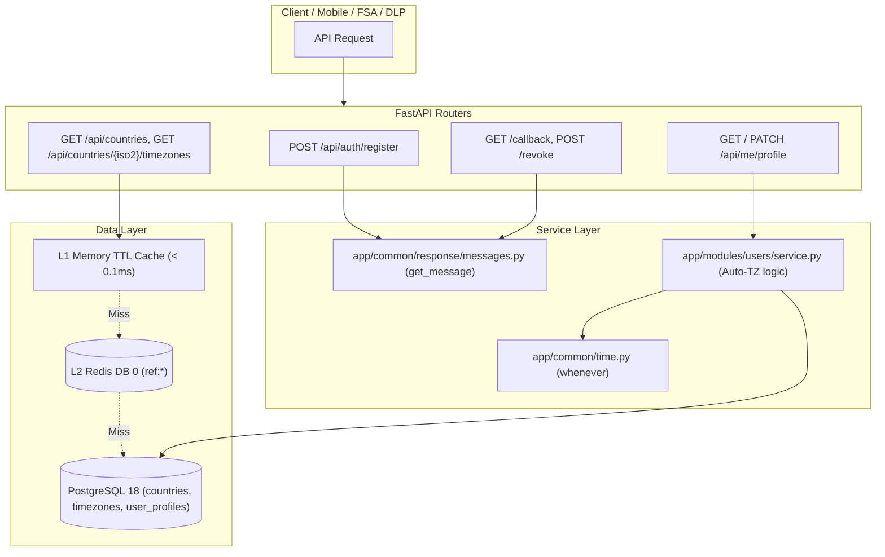

# User Localization, Timezone Management & Module-Level Messaging

**Documentation Reference:** `docs/features-implemented/user-localization-timezone-and-messaging.md`  
**Status:** COMPLETED & VERIFIED  
**Date:** September 2026  
**Applicable Services:** FastAPI Backend, PostgreSQL 18, Redis DB 0

---

## 1. Overview & Architecture

This feature delivers an enterprise-grade localization, timezone, and response-messaging foundation for `th-middleware`:

1. **Standardized Module-Level Language & Messaging**: Replaces hardcoded strings and schema-violating nested dictionaries with a unified, module-scoped language catalog (`en` initially) and cached resolver. Every response adheres to the `{code, msg, data, request_id}` contract (e.g. `"Your account has been created successfully."` upon registration).
2. **Type-Safe, DST-Compliant Time Utility**: Integrates `whenever` into `app/common/time.py`, providing zero-ambiguity timezone arithmetic, Daylight Saving Time (DST) handling, and an automated SQLAlchemy `TypeDecorator` (`WheneverInstant`).
3. **Reference Tables & Dual-Key User Profiles**: Implements ISO 3166-1 `countries`, IANA `timezones`, `country_timezones` (with partial unique default index), and `user_profiles` combining `BigInteger` surrogate primary key for relational join performance and `UUID` public keys for API exposure.
4. **Auto-Unless-Overridden Profile Logic**: Updating a user's country automatically sets their default timezone if `timezone_source == 'auto'`. Explicitly updating their timezone locks `timezone_source = 'manual'`, preventing future auto-overwrites.
5. **Unified Modular Seeders & Generators**: Encapsulates domain seeders and factories inside module folders (`app/modules/users/seeders/` & `generators/`), common primitives in `app/common/generators/`, and orchestrates execution via root CLI scripts (`scripts/seed_countries_timezones.py` & `scripts/seed.py`).
6. **Multi-Tier Reference Caching**: L1 in-process TTL cache (sub-millisecond) + L2 Redis DB 0 cache for country and timezone reference lookups.



---

## 2. Module-Level Language & Response Messaging

### 2.1 File Structure
```
app/
├── common/
│   └── response/
│       ├── messages.py        # Central dynamic catalog loader & resolver
│       └── schema.py          # ResponseModel[T] with .ok(...) factory
└── modules/
    ├── users/
    │   └── lang/
    │       ├── __init__.py
    │       └── en.py          # Users English catalog
    └── zoho/
        └── auth/
            └── lang/
                ├── __init__.py
                └── en.py      # Zoho Auth English catalog
```

### 2.2 Core Resolver API (`app/common/response/messages.py`)
* `get_message(module, key, lang=None, default=None, **kwargs)`:
  * Looks up localized message in memory cache.
  * Slashed or dotted module paths are normalized (`zoho/auth` -> `app.modules.zoho.auth.lang.en`).
  * Supports keyword interpolation (e.g. `{name}`).
  * Respects request language context (`Accept-Language` header) with graceful fallback to `en`.

### 2.3 ResponseModel Integration (`app/common/response/schema.py`)
```python
ResponseModel.ok(
    data=user_out,
    module="users",
    msg_key="register_success"
)
# Returns: {"code": "ok", "msg": "Your account has been created successfully.", "data": {...}}
```

### 2.4 Zoho Auth Response Normalization (`app/modules/zoho/auth/api.py`)
Every Zoho OAuth endpoint returns localized messages using the unified response envelope (`msg` key):
* `GET /initiate`: `msg="Zoho authorization initiated successfully."` (when `redirect=false`), or 307 browser redirect when `redirect=true`.
* `GET /callback`: `msg="Successfully authenticated with Zoho."`, `data={"connected": True}`.
* `POST /revoke`: `msg="Successfully disconnected from Zoho."`, `data={"disconnected": True}`.
* `GET /status`: `msg="Zoho connection is active."` (or `"Zoho connection is not configured or has been disconnected."`), `data={"is_connected": bool}`.

---

## 3. Time & Timezone Utility (`app/common/time.py`)

Built on the modern `whenever` library:
* **`now_utc() -> Instant`**: Exact UTC moment.
* **`now_in_tz(iana_tz) -> ZonedDateTime`**: Moment zoned in given IANA timezone (e.g. `Asia/Kolkata`).
* **`to_user_tz(moment, iana_tz) -> ZonedDateTime`**: Safe conversion handling naive/aware inputs and DST transitions.
* **`format_user_datetime(moment, iana_tz, fmt=None) -> str`**: Formats dates for human display in local time (`YYYY-MM-DD HH:mm:ss`).
* **`format_user_datetime_display(moment, iana_tz) -> str`**: Formats timestamps in user timezone with time zone abbreviation for transactional emails (e.g. `September 17, 2026, 17:20 IST` or `September 17, 2026, 08:00 EDT`). Replaces UTC in Login OTP security emails.
* **`to_db_utc(moment) -> datetime`** & **`from_db_utc(dt) -> Instant`**: Seamless boundary conversions for PostgreSQL/SQLAlchemy.
* **`is_valid_iana_timezone(iana_name) -> bool`**: Validates timezone strings against tzdb.
* **`WheneverInstant`**: SQLAlchemy `TypeDecorator` mapping UTC `TIMESTAMP WITH TIME ZONE` directly to `whenever.Instant`.

---

## 4. Database Schema & Dual-Key Model

### 4.1 Schema Tables
```sql
-- 1. Reference table: countries (ISO 3166-1)
CREATE TABLE countries (
    iso2            VARCHAR(2) PRIMARY KEY,
    iso3            VARCHAR(3) UNIQUE NOT NULL,
    numeric_code    VARCHAR(3),
    name            VARCHAR(100) NOT NULL,
    official_name   VARCHAR(300),
    region          VARCHAR(75),
    subregion       VARCHAR(75),
    phone_code      VARCHAR(10),
    currency_code   VARCHAR(5),
    is_active       BOOLEAN NOT NULL DEFAULT TRUE,
    created_at      TIMESTAMPTZ NOT NULL DEFAULT now(),
    updated_at      TIMESTAMPTZ NOT NULL DEFAULT now()
);

-- 2. Reference table: timezones (IANA tz database identifiers)
CREATE TABLE timezones (
    iana_name       VARCHAR(64) PRIMARY KEY,
    display_name    VARCHAR(100) NOT NULL,
    is_active       BOOLEAN NOT NULL DEFAULT TRUE
);

-- 3. Mapping table: country_timezones (multi-zone countries)
CREATE TABLE country_timezones (
    id              SERIAL PRIMARY KEY,
    country_iso2    VARCHAR(2) NOT NULL REFERENCES countries(iso2) ON DELETE CASCADE,
    timezone_name   VARCHAR(64) NOT NULL REFERENCES timezones(iana_name) ON DELETE CASCADE,
    is_default      BOOLEAN NOT NULL DEFAULT FALSE,
    UNIQUE (country_iso2, timezone_name)
);

CREATE UNIQUE INDEX uq_country_default_tz
    ON country_timezones (country_iso2)
    WHERE is_default = TRUE;

-- 4. User profile: auto-unless-overridden localization
CREATE TABLE user_profiles (
    id               BIGSERIAL PRIMARY KEY,
    uuid             UUID UNIQUE NOT NULL DEFAULT gen_random_uuid(),
    user_id          BIGINT UNIQUE NOT NULL REFERENCES users(id) ON DELETE CASCADE,
    country_iso2     VARCHAR(2) REFERENCES countries(iso2) ON DELETE SET NULL,
    timezone_name    VARCHAR(64) REFERENCES timezones(iana_name) ON DELETE SET NULL,
    timezone_source  VARCHAR(10) NOT NULL DEFAULT 'auto'
                     CHECK (timezone_source IN ('auto', 'manual')),
    updated_at       TIMESTAMPTZ NOT NULL DEFAULT now()
);
```

### 4.2 Dual-Key Model & Country Code Architecture
* **`BigIntPKWithUUIDMixin`** (`app/database/mixins.py`):
  * `id`: `BigInteger` primary key for database index efficiency, zero B-Tree page splits, and compact relational foreign keys (`user_profiles.user_id -> users.id`).
  * `uuid`: `UUID` public key for API exposure, preventing enumeration and information leakage.
* **`users.country_code` Column**:
  * ISO 3166-1 alpha-2 country code (`VARCHAR(2)`) added to `users` with index `ix_users_country_code`.
* **GeoIP Auto-Assignment on Registration**:
  * Resolves client IP via MaxMind GeoLite2 in `app/common/geoip.py`.
  * Matches `country_code` in `countries` reference table.
  * Resolves default timezone from `country_timezones` (`WHERE is_default = TRUE`).
  * Populates `users.country`, `users.country_code`, `users.timezone`, `users.currency` and initializes `user_profiles` (`country_iso2`, `timezone_name`, `timezone_source='auto'`).
* **Alembic Migrations**:
  * Revision `f7a8b9c0d1e2`: `20260917_1700_f7a8b9c0d1e2_countries_timezones_user_profiles.py` (tables: `countries`, `timezones`, `country_timezones`, `user_profiles`).
  * Revision `a1b2c3d4e5f6`: `20260917_1800_a1b2c3d4e5f6_add_country_code_to_users.py` (column: `users.country_code`).

---

## 5. Endpoints Reference

| Method | Endpoint | Auth | Description | Response Envelope |
|---|---|---|---|---|
| `GET` | `/api/countries` | Public | List active ISO 3166-1 countries (cached) | `ResponseModel[list[CountryOut]]` |
| `GET` | `/api/countries/{iso2}/timezones` | Public | List timezones mapped to country (cached) | `ResponseModel[list[CountryTimezoneOut]]` |
| `GET` | `/api/me/profile` | JWT (`CurrentUser`) | Get authenticated user's profile | `ResponseModel[UserProfileOut]` |
| `PATCH` | `/api/me/profile` | JWT (`CurrentUser`) | Update country and/or timezone | `ResponseModel[UserProfileOut]` |
| `POST` | `/api/auth/register` | Public | Register new user with GeoIP auto-localization | `ResponseModel[UserOut]` with `"msg": "Your account has been created successfully."` |
| `POST` | `/api/auth/forgot-password` | Public | Request password reset with enterprise anti-enumeration | `ResponseModel[ForgotPasswordOut]` with `"msg": "If an account matches those details, a reset code or link has been sent."`, returning `email` and `masked_email`. |
| `GET` | `/api/zoho/auth/initiate` | Optional JWT | Generate Zoho OAuth URL (redirect=false returns JSON) | `RedirectResponse` or `ResponseModel` with `"msg": "Zoho authorization initiated successfully."` |
| `GET` | `/api/zoho/auth/callback` | OAuth | Zoho OAuth callback redirect | `ResponseModel` with `"msg": "Successfully authenticated with Zoho."` |
| `POST` | `/api/zoho/auth/revoke` | Optional JWT | Revoke Zoho tokens | `ResponseModel` with `"msg": "Successfully disconnected from Zoho."` |
| `GET` | `/api/zoho/auth/status` | Optional JWT | Check Zoho integration connection status | `ResponseModel` with `"msg": "Zoho connection is active."` (or disconnected) |

---

## 6. Seeders & Generators

### 6.1 Unified Modular Structure
* **Module Seeder**: `app/modules/users/seeders/reference.py`
  * `load_countries_data(json_path)`
  * `build_country_timezones(zone_path)`: zone1970 parser assigning index 0 as `is_default=True`.
  * `run_seed_reference(engine, json_path, zone_path)`: Idempotent upserts.
* **Module Generators**: `app/modules/users/generators/user_factory.py`
  * `generate_fake_user_data()`
  * `generate_fake_profile_data()`
* **Common Generators**: `app/common/generators/identities.py`
  * `random_indian_phone()`, `random_pan()`, `random_gstin()`, `random_recent_instant()`.
* **Root Orchestrator Scripts**:
  * `scripts/seed_countries_timezones.py`: Standalone CLI seeder.
  * `scripts/seed_countries_timezones.sh`: Shell wrapper sourcing `.env`.
  * `scripts/seed.py`: Master seeder runner.

---

## 7. Verification & Test Suite

All tests pass hermetically on a bare checkout:
```bash
pytest tests/test_time_utility.py tests/test_response_messages.py tests/test_zone1970_parser.py tests/test_profile_endpoints.py tests/test_health.py
# 31 passed, 11 warnings in 2.80s
```

Full repository test suite:
```bash
pytest
# 101 passed, 71 skipped in 4.38s
```
