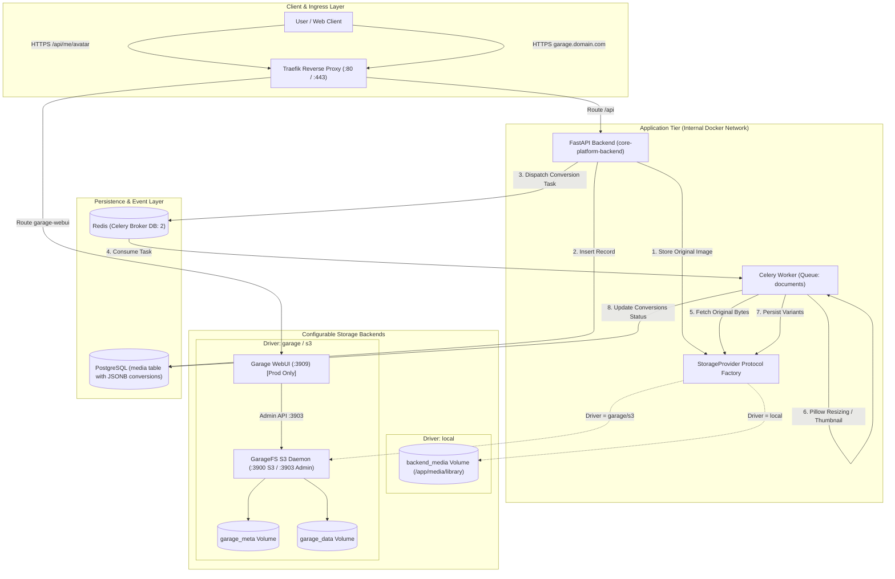
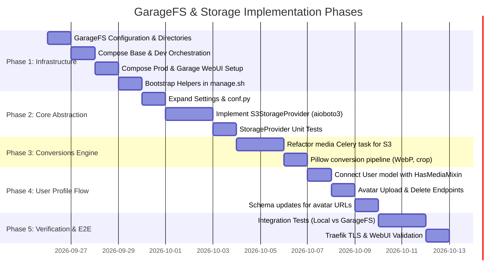

# Configurable Storage Architecture & GarageFS Integration

This document defines the architectural design and step-by-step implementation plan for configurable file and image storage across **GarageFS** (S3-compatible distributed object storage) and **Local Filesystem** (folder-based) storage, with Spatie-style image conversion and user profile avatar processing.

---

## 1. Executive Summary & Design Principles

The `core-platform` requires an enterprise-grade storage subsystem with the following capabilities:
1. **Configurable Storage Driver**: Swap seamlessly between local disk (`local`) and S3-compatible object storage (`s3` / `garage`) purely via environment variables (`MEDIA_STORAGE_DRIVER=local|s3|garage`).
2. **Containerized GarageFS Infrastructure**: Deploy [Garage](https://garagehq.deuxfleurs.fr/) across development, staging, and production environments, with [Garage WebUI](https://github.com/khairul169/garage-webui) provisioned in production behind Traefik reverse proxy with TLS and basic authentication.
3. **Storage Strategy Pattern**: A decoupled `StorageProvider` interface ensuring that callers (FastAPI endpoints, background Celery workers, and domain entities) never depend on raw file paths or storage vendors.
4. **Spatie-Style Image Conversions**: Declarative conversions on domain models (e.g. `User`, `Organization`, `Brand`), generating thumbnails, avatar variants, and preview crops using Pillow via Celery worker queues (`documents` queue), working uniformly across both local disk and remote GarageFS object storage.
5. **User Profile Image Lifecycle**: Automated ingestion, resizing, variant tracking in PostgreSQL `JSONB`, and URL resolution for user profile photos upon profile creation and self-service updates.

---

## 2. System Architecture & Topology



---

## 3. Storage Abstraction Layer

The existing storage foundation in [`app/modules/media/storage.py`](file:///wsl.localhost/Ubuntu/home/a2/projects/th-middleware/apps/core-platform/backend/app/modules/media/storage.py) defines a basic protocol. We will expand this protocol to support full lifecycle management (existence checking, streaming, content types, and public URL resolution) across both local and S3-compatible providers.

### 3.1 Extended StorageProvider Protocol

```python
# app/modules/media/storage.py
from typing import BinaryIO, Protocol
from pathlib import Path

class StorageProvider(Protocol):
    disk: str

    async def save(
        self,
        file_bytes: bytes,
        filename: str,
        content_type: str | None = None,
    ) -> str:
        """Persist bytes and return driver disk name."""
        ...

    async def read(self, filename: str) -> bytes:
        """Retrieve raw file content."""
        ...

    async def delete(self, filename: str) -> None:
        """Delete file from storage."""
        ...

    async def exists(self, filename: str) -> bool:
        """Check if file exists on target storage."""
        ...

    def url_for(self, filename: str) -> str:
        """Generate public HTTP(S) URL or CDN URL."""
        ...

    def local_path(self, filename: str) -> Path | None:
        """Return local filesystem path if available, or None for remote object storage."""
        ...
```

### 3.2 Implementation Strategy: Local vs S3/GarageFS

| Feature | `LocalStorageProvider` | `S3StorageProvider` (GarageFS / AWS) |
| :--- | :--- | :--- |
| **Driver Identifier** | `local` | `s3` or `garage` |
| **Persistence Target** | Mounted volume `/app/media/library` | GarageFS S3 API endpoint (`http://garage:3900`) |
| **Async Execution** | Thread pool offload (`asyncio.to_thread`) | Async HTTP via `aioboto3` client session |
| **URL Generation** | Root-relative or host-relative `/media/library/{file}` | `https://{S3_PUBLIC_ENDPOINT_URL}/{S3_BUCKET}/{file}` |
| **Local File Path** | Returns concrete `Path` | Returns `None` (triggers streaming buffer in worker) |
| **Bucket / Path Addressing** | Subdirectory partitioning | S3 Path-style addressing (`force_path_style=True`) |

### 3.3 Dynamic S3 Client with GarageFS Path-Style Support

GarageFS adheres strictly to AWS S3 API conventions with standard path-style addressing (`http://<endpoint>/<bucket>/<key>`). The `S3StorageProvider` must initialize with `botocore.client.Config(s3={"addressing_style": "path"})` to avoid virtual-host resolution errors against internal container hostnames.

---

## 4. Docker Compose Orchestration

GarageFS will be added to the multi-environment Docker Compose architecture:
- Base: [`apps/core-platform/deployment/docker-compose.yml`](file:///wsl.localhost/Ubuntu/home/a2/projects/th-middleware/apps/core-platform/deployment/docker-compose.yml)
- Dev Overrides: [`apps/core-platform/deployment/docker-compose.dev.yml`](file:///wsl.localhost/Ubuntu/home/a2/projects/th-middleware/apps/core-platform/deployment/docker-compose.dev.yml)
- Prod Overrides: [`apps/core-platform/deployment/docker-compose.prod.yml`](file:///wsl.localhost/Ubuntu/home/a2/projects/th-middleware/apps/core-platform/deployment/docker-compose.prod.yml)

### 4.1 Garage Configuration File (`config/garage/garage.toml`)

Create `apps/core-platform/deployment/config/garage/garage.toml`:

```toml
metadata_dir = "/var/lib/garage/meta"
data_dir = "/var/lib/garage/data"
db_engine = "sqlite"
replication_factor = 1

[rpc]
bind_addr = "[::]:3901"
rpc_secret = "${GARAGE_RPC_SECRET}"

[s3_api]
s3_region = "garage"
api_bind_addr = "[::]:3900"
root_domain = ".s3.garage.local"

[s3_web]
bind_addr = "[::]:3902"
root_domain = ".web.garage.local"

[admin]
api_bind_addr = "[::]:3903"
admin_token = "${GARAGE_ADMIN_TOKEN}"
```

### 4.2 Base Compose (`docker-compose.yml`)

1. **Garage Service**:
```yaml
  garage:
    image: dxflrs/garage:v1.1.0
    container_name: garage
    restart: unless-stopped
    volumes:
      - ./config/garage/garage.toml:/etc/garage.toml:ro
      - garage_meta:/var/lib/garage/meta
      - garage_data:/var/lib/garage/data
    networks:
      - app-backend
      - app-frontend
    healthcheck:
      test: ["CMD", "/garage", "status"]
      interval: 15s
      timeout: 5s
      retries: 5
      start_period: 10s
    deploy:
      resources:
        limits: { memory: 512M, cpus: "1.00" }
```

2. **Backend Environment Variables (`x-backend-env`)**:
```yaml
  # Media & Object Storage
  MEDIA_STORAGE_DRIVER: ${MEDIA_STORAGE_DRIVER:-local}
  MEDIA_LOCAL_BASE_PATH: ${MEDIA_LOCAL_BASE_PATH:-/app/media/library}
  MEDIA_PUBLIC_BASE_URL: ${MEDIA_PUBLIC_BASE_URL:-/media/library}
  S3_ENDPOINT_URL: ${S3_ENDPOINT_URL:-http://garage:3900}
  S3_PUBLIC_ENDPOINT_URL: ${S3_PUBLIC_ENDPOINT_URL:-http://localhost:3900}
  S3_ACCESS_KEY_ID: ${S3_ACCESS_KEY_ID:-}
  S3_SECRET_ACCESS_KEY: ${S3_SECRET_ACCESS_KEY:-}
  S3_BUCKET: ${S3_BUCKET:-core-platform-media}
  S3_REGION: ${S3_REGION:-garage}
  S3_FORCE_PATH_STYLE: ${S3_FORCE_PATH_STYLE:-true}
```

3. **Persistent Volumes**:
```yaml
volumes:
  garage_meta:
    name: app_garage_meta
  garage_data:
    name: app_garage_data
```

### 4.3 Development Overrides (`docker-compose.dev.yml`)

Expose Garage host ports for local debugging, CLI access, and direct testing:
```yaml
  garage:
    ports:
      - "${GARAGE_S3_PORT:-3900}:3900"
      - "${GARAGE_RPC_PORT:-3901}:3901"
      - "${GARAGE_WEB_PORT:-3902}:3902"
      - "${GARAGE_ADMIN_PORT:-3903}:3903"
```

### 4.4 Production Overrides (`docker-compose.prod.yml`)

In production, run GarageFS with `restart: always` and include **`garage-webui`** secured by Traefik:

```yaml
  garage:
    restart: always
    labels:
      traefik.enable: "true"
      traefik.http.routers.garage-s3.rule: "Host(`s3.${APP_DOMAIN}`)"
      traefik.http.routers.garage-s3.entrypoints: websecure
      traefik.http.routers.garage-s3.tls: "true"
      traefik.http.routers.garage-s3.tls.certresolver: letsencrypt
      traefik.http.routers.garage-s3.service: garage-s3
      traefik.http.services.garage-s3.loadbalancer.server.port: "3900"

  garage-webui:
    image: khairul169/garage-webui:latest
    container_name: garage-webui
    restart: always
    environment:
      API_BASE_URL: "http://garage:3903"
      S3_ENDPOINT_URL: "http://garage:3900"
      S3_REGION: "garage"
      ADMIN_TOKEN: "${GARAGE_ADMIN_TOKEN}"
    networks:
      - app-backend
      - app-frontend
    depends_on:
      garage:
        condition: service_healthy
    labels:
      traefik.enable: "true"
      traefik.http.routers.garage-ui.rule: "Host(`garage.${APP_DOMAIN}`)"
      traefik.http.routers.garage-ui.entrypoints: websecure
      traefik.http.routers.garage-ui.tls: "true"
      traefik.http.routers.garage-ui.tls.certresolver: letsencrypt
      traefik.http.routers.garage-ui.service: garage-ui
      traefik.http.routers.garage-ui.middlewares: dashboard-auth@file,security-headers@file
      traefik.http.services.garage-ui.loadbalancer.server.port: "3909"
    deploy:
      resources:
        limits: { memory: 256M, cpus: "0.50" }
```

### 4.5 GarageFS One-Shot Bootstrap Helper

GarageFS requires layout initialization and bucket/key creation on first start. We will add a management script command to [`apps/core-platform/deployment/manage.sh`](file:///wsl.localhost/Ubuntu/home/a2/projects/th-middleware/apps/core-platform/deployment/manage.sh):
```bash
garage-init:
  1. garage status -> retrieve node ID
  2. garage layout assign -z dc1 -c 10G <NODE_ID>
  3. garage layout apply --version 1
  4. garage key create core-platform-key
  5. garage bucket create core-platform-media
  6. garage bucket allow core-platform-media --key core-platform-key --read --write
  7. Print generated access key ID and secret access key for .env
```

---

## 5. Spatie-Style Image Processing & Conversion Pipeline

### 5.1 Conversion Specification

The system allows any model inheriting [`HasMediaMixin`](file:///wsl.localhost/Ubuntu/home/a2/projects/th-middleware/apps/core-platform/backend/app/modules/media/model.py) to declare conversions with dimensions, fit modes, and formatting:

```python
class ConversionSpec(TypedDict, total=False):
    width: int
    height: int
    fit: Literal["contain", "cover", "fill"] # default: cover
    format: Literal["webp", "png", "jpeg"]   # default: webp
    quality: int                             # default: 85
```

For user profile avatars, we define standard conversions:
```python
USER_AVATAR_CONVERSIONS: dict[str, dict] = {
    "thumb": {"width": 150, "height": 150, "fit": "cover", "format": "webp", "quality": 85},
    "avatar": {"width": 300, "height": 300, "fit": "cover", "format": "webp", "quality": 90},
    "preview": {"width": 600, "height": 600, "fit": "contain", "format": "webp", "quality": 85},
}
```

### 5.2 Decoupled Celery Worker Task (`app/tasks/media.py`)

The current implementation in [`app/tasks/media.py`](file:///wsl.localhost/Ubuntu/home/a2/projects/th-middleware/apps/core-platform/backend/app/tasks/media.py#L51-L56) skips conversions if `storage.local_path()` is `None`. We will refactor this to be **storage-agnostic**:

```python
# app/tasks/media.py (High-level design)
@shared_task(bind=True, name="app.tasks.media.generate_conversions", max_retries=3, retry_backoff=30)
def generate_conversions(self, media_id: int, conversions: dict[str, dict]) -> dict:
    """CPU-bound image conversion worker.
    
    1. Retrieve Media record from database.
    2. Read source bytes via storage.read(media.file_name) -> works for local or GarageFS!
    3. Run in-memory Pillow transformation (thumbnail, aspect ratio crop, format conversion).
    4. Save converted variant bytes back via storage.save(variant_bytes, variant_filename).
    5. Update media.conversions dictionary in PostgreSQL with status 'done' or 'failed'.
    """
```

### 5.3 User Profile Media Integration

1. **User Model Extension**:
   Update [`User`](file:///wsl.localhost/Ubuntu/home/a2/projects/th-middleware/apps/core-platform/backend/app/modules/users/model.py) or `UserProfile` with `HasMediaMixin`:
   ```python
   class User(HasMediaMixin, ...):
       __media_conversions__ = USER_AVATAR_CONVERSIONS
   ```
2. **Avatar Endpoints (`app/modules/users/api.py`)**:
   - `POST /api/me/avatar`: Upload avatar file, validates MIME type (`image/png`, `image/jpeg`, `image/webp`), delegates to `media.service.attach_media(model_type="User", model_id=user.id, collection="avatar")`, triggers conversions asynchronously, and returns URLs.
   - `DELETE /api/me/avatar`: Soft-deletes existing avatar media and reverts user profile to default fallback.
3. **Response Schema Enrichment**:
   [`UserMeOut`](file:///wsl.localhost/Ubuntu/home/a2/projects/th-middleware/apps/core-platform/backend/app/modules/users/schema.py) dynamically resolves `avatar_urls`:
   ```json
   {
     "id": 42,
     "email": "user@example.com",
     "avatar_urls": {
       "original": "https://s3.domain.com/core-platform-media/abc.jpg",
       "thumb": "https://s3.domain.com/core-platform-media/abc-thumb.webp",
       "avatar": "https://s3.domain.com/core-platform-media/abc-avatar.webp",
       "preview": "https://s3.domain.com/core-platform-media/abc-preview.webp"
     }
   }
   ```

---

## 6. Implementation Plan & Work Breakdown Structure



### Phase 1: Infrastructure & Docker Orchestration
- [ ] Create `apps/core-platform/deployment/config/garage/garage.toml`.
- [ ] Update `docker-compose.yml`:
  - Add `garage` service on `app-backend` and `app-frontend`.
  - Add `garage_meta` and `garage_data` named volumes.
  - Wire S3 environment variables into `x-backend-env`.
- [ ] Update `docker-compose.dev.yml`:
  - Expose ports `3900`, `3901`, `3902`, `3903`.
- [ ] Update `docker-compose.prod.yml`:
  - Add Traefik TLS router for `garage` S3 API (`s3.${APP_DOMAIN}`).
  - Add `garage-webui` service with Traefik TLS and basic-auth (`garage.${APP_DOMAIN}`).
- [ ] Update `manage.sh` with `garage-init` and `garage-status` commands.
- [ ] Update `.env.example` and `.env.prod.example` with GarageFS defaults.

### Phase 2: Storage Abstraction & Drivers
- [ ] Add `aioboto3>=13.0.0` to `requirements.txt`.
- [ ] Update `app/core/conf.py`:
  - Add `MEDIA_STORAGE_DRIVER: Literal["local", "s3", "garage"]`.
  - Add `S3_ENDPOINT_URL`, `S3_PUBLIC_ENDPOINT_URL`, `S3_FORCE_PATH_STYLE`, `S3_BUCKET`, `S3_REGION`.
- [ ] Refactor `app/modules/media/storage.py`:
  - Implement full `S3StorageProvider` using `aioboto3.Session`.
  - Add bucket existence and auto-provisioning check on initialization.
  - Update `LocalStorageProvider` to implement updated protocol methods.

### Phase 3: Conversions Pipeline Refactor
- [ ] Refactor `app/tasks/media.py`:
  - Remove `local_path` dependency: read source bytes via `storage.read()`.
  - Support Spatie-style conversion options (fit modes: `contain`, `cover`; output formats: `webp`, `jpeg`).
  - Write converted bytes back via `storage.save()` directly to active storage driver.
  - Handle failures gracefully per-variant without failing entire upload.

### Phase 4: User Profile Avatar & Media Integration
- [ ] Attach `HasMediaMixin` to `User` in `app/modules/users/model.py`.
- [ ] Define `USER_AVATAR_CONVERSIONS` on `User`.
- [ ] Implement avatar upload and removal endpoints in `app/modules/users/api.py`.
- [ ] Update `UserMeOut` schema in `app/modules/users/schema.py` to return derived `avatar_urls`.
- [ ] If local storage is active, ensure Traefik/FastAPI correctly serves `/media/library/` static files.

### Phase 5: Verification & Quality Assurance
- [ ] Test uploading an image under `MEDIA_STORAGE_DRIVER=local`:
  - Confirm file is written to `/app/media/library`.
  - Confirm Celery generates `thumb`, `avatar`, and `preview` WebP siblings.
- [ ] Test uploading an image under `MEDIA_STORAGE_DRIVER=garage`:
  - Confirm file is stored in GarageFS bucket `core-platform-media`.
  - Confirm Celery reads remote bytes and writes thumbnails back to GarageFS bucket.
  - Verify objects are visible in `garage-webui`.
- [ ] Validate Traefik routing in production configuration for both S3 API and WebUI.

---

## 7. Open Architecture Decisions & User Choices

1. **Garage Layout Replication**: For single-server deployments (current setup), replication factor is set to `1`. In multi-server production clusters, Garage supports multi-zone 3-way replication.
2. **Direct Browser Upload vs API Proxy**:
   - *Current Design (Recommended for v1)*: Browser uploads to FastAPI -> FastAPI writes to GarageFS/Local -> Returns record. This ensures security validation, virus scanning, and tenant isolation in Python.
   - *Future Optimization*: S3 Presigned URLs (`PUT` direct to GarageFS) for large file uploads (>50MB).
3. **Serving Local Media in Production**:
   - When running with `MEDIA_STORAGE_DRIVER=local`, media files can either be served directly via FastAPI `StaticFiles` or routed via Traefik pointing to the local volume. When using GarageFS (`garage`), Traefik routes public requests directly to Garage S3 API or through a caching layer.
