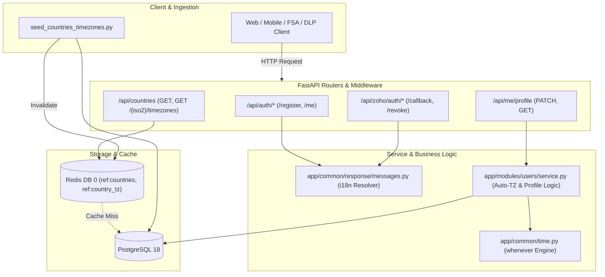

# Enterprise Implementation Plan: User Localization, Timezone Management & Module-Level Messaging

**Document Reference:** `docs/implementation-plan/user-localization-timezone-and-messages.md`  
**Status:** DRAFT (Architecture Review)  
**Author:** Principal Enterprise Systems Architect & Senior FastAPI Engineer  
**Date:** September 2026  
**Target Systems:** `app/common/response/`, `app/common/time/`, `app/modules/users/`, `app/modules/zoho/auth/`

---

## Executive Summary & Alignment

This implementation plan establishes a production-grade, enterprise-ready solution for three tightly coupled capabilities in `th-middleware`:

1. **Standardized Module-Level Language/Response Messaging**: Moving away from ad-hoc strings and schema-violating nested dictionaries (`data={"message": "..."}`) into a cohesive, module-scoped language system (`en` initially) returning user-friendly messages via the standard `{code, msg, data, request_id}` response envelope (e.g., `"Your account has been created successfully."` upon registration).
2. **Type-Safe, DST-Compliant Time & Timezone Engine**: Integrating the `whenever` library into a robust shared utility (`app/common/time.py`) to eliminate standard-library datetime pitfalls, handle Daylight Saving Time (DST) arithmetic without errors, and provide zero-ambiguity conversions between UTC database timestamps and user local timezones.
3. **Country & Timezone Data Model with Auto-Resolution**: Implementing ISO 3166-1 `countries`, IANA `timezones`, `country_timezones` mapping tables, and an "auto-unless-overridden" `user_profiles` schema. When a user selects a country, their default timezone is automatically assigned; when they explicitly customize their timezone, the system locks `timezone_source = 'manual'`.
4. **Idempotent Ingestion Seeder & Redis Caching**: Providing an automated CLI seeder (`seed_countries_timezones.py`) and shell runner (`seed_countries_timezones.sh`) utilizing authoritative data sources (`backend/data/countries/countries.json` and `backend/data/timezones/zone1970.tab`), alongside Redis caching for near-zero database lookup overhead.

This design strictly adheres to the core doctrines defined in [`master-prompt.md`](file:///wsl.localhost/Ubuntu/home/a2/projects/th-middleware/docs/architecture-prompts/master-prompt.md) and repository standards in [`PROJECT_STRUCTURE.md`](file:///wsl.localhost/Ubuntu/home/a2/projects/th-middleware/docs/PROJECT_STRUCTURE.md).

---

## 1. Context & Architectural Assessment

### 1.1 Existing Response Envelope vs. Current Implementation Flaws

The system's response contract established in `app/common/response/schema.py` is:

```python
class ResponseModel(BaseModel, Generic[T]):
    code: str = "ok"
    msg: str = "success"
    data: T | None = None
    request_id: str | None = None
    meta: dict | None = None
```

#### Discovered Discrepancies:
1. **User Registration (`app/modules/users/api.py:53`)**:
   ```python
   @auth_router.post("/register", response_model=ResponseModel[UserOut], status_code=201)
   async def register(db: DBSession, body: RegisterRequest, client: ClientInfoDep):
       user = await service.register(db, body, client=client)
       return ResponseModel(data=UserOut.model_validate(user))
   ```
   *Issue:* Because `msg` is omitted, the client receives `"msg": "success"`. This is technical, impersonal, and does not provide an engaging user experience. It should be: `"Your account has been created successfully."`
2. **Zoho OAuth Endpoints (`app/modules/zoho/auth/api.py:67, 75`)**:
   ```python
   # Line 67:
   return ResponseModel(data={"message": "Successfully authenticated with Zoho"})
   # Line 75:
   return ResponseModel(data={"message": "Successfully disconnected from Zoho"})
   ```
   *Issue:* Violates the response envelope contract. The frontend expects human-readable notifications in `body.msg`, while `body.data` is reserved for payload objects. Nesting `message` inside `data` creates client parsing fragmentation.
3. **Hardcoded Ad-Hoc Messages Across Modules**:
   Modules such as `tags`, `documents`, `emails`, and `zoho/organizations` pass arbitrary inline strings like `msg="Tag created"`, `msg="Created locally; push to Zoho queued"`. There is no localization mechanism, no centralized key catalog, and no clean way to support future Indian languages (Hindi, Gujarati) or international expansion.

### 1.2 User ID Type Constraint Trap

In the provided schema specification, the snippet showed:
```sql
CREATE TABLE user_profiles (
    id UUID PRIMARY KEY DEFAULT gen_random_uuid(),
    user_id UUID NOT NULL REFERENCES users(id) ON DELETE CASCADE, ...
)
```
**CRITICAL ARCHITECTURAL OBSERVATION:**  
In `th-middleware`, `users.id` is defined as:
```python
id: Mapped[int] = mapped_column(BigInteger, primary_key=True, autoincrement=True)
```
Foreign key constraints in PostgreSQL require identical data types between referencing and referenced columns. Linking `user_profiles.user_id` as `UUID` to `users.id` (`BIGINT`) will cause an immediate database foreign key constraint error. Therefore, `user_profiles.user_id` MUST be typed as `BigInteger` (`int` in SQLAlchemy 2.0).

---

## 2. Component Architecture & System Design



---

## 3. Module-Level Language & Response Message System

### 3.1 Design Goals
- **Module Locality**: Each module owns its own language catalog (e.g., `app/modules/users/lang/en.py`, `app/modules/zoho/auth/lang/en.py`).
- **Standardized Resolver**: A shared, lightweight resolver in `app/common/response/messages.py` that formats message templates with variable interpolation.
- **Envelope Integration**: Seamless use with `ResponseModel(data=..., msg=get_message("users", "register_success"))` or helper factory `ResponseModel.with_msg(...)`.
- **Zero Performance Penalty**: In-memory dictionary lookups, no disk I/O per request, ready for multi-language extensions (`en`, `gu`, `hi`).

### 3.2 File Structure

```
apps/core-platform/backend/app/
├── common/
│   └── response/
│       ├── __init__.py
│       ├── schema.py          # ResponseModel[T], PageModel[T]
│       └── messages.py        # Central get_message helper & registry
├── modules/
│   ├── users/
│   │   └── lang/
│   │       ├── __init__.py
│   │       └── en.py          # Users module English message catalog
│   └── zoho/
│       └── auth/
│           └── lang/
│               ├── __init__.py
│               └── en.py      # Zoho Auth English message catalog
```

### 3.3 Message Catalogs

#### Users Message Catalog (`app/modules/users/lang/en.py`)
```python
"""Users module English language messages."""

MESSAGES: dict[str, str] = {
    # Auth flows
    "register_success": "Your account has been created successfully.",
    "login_success": "Login successful.",
    "logout_success": "You have been logged out successfully.",
    "login_otp_sent": "A one-time login code has been sent to your email.",
    "login_otp_verified": "Login verified successfully.",
    "password_changed": "Your password has been changed successfully.",
    "password_reset_sent": "If an account matches those details, a reset code or link has been sent.",
    "password_reset_success": "Your password has been reset successfully.",
    "token_refreshed": "Token refreshed successfully.",
    
    # Profile & settings
    "profile_updated": "Your profile has been updated successfully.",
    "country_updated": "Country updated successfully.",
    "timezone_updated": "Timezone updated successfully.",
    "profile_fetched": "Profile retrieved successfully.",
    
    # User lifecycle / moderation
    "user_created": "User created successfully.",
    "user_updated": "User updated successfully.",
    "user_deleted": "User deleted successfully.",
    "user_restored": "User restored successfully.",
    "user_banned": "User has been banned successfully.",
    "user_unbanned": "User ban has been lifted.",
    "user_throttled": "User has been throttled.",
    "user_unthrottled": "User throttle has been lifted.",
}
```

#### Zoho Auth Message Catalog (`app/modules/zoho/auth/lang/en.py`)
```python
"""Zoho Auth module English language messages."""

MESSAGES: dict[str, str] = {
    "auth_connected": "Successfully authenticated with Zoho.",
    "auth_disconnected": "Successfully disconnected from Zoho.",
    "auth_initiated": "Zoho authentication initiated.",
    "state_invalid": "Invalid or expired OAuth state parameter.",
    "revoke_missing_token": "No Zoho refresh token available to revoke.",
}
```

### 3.4 Resolver Implementation (`app/common/response/messages.py`)

```python
"""Module-level message resolver for unified API response envelopes."""

from __future__ import annotations
import importlib
from typing import Any
import structlog

logger = structlog.get_logger("app.common.response.messages")

# Cache loaded module dictionaries: (module_name, lang) -> dict
_CATALOG_CACHE: dict[tuple[str, str], dict[str, str]] = {}


def load_module_catalog(module: str, lang: str = "en") -> dict[str, str]:
    """Dynamically load and cache a module's language dictionary."""
    cache_key = (module, lang)
    if cache_key in _CATALOG_CACHE:
        return _CATALOG_CACHE[cache_key]

    # Standard path: app.modules.<module>.lang.<lang>
    module_path = f"app.modules.{module}.lang.{lang}"
    try:
        mod = importlib.import_module(module_path)
        catalog = getattr(mod, "MESSAGES", {})
        _CATALOG_CACHE[cache_key] = catalog
        return catalog
    except ModuleNotFoundError:
        logger.warning("language_catalog_not_found", module=module, lang=lang, path=module_path)
        _CATALOG_CACHE[cache_key] = {}
        return {}


def get_message(
    module: str,
    key: str,
    lang: str = "en",
    default: str | None = None,
    **kwargs: Any,
) -> str:
    """Retrieve and interpolate a localized message string.
    
    Usage:
        msg = get_message("users", "register_success")
        msg = get_message("users", "welcome_user", name="Alice")
    """
    catalog = load_module_catalog(module, lang)
    template = catalog.get(key, default or key)
    if kwargs:
        try:
            return template.format(**kwargs)
        except KeyError as err:
            logger.warning("message_interpolation_failed", template=template, missing_key=str(err))
            return template
    return template
```

### 3.5 Integration with `ResponseModel`

In `app/common/response/schema.py`, extend `ResponseModel` with an ergonomic helper while preserving 100% backward compatibility:

```python
class ResponseModel(BaseModel, Generic[T]):
    code: str = "ok"
    msg: str = "success"
    data: T | None = None
    request_id: str | None = None
    meta: dict | None = None

    @classmethod
    def ok(
        cls,
        data: T | None = None,
        *,
        msg: str | None = None,
        module: str | None = None,
        msg_key: str | None = None,
        lang: str = "en",
        code: str = "ok",
        meta: dict | None = None,
        **kwargs: Any,
    ) -> ResponseModel[T]:
        """Construct a successful ResponseModel with resolved localized message."""
        if module and msg_key:
            resolved_msg = get_message(module, msg_key, lang=lang, default=msg, **kwargs)
        else:
            resolved_msg = msg or "success"
        return cls(code=code, msg=resolved_msg, data=data, meta=meta)
```

---

## 4. Time & Timezone Utility with `whenever`

### 4.1 Dependency Addition
Add `whenever` to `requirements.txt`:
```txt
# --- Time & Timezone (DST-safe, type-safe date-time arithmetic) ---
whenever>=0.6.2,<1.0
```

### 4.2 Utility Module: `app/common/time.py`
The utility provides an unshakeable boundary between Python's standard library (for database persistence via asyncpg) and DST-safe domain logic.

```python
"""Type-safe, DST-aware time and timezone utility built on `whenever`.

Doctrine:
- In-memory domain operations: Use `whenever.Instant` and `whenever.ZonedDateTime`.
- Persistence boundary (SQLAlchemy / asyncpg): Convert to/from UTC aware stdlib datetime.
- API & formatting boundary: ISO-8601 strings or formatted local strings.
"""

from __future__ import annotations
from datetime import UTC, datetime
from typing import Literal
import whenever
from whenever import Instant, PlainDateTime, ZonedDateTime, hours, days


def now_utc() -> Instant:
    """Return current moment as an Instant (exact point in time, UTC)."""
    return Instant.now()


def now_in_tz(iana_tz: str) -> ZonedDateTime:
    """Return current moment zoned in the given IANA timezone."""
    return Instant.now().to_tz(iana_tz)


def to_user_tz(moment: Instant | datetime, iana_tz: str) -> ZonedDateTime:
    """Convert an Instant or aware UTC datetime to user's local timezone."""
    if isinstance(moment, datetime):
        if moment.tzinfo is None:
            # Assume UTC for naive timestamps from database
            instant = Instant.from_utc(
                moment.year, moment.month, moment.day,
                moment.hour, moment.minute, moment.second,
                nanosecond=moment.microsecond * 1000
            )
        else:
            instant = Instant.from_stdlib(moment)
    else:
        instant = moment
    return instant.to_tz(iana_tz)


def format_user_datetime(
    moment: Instant | datetime | None = None,
    iana_tz: str = "Asia/Kolkata",
    fmt: str = "YYYY-MM-DD HH:mm:ss",
) -> str:
    """Format a timestamp in the user's timezone for displays and emails.
    Replaces brittle hand-rolled formatters.
    """
    target = now_utc() if moment is None else (
        Instant.from_stdlib(moment) if isinstance(moment, datetime) else moment
    )
    zoned = target.to_tz(iana_tz)
    # whenever supports custom pattern formatting
    return zoned.format(fmt)


def to_db_utc(zoned_or_instant: ZonedDateTime | Instant) -> datetime:
    """Convert a whenever object to a standard library timezone-aware UTC datetime for asyncpg."""
    return zoned_or_instant.to_stdlib() if isinstance(zoned_or_instant, Instant) else zoned_or_instant.to_instant().to_stdlib()


def is_valid_iana_timezone(iana_name: str) -> bool:
    """Check if string is a recognized IANA timezone identifier."""
    try:
        Instant.now().to_tz(iana_name)
        return True
    except Exception:
        return False
```

---

## 5. Database Schema & Migration Specification

Following `<table_building_doctrine>`, all models inherit proper mixins, column nullabilities match business rules, and the `metadata` attribute collision is strictly avoided.

### 5.1 Tables Definition

```
countries (ISO 3166-1)
├── iso2 CHAR(2) [PK]
├── iso3 CHAR(3) [UNIQUE, NOT NULL]
├── numeric_code CHAR(3) [NULLABLE]
├── name VARCHAR(100) [NOT NULL]
├── official_name VARCHAR(300) [NULLABLE]
├── region VARCHAR(75) [NULLABLE]
├── subregion VARCHAR(75) [NULLABLE]
├── phone_code VARCHAR(10) [NULLABLE]
├── currency_code CHAR(5) [NULLABLE]
├── is_active BOOLEAN [NOT NULL, DEFAULT TRUE]
├── created_at TIMESTAMPTZ [NOT NULL, DEFAULT now()]
└── updated_at TIMESTAMPTZ [NOT NULL, DEFAULT now()]

timezones (IANA Identifiers)
├── iana_name VARCHAR(64) [PK]
├── display_name VARCHAR(100) [NOT NULL]
└── is_active BOOLEAN [NOT NULL, DEFAULT TRUE]

country_timezones (Multi-zone Mapping)
├── id SERIAL [PK]
├── country_iso2 CHAR(2) [FK -> countries.iso2 ON DELETE CASCADE]
├── timezone_name VARCHAR(64) [FK -> timezones.iana_name ON DELETE CASCADE]
├── is_default BOOLEAN [NOT NULL, DEFAULT FALSE]
└── Constraints:
    ├── UNIQUE(country_iso2, timezone_name)
    └── Partial UNIQUE INDEX: uq_country_default_tz ON country_timezones(country_iso2) WHERE is_default = TRUE

user_profiles (User Localization Preferences)
├── id UUID [PK, DEFAULT gen_random_uuid()]
├── user_id BIGINT [UNIQUE, NOT NULL, FK -> users.id ON DELETE CASCADE]  <-- MATCHES users.id BIGINT
├── country_iso2 CHAR(2) [NULLABLE, FK -> countries.iso2 ON DELETE SET NULL]
├── timezone_name VARCHAR(64) [NULLABLE, FK -> timezones.iana_name ON DELETE SET NULL]
├── timezone_source VARCHAR(10) [NOT NULL, DEFAULT 'auto', CHECK (timezone_source IN ('auto', 'manual'))]
└── updated_at TIMESTAMPTZ [NOT NULL, DEFAULT now()]
```

### 5.2 SQLAlchemy 2.0 Models (`app/modules/users/model.py`)

Add to `app/modules/users/model.py`:

```python
import enum
import uuid
from sqlalchemy import (
    BigInteger, Boolean, CheckConstraint, Enum, ForeignKey,
    Index, Integer, String, text
)
from sqlalchemy.dialects.postgresql import UUID
from sqlalchemy.orm import Mapped, mapped_column, relationship
from app.database.mixins import TimestampMixin


class TimezoneSource(str, enum.Enum):
    auto = "auto"
    manual = "manual"


class Country(TimestampMixin, Base):
    __tablename__ = "countries"

    iso2: Mapped[str] = mapped_column(String(2), primary_key=True)
    iso3: Mapped[str] = mapped_column(String(3), unique=True, nullable=False)
    numeric_code: Mapped[str | None] = mapped_column(String(3), nullable=True)
    name: Mapped[str] = mapped_column(String(100), nullable=False)
    official_name: Mapped[str | None] = mapped_column(String(300), nullable=True)
    region: Mapped[str | None] = mapped_column(String(75), nullable=True)
    subregion: Mapped[str | None] = mapped_column(String(75), nullable=True)
    phone_code: Mapped[str | None] = mapped_column(String(10), nullable=True)
    currency_code: Mapped[str | None] = mapped_column(String(5), nullable=True)
    is_active: Mapped[bool] = mapped_column(Boolean, default=True, nullable=False)

    timezones: Mapped[list["CountryTimezone"]] = relationship(
        "CountryTimezone", back_populates="country", cascade="all, delete-orphan", lazy="selectin"
    )


class Timezone(Base):
    __tablename__ = "timezones"

    iana_name: Mapped[str] = mapped_column(String(64), primary_key=True)
    display_name: Mapped[str] = mapped_column(String(100), nullable=False)
    is_active: Mapped[bool] = mapped_column(Boolean, default=True, nullable=False)


class CountryTimezone(Base):
    __tablename__ = "country_timezones"

    id: Mapped[int] = mapped_column(Integer, primary_key=True, autoincrement=True)
    country_iso2: Mapped[str] = mapped_column(
        String(2), ForeignKey("countries.iso2", ondelete="CASCADE"), nullable=False
    )
    timezone_name: Mapped[str] = mapped_column(
        String(64), ForeignKey("timezones.iana_name", ondelete="CASCADE"), nullable=False
    )
    is_default: Mapped[bool] = mapped_column(Boolean, default=False, nullable=False)

    country: Mapped["Country"] = relationship("Country", back_populates="timezones")
    timezone: Mapped["Timezone"] = relationship("Timezone")

    __table_args__ = (
        Index("uq_country_timezone", "country_iso2", "timezone_name", unique=True),
        Index(
            "uq_country_default_tz",
            "country_iso2",
            unique=True,
            postgresql_where=text("is_default = TRUE"),
        ),
    )


class UserProfile(Base):
    __tablename__ = "user_profiles"

    id: Mapped[uuid.UUID] = mapped_column(
        UUID(as_uuid=True), primary_key=True, default=uuid.uuid4
    )
    # Matches User.id (BigInteger)
    user_id: Mapped[int] = mapped_column(
        BigInteger, ForeignKey("users.id", ondelete="CASCADE"), unique=True, nullable=False
    )
    country_iso2: Mapped[str | None] = mapped_column(
        String(2), ForeignKey("countries.iso2", ondelete="SET NULL"), nullable=True
    )
    timezone_name: Mapped[str | None] = mapped_column(
        String(64), ForeignKey("timezones.iana_name", ondelete="SET NULL"), nullable=True
    )
    timezone_source: Mapped[TimezoneSource] = mapped_column(
        Enum(TimezoneSource, native_enum=False, length=10),
        default=TimezoneSource.auto,
        nullable=False,
    )
    updated_at: Mapped[datetime] = mapped_column(
        DateTime(timezone=True), default=_utcnow, onupdate=_utcnow, nullable=False
    )

    user: Mapped["User"] = relationship("User", backref="profile")
    country: Mapped["Country | None"] = relationship("Country")
    timezone: Mapped["Timezone | None"] = relationship("Timezone")

    __table_args__ = (
        Index("idx_user_profiles_country", "country_iso2"),
        CheckConstraint("timezone_source IN ('auto', 'manual')", name="ck_user_profiles_tz_source"),
    )
```

### 5.3 Alembic Migration Plan
New migration file: `alembic/versions/20260917_1700_f7a8b9c0d1e2_countries_timezones_user_profiles.py`  
Down revision: `e5f6a7b8c9d0` (`user_moderation.py`)

- **Upgrade steps:**
  1. Create table `countries` with primary key `iso2`, unique `iso3`, and timestamp columns.
  2. Create table `timezones` with primary key `iana_name`.
  3. Create table `country_timezones` with unique constraint on `(country_iso2, timezone_name)` and partial unique index `uq_country_default_tz` with `postgresql_where=sa.text("is_default = TRUE")`.
  4. Create table `user_profiles` with `user_id` referencing `users(id) ON DELETE CASCADE`.
  5. Backfill `user_profiles` for all existing records in `users` with default `country_iso2='IN'`, `timezone_name='Asia/Kolkata'`, and `timezone_source='auto'`.
- **Downgrade steps:**
  1. Drop table `user_profiles`.
  2. Drop table `country_timezones`.
  3. Drop table `timezones`.
  4. Drop table `countries`.

---

## 6. Service Layer & Business Logic

### 6.1 Auto-Unless-Overridden Profile Logic (`app/modules/users/service.py`)

```python
from sqlalchemy import select
from sqlalchemy.ext.asyncio import AsyncSession
from app.modules.users.model import CountryTimezone, TimezoneSource, User, UserProfile
from app.common.exception.errors import NotFoundError, AppError


async def get_or_create_profile(db: AsyncSession, user_id: int) -> UserProfile:
    """Get existing UserProfile or create with defaults."""
    stmt = select(UserProfile).where(UserProfile.user_id == user_id)
    profile = await db.scalar(stmt)
    if profile is None:
        profile = UserProfile(
            user_id=user_id,
            country_iso2="IN",
            timezone_name="Asia/Kolkata",
            timezone_source=TimezoneSource.auto,
        )
        db.add(profile)
        await db.flush()
    return profile


async def set_user_country(db: AsyncSession, profile: UserProfile, country_iso2: str) -> UserProfile:
    """Update user country; auto-sets default timezone if timezone_source is 'auto'."""
    profile.country_iso2 = country_iso2.upper()

    if profile.timezone_source == TimezoneSource.auto:
        stmt = (
            select(CountryTimezone.timezone_name)
            .where(CountryTimezone.country_iso2 == profile.country_iso2)
            .where(CountryTimezone.is_default.is_(True))
        )
        default_tz = await db.scalar(stmt)
        if default_tz:
            profile.timezone_name = default_tz

    await db.commit()
    await db.refresh(profile)
    return profile


async def set_user_timezone_manually(db: AsyncSession, profile: UserProfile, timezone_name: str) -> UserProfile:
    """Manually set user timezone, permanently locking source to 'manual'."""
    profile.timezone_name = timezone_name
    profile.timezone_source = TimezoneSource.manual
    await db.commit()
    await db.refresh(profile)
    return profile
```

### 6.2 Redis Caching for Reference Tables

Per `<deployment_topology>`, caching belongs in Redis DB 0 under distinct prefixes with TTL:
- Key `ref:countries:all` -> JSON array of all active countries (TTL 86400s / 24h).
- Key `ref:country_tz:{iso2}` -> JSON array of timezones for country (TTL 86400s / 24h).

```python
"""Reference data caching layer (Redis DB 0)."""

import json
from sqlalchemy import select
from sqlalchemy.ext.asyncio import AsyncSession
from app.database.redis import redis_client
from app.modules.users.model import Country, CountryTimezone

CACHE_TTL = 86400  # 24 hours


async def get_cached_countries(db: AsyncSession) -> list[dict]:
    cache_key = "ref:countries:all"
    cached = await redis_client.get(cache_key)
    if cached:
        return json.loads(cached)

    stmt = select(Country).where(Country.is_active.is_(True)).order_by(Country.name)
    rows = (await db.scalars(stmt)).all()
    data = [
        {
            "iso2": c.iso2,
            "iso3": c.iso3,
            "name": c.name,
            "official_name": c.official_name,
            "region": c.region,
            "subregion": c.subregion,
            "phone_code": c.phone_code,
            "currency_code": c.currency_code,
        }
        for c in rows
    ]
    await redis_client.set(cache_key, json.dumps(data), ex=CACHE_TTL)
    return data


async def get_cached_country_timezones(db: AsyncSession, country_iso2: str) -> list[dict]:
    iso2 = country_iso2.upper()
    cache_key = f"ref:country_tz:{iso2}"
    cached = await redis_client.get(cache_key)
    if cached:
        return json.loads(cached)

    stmt = (
        select(CountryTimezone)
        .where(CountryTimezone.country_iso2 == iso2)
        .order_by(CountryTimezone.is_default.desc(), CountryTimezone.timezone_name)
    )
    rows = (await db.scalars(stmt)).all()
    data = [
        {"timezone_name": r.timezone_name, "is_default": r.is_default}
        for r in rows
    ]
    await redis_client.set(cache_key, json.dumps(data), ex=CACHE_TTL)
    return data


async def invalidate_reference_cache():
    """Invalidate reference cache keys (called after seeder)."""
    keys = await redis_client.keys("ref:*")
    if keys:
        await redis_client.delete(*keys)
```

---

## 7. Seeder & Ingestion Pipeline

### 7.1 Authoritative Data Sources
1. Country Metadata: `apps/core-platform/backend/data/countries/countries.json` (mledoze/countries, contains ISO codes, names, phone codes, currencies).
2. Timezone Descriptions: `apps/core-platform/backend/data/timezones/zone1970.tab` (authoritative IANA tzdb table).

### 7.2 zone1970.tab Parsing Logic
In `zone1970.tab`, the table is sorted so the most populous timezone for a country appears first. The parser marks the first encountered timezone for a country as `is_default = True`:

```python
def build_country_timezones(zone1970_path: str) -> dict[str, list[str]]:
    mapping: dict[str, list[str]] = defaultdict(list)
    with open(zone1970_path, encoding="utf-8") as f:
        for line in f:
            line = line.strip()
            if not line or line.startswith("#"):
                continue
            parts = line.split("\t")
            if len(parts) < 3:
                continue
            codes, _coords, tz_name = parts[0], parts[1], parts[2]
            for iso2 in codes.split(","):
                iso2 = iso2.strip().upper()
                if tz_name not in mapping[iso2]:
                    mapping[iso2].append(tz_name)
    return mapping
```

### 7.3 Seeder Script: `apps/core-platform/backend/scripts/seed_countries_timezones.py`
The script:
- Slices and upserts `countries` in batches via `ON CONFLICT (iso2) DO UPDATE`.
- Extracts all unique IANA timezone names and upserts into `timezones` via `ON CONFLICT (iana_name) DO UPDATE`.
- Populates `country_timezones` with `is_default = True` for index `0` of each country.
- Supports both asyncpg connection string or converted psycopg URL.
- Clears Redis cache `ref:*` on completion.

### 7.4 Shell Automation Script: `apps/core-platform/backend/scripts/seed_countries_timezones.sh`
```bash
#!/usr/bin/env bash
set -eo pipefail

SCRIPT_DIR="$(cd "$(dirname "${BASH_SOURCE[0]}")" && pwd)"
BACKEND_DIR="$(cd "${SCRIPT_DIR}/.." && pwd)"

# Source .env safely
if [ -f "${BACKEND_DIR}/.env" ]; then
    set -a
    . "${BACKEND_DIR}/.env"
    set +a
else
    echo "Error: .env file not found at ${BACKEND_DIR}/.env"
    exit 1
fi

JSON_FILE="${BACKEND_DIR}/data/countries/countries.json"
ZONE_FILE="${BACKEND_DIR}/data/timezones/zone1970.tab"

echo "=== Seeding Countries, Timezones, and Country-Timezone Mappings ==="
python3 "${SCRIPT_DIR}/seed_countries_timezones.py" \
    --json-file "${JSON_FILE}" \
    --zone-file "${ZONE_FILE}" \
    --database-url "${DATABASE_URL}"

echo "=== Seeding Completed Successfully ==="
```

---

## 8. API Layer & Transport Schemas

### 8.1 Pydantic Schemas (`app/modules/users/schema.py`)

```python
class CountryOut(BaseModel):
    iso2: str
    iso3: str
    name: str
    official_name: str | None = None
    region: str | None = None
    subregion: str | None = None
    phone_code: str | None = None
    currency_code: str | None = None

    model_config = ConfigDict(from_attributes=True)


class CountryTimezoneOut(BaseModel):
    timezone_name: str
    is_default: bool

    model_config = ConfigDict(from_attributes=True)


class UserProfileUpdate(BaseModel):
    country: str | None = Field(None, min_length=2, max_length=2, description="ISO2 country code, e.g. IN")
    timezone: str | None = Field(None, description="IANA timezone name, e.g. Asia/Kolkata")


class UserProfileOut(BaseModel):
    user_id: int
    country_iso2: str | None
    timezone_name: str | None
    timezone_source: str
    updated_at: datetime

    model_config = ConfigDict(from_attributes=True)
```

### 8.2 Endpoints Specification

#### 1. `GET /api/countries`
- **Method:** `GET`
- **Auth:** Public or Authenticated (cached)
- **Response:** `ResponseModel[list[CountryOut]]`
- **Behavior:** Returns full list of ISO 3166-1 active countries from Redis cache.

#### 2. `GET /api/countries/{iso2}/timezones`
- **Method:** `GET`
- **Auth:** Public or Authenticated (cached)
- **Response:** `ResponseModel[list[CountryTimezoneOut]]`
- **Behavior:** Returns mapped timezones for the country; indicates which timezone is default.

#### 3. `GET /api/me/profile`
- **Method:** `GET`
- **Auth:** `CurrentUser` (Bearer JWT)
- **Response:** `ResponseModel[UserProfileOut]`
- **Msg:** `"Profile retrieved successfully."`

#### 4. `PATCH /api/me/profile`
- **Method:** `PATCH`
- **Auth:** `CurrentUser` (Bearer JWT)
- **Body:** `UserProfileUpdate`
- **Rules:**
  - If `country` is provided: runs `set_user_country(...)`. If `timezone_source == 'auto'`, auto-fills default timezone for that country.
  - If `timezone` is provided: runs `set_user_timezone_manually(...)`, permanently locking `timezone_source = 'manual'`.
  - Both can be passed in one request: country is updated, then manual timezone is locked.
- **Response:** `ResponseModel[UserProfileOut]`
- **Msg:** `"Your profile has been updated successfully."` (resolved via `get_message("users", "profile_updated")`)

#### 5. Updated Registration: `POST /api/auth/register`
- **Status:** 201 Created
- **Response:** `ResponseModel[UserOut]`
- **Msg:** `"Your account has been created successfully."` (resolved via `get_message("users", "register_success")`)
- **Side Effect:** Provisions `UserProfile` initialized with `IN` and `Asia/Kolkata`.

#### 6. Updated Zoho Auth Endpoints (`app/modules/zoho/auth/api.py`)
- `GET /api/zoho/auth/callback`:
  - Changes: `return ResponseModel(msg=get_message("zoho_auth", "auth_connected"), data={"connected": True})`
- `POST /api/zoho/auth/revoke`:
  - Changes: `return ResponseModel(msg=get_message("zoho_auth", "auth_disconnected"), data={"revoked": True})`

---

## 9. Testing Doctrine & Verification Strategy

Following `<testing_doctrine>`, tests must pass hermetically without live infrastructure, while integration tests target scratch PostgreSQL (55432) and Redis (56379).

```
tests/
├── unit/
│   ├── test_time_utility.py           # Whenever Instant, ZonedDateTime, DST arithmetic
│   ├── test_response_messages.py       # get_message resolution, interpolation, fallback
│   └── test_zone1970_parser.py         # Pure parsing of zone1970.tab and default flags
├── integration/
│   ├── test_user_profiles.py          # Auto vs. manual timezone transition logic
│   ├── test_reference_caching.py       # Redis cache hit/miss/invalidation
│   ├── test_seeder_idempotency.py      # countries & timezones seeder execution
│   └── test_auth_localized_response.py # HTTP registration & envelope msg verification
```

### Coverage Checklist
- [ ] **Unit - Time Utility**: Verify DST transition arithmetic (e.g. Europe/Paris spring forward).
- [ ] **Unit - Language System**: Verify fallback to default when key is missing and variable formatting (`{name}`).
- [ ] **Integration - Auto Timezone**: Given `source=auto`, PATCH `{country: "US"}` sets `country_iso2="US"` and `timezone_name="America/New_York"` (`is_default=True`).
- [ ] **Integration - Manual Override**: PATCH `{timezone: "America/Chicago"}` flips `timezone_source="manual"`.
- [ ] **Integration - Lock Protection**: Following manual lock, PATCH `{country: "IN"}` updates country to `"IN"` but retains `timezone_name="America/Chicago"`.
- [ ] **Integration - Scratch Cleanup**: Add `user_profiles`, `country_timezones`, `timezones`, `countries` to `tests/conftest.py`'s `_TEST_TABLES`.

---

## 10. Step-by-Step Implementation Roadmap

| Step | Phase | Task Description | Files Touched / Created |
|:---:|:---|:---|:---|
| **1** | Core & Messages | Implement language catalogs and central message resolver | `app/common/response/messages.py`<br>`app/modules/users/lang/en.py`<br>`app/modules/zoho/auth/lang/en.py`<br>`app/common/response/schema.py` |
| **2** | Dependencies | Add `whenever` to backend runtime dependencies | `requirements.txt` |
| **3** | Time Engine | Build DST-safe time and timezone utilities with `whenever` | `app/common/time.py` |
| **4** | Data Schema | Define `Country`, `Timezone`, `CountryTimezone`, `UserProfile` | `app/modules/users/model.py` |
| **5** | Migration | Generate and verify Alembic async migration | `alembic/versions/*_countries_timezones_user_profiles.py` |
| **6** | Seeder | Build idempotent seeder & shell runner | `scripts/seed_countries_timezones.py`<br>`scripts/seed_countries_timezones.sh` |
| **7** | Service Logic | Implement auto/manual timezone service & Redis caching | `app/modules/users/service.py`<br>`app/modules/users/reference_cache.py` |
| **8** | API Routes | Add `/countries`, `/countries/{iso2}/timezones`, `/me/profile`, update `/register` and `/zoho/auth/*` | `app/modules/users/api.py`<br>`app/modules/users/schema.py`<br>`app/modules/zoho/auth/api.py`<br>`app/router.py` |
| **9** | Test Suite | Write hermetic unit tests and integration tests | `tests/unit/test_time_utility.py`<br>`tests/integration/test_user_profiles.py` |
| **10**| Documentation | Update `PROJECT_STRUCTURE.md` and module docs | `docs/PROJECT_STRUCTURE.md`<br>`docs/modules/auth-module-documentation.md` |

---

## 11. Definition of Done Checklist

Before submitting the code changes:
- [ ] `user_profiles.user_id` is typed as `BigInteger` (matching `users.id`).
- [ ] Partial unique index `uq_country_default_tz` on `country_timezones(country_iso2) WHERE is_default = TRUE` is created.
- [ ] `ResponseModel` in `/api/auth/register` returns `"msg": "Your account has been created successfully."`.
- [ ] `zoho/auth/api.py` returns status messages in `msg`, leaving `data` clean.
- [ ] Reference data (`countries`, `country_timezones`) is cached in Redis DB 0 with 24-hour TTL.
- [ ] Seeder script parses `zone1970.tab` and `countries.json` idempotently.
- [ ] `whenever` is used for timezone conversions and formatters without naive datetime bugs.
- [ ] All tests pass hermetically on a bare checkout.
