# 01 — Domain model

The DDL is [`catalogue_schema.sql`](catalogue_schema.sql); this document says **why** each table exists, what it is
NOT, and where every pasted design went.

---

## 1. The model in one picture

```mermaid
erDiagram
    uqc_codes ||--o{ units : "reports as"
    units ||--o{ item_units : "level unit"
    packaging_types ||--o{ item_units : "physical pack"
    item_groups ||--o{ items : "merchandised in"
    item_groups ||--o{ item_groups : "parent"
    products ||--o{ items : "variant of"
    products ||--o{ product_attributes : "axes"
    attributes ||--o{ attribute_options : "values"
    attributes ||--o{ product_attributes : ""
    items ||--o{ item_attribute_values : "axis values"
    brands ||--o{ items : ""
    manufacturers ||--o{ items : ""
    items ||--|| item_merchandising : "storefront"
    items ||--o{ item_units : "packaging hierarchy"
    item_units ||--o{ item_units : "contains"
    items ||--o{ item_identifiers : "barcodes"
    item_units ||--o{ item_identifiers : "GTIN per level"
    items ||--o{ item_components : "BOM / kit"
    items ||--o{ item_sales_channels : "listed on"
    sales_channels ||--o{ item_sales_channels : ""
    items ||--o{ item_vendors : "supplied by"
    parties ||--o{ item_vendors : "vendor"
    items ||--o{ batches : "lots"
    batches ||--o{ batch_holds : "quarantine/recall"
    items ||--o{ price_list_items : "priced in"
    item_units ||--o{ price_list_items : "pack price"
    schemes ||--o{ scheme_targets : "applies to"
    schemes ||--o{ scheme_slabs : "rewards"
    schemes ||--o{ scheme_eligibility : "who"
    storage_locations ||--o{ storage_locations : "parent"
    stock_movements ||--o{ stock_movement_lines : ""
    items ||--o{ stock_ledger_entries : ""
    batches ||--o{ stock_ledger_entries : ""
    storage_locations ||--o{ stock_ledger_entries : ""
    stock_ledger_entries }o--|| stock_balances : "projected into"
    items ||--o{ stock_reservations : ""
    items ||--o{ replenishment_policies : "per warehouse"
    storage_locations ||--o{ stock_policies : "warehouse layer"
    item_groups ||--o{ stock_policies : "group layer"
    items ||--o{ stock_policies : "item layer"
    items ||--o{ external_stock_levels : "Zoho snapshot"
```

Polymorphic capabilities (no FK in the picture, registered in `core.entity_types`): taxes (`tax.tax_assignments`),
accounts (`accounting.account_assignments`), categories (`core.categorizables`), documents (`documents.document_links`),
media (`media.items`), comments (`comments.comments`), custom fields (`extfields.field_values`), tags, Zoho identity
(`sync.sync_records`).

---

## 2. Reconciling the pasted designs

Rule applied throughout: **one truth per fact**, and **extend what exists** (master prompt directive 2). "Exists" means
the platform already has a generic, tested home for it.

### 2.1 Masters you pasted

| Pasted | Decision | Where it lives |
|---|---|---|
| **Brand owners** (`legal_name, trade_name, cin, pan_masked, gstin, registered_state`) | **Exists** — not a new table | A brand owner IS a manufacturer-like legal entity: `core.manufacturers` (`legal_name`, `name` = trade name) + `core.manufacturer_identifiers` (`gstin`, `pan`, `cin` with format CHECKs) + `core.brand_manufacturers.kind = 'brand_owner'` (already in the enum, with validity window and default flag). `registered_state` = the GSTIN's state code / the registered-office address in `geo.place_links`. PAN in clear, per the parties owner decision |
| **Item groups** (`ORAL_CARE`, `MENS_GROOMING`, visible/menu/order) | **Adopted** as `catalogue.item_groups` | Merchandising groups, with an optional parent. Explicitly not categories (you said so) and not Zoho's item groups (D-2) |
| **Packaging types** | **Adopted** as `catalogue.packaging_types` | `metadata_` → `properties` (SQLAlchemy `metadata` trap); weight/dimension get unit FKs instead of implied units |
| **Sales channels** | **Adopted** as `catalogue.sales_channels` | + `channel_kind`, + `zoho_code` mapping Zoho's contact `sales_channel` (`direct_sales` — already on `party.parties`) |
| **Item sales channels** (`price_override`, `is_listed`, window) | **Adopted** as `catalogue.item_sales_channels` | + `price_item_unit_id` (which pack the override prices), + `channel_sku`/`channel_title` (marketplaces) |
| **Item components** (`role, qty, unit_id, wastage_pct, substitute_group`) | **Adopted** as `catalogue.item_components` | `unit_id` → `component_item_unit_id` (a pack level of the *component*, so "1 box of 10 cleansers" is exact); cycle-guard trigger; validity window |
| **Item packs** (`pack_type_id, parent_pack_id, contains_qty_base, cost_snapshot, is_default_sale_pack, barcode, window`) | **Adopted** as `catalogue.item_units` | Merged with the UoM guide's `item_uom_level` and the products schema's `product_unit_conversions` — three names for one concept. `cost_snapshot` **dropped**: cost is a fact of a receipt (ledger), not of a pack definition. `barcode` → `item_identifiers` (several codes per level) |
| **Units** (`code, name, decimal_places, uqc_code`) + Zoho units + Zoho weight units | **Adopted** as `catalogue.units` (one table, `unit_class`) + GLOBAL `catalogue.uqc_codes` | D-3 |
| **Tax groups** (`GST_5` …) | **Exists** | `tax.tax_components` (`tax_type = tax_group`) + `tax.tax_assignments` (item owner type, intra/inter × sales/purchase). The item's `tax_group_id` column in your example becomes assignments — Zoho's `item_tax_preferences` already has exactly that shape |
| **Manufacturers** (Zoho payload) | **Exists** + `zoho_id` echo | `core.manufacturers`; address → `geo`; `gst_no` → identifier `gstin`; `brand_fssai_no` → `fssai`; `importer_fssai_no` → new kind `fssai_importer` |

### 2.2 The item (your list example + the `product_variants` paste + Zoho)

Every column of your item example has a home:

| Your column | Where |
|---|---|
| `id, uuid, created_*, updated_*, deleted_*` | Standard block (`created_by` etc. — house names) |
| `sku, code, name, description, purchase_description` | `items` |
| `slug, display_name, tagline, seo_*, url_slug, specifications, specificationset_ref, is_visible, menu_position` | `item_merchandising` (1:1, §3.2). `url_slug` = `slug` (one column) |
| `item_type` | **Derived**, not stored: from `can_be_sold`/`can_be_purchased`/`is_inventory_tracked` (Zoho's `sales | purchases | sales_and_purchases | inventory`). Exposed as a computed field |
| `product_type, track_mode, can_be_sold, can_be_purchased, is_fulfillable, is_returnable` | `items` |
| `item_group_id, brand_id, manufacturer_id, unit_id (→ base_unit_id), hsn_code (→ hsn_or_sac)` | `items` |
| `tax_group_id` | `tax.tax_assignments` (§2.1) |
| `valuation_method, requires_qc, expiry_tracked, shelf_life_days, storage_temp_min/max_c` | `items` (+ `storage_condition`, `drug_schedule`, `requires_prescription`, `generic_name`, `alias_names` — pharma). Shelf-life / expiry **rules** are scoped `inventory.stock_policies` (rev 2), not item columns |
| `batch_number_policy` | **Dropped** — every observed value is `per_item`, which the batch unique key `(item, batch_number)` already *is*. Raise it if a cross-item lot scheme exists |
| `reorder_level_base, minimum/maximum_order_qty_base` | `items` (org default) + `inventory.replenishment_policies` (per warehouse) |
| `dimensions_json {length,width,height,dimension_unit}`, `net_weight_g, weight_unit` | Typed columns on `items` with unit FKs (`length/width/height/dimension_unit_id`, `net_weight/gross_weight/weight_unit_id`); each pack level has its own on `item_units` |
| `default_currency` | **Dropped** — rates are in the organization's base currency (as Zoho); foreign-currency prices are price lists with `currency_id` |
| `country_of_origin, position, internal_notes, is_active` | `items` (`is_active` → `status`; repo has no `is_active` columns) |
| `metadata_ {legacy_rate, legacy_purchase_rate, case_size}` | `legacy_*` → `app_metadata` (migration markers are application metadata); `case_size` is **structure** → an `item_units` level |

From the `product_variants` paste, the Zoho mirror columns are handled by class:

| Paste columns | Decision |
|---|---|
| `stock_on_hand_cache … quantity_in_transit_as_of`, `locations` | **Not on the item.** Zoho's figures → `inventory.external_stock_levels`; ours → `inventory.stock_balances` |
| `tax_*` (13 columns), `tax_groups_details`, `item_tax_preferences`, `purchase_tax_information` | `tax.tax_assignments` (+ the raw document in `sync.sync_records`) |
| `account_id/name`, `purchase_account_*`, `inventory_account_*` | `accounting.account_assignments` (purposes sales / purchase / inventory_asset) |
| `upc, ean, isbn, part_number` | `catalogue.item_identifiers` |
| `vendor_id, vendor_name` | `catalogue.item_vendors` (preferred) |
| `custom_fields, custom_field_hash, cf_*` | `extfields` (`HasCustomFieldsMixin`, `zoho_field_id`) |
| `image_name/type/document_id, image_sync_in_progress` | `media` gallery (fetched by a task) |
| `documents, comments` (JSON) | `documents` / `comments` modules |
| `rate, purchase_rate, label_rate, pricebook_rate, pricing_scheme` | `items.sales_rate/purchase_rate/mrp`; price-list rates stay on `pricing.price_list_items` |
| `created_time, last_modified_time` | `source_created_at`; `last_modified_time` = crosswalk fence (never a column) |
| `asset_value, initial_stock(_rate)` | Opening balance = an `opening` stock movement, not item columns |
| `crm_owner_id, zcrm_product_id, is_linked_with_zohocrm, associated_template_id, offline_created_date_with_time, has_attachment` | Raw document only (`sync.sync_records.raw`); promote when a feature needs one |
| `is_combo_product, combo_type, mapped_items, kit_quantity, composite_item_id` | `items.composition` + `item_components` |
| `attribute_id1..3`, `variant_type` | `product_attributes` + `item_attribute_values` |

### 2.3 The batch audit (`wms.*`)

The audit is right about the disease (one 92-column row owning six facts, three tables owning one balance, partitioned
tables whose keys cannot be created, external identity on canonical rows). Its cure re-builds infrastructure this
platform already runs. Decisions:

| Audit proposal | Decision | Why |
|---|---|---|
| Slim `batches` | **Adopted**, slimmer: 20 business columns, every deprecated column dropped (no legacy table exists here to preserve) | Greenfield: "keep 92 columns deprecated for compatibility" protects a database we do not have |
| `stock_ledger_entries` (one ledger) | **Adopted** in `inventory`, signed quantities, item × batch × location × status, source = any `core.entity_types` code | §4 of 04 |
| `batch_stock_positions` (async projector cache) | **Adopted as `stock_balances`, updated in the posting transaction** | A projector lags; allocation must not read stale stock. Atomic increment + CHECK = no oversell |
| `batch_status_history` + `stock_types` + `batch_status_transitions` + deferred overlap trigger | **Adapted**: `batch_holds` (open/released, one open per type) + `qc_status` + the stock-status vocabulary as a CHECK | Holds can legitimately overlap across types (recall during QC); "status" of stock is a per-location fact (damaged bin) distinct from a lot's hold. Simpler, and point-in-time queries still work |
| `reason_codes` | **Adopted** (`inventory.reason_codes`, org-scoped, seeded) | |
| `source_documents` | **Rejected** — sales/purchase documents are their own modules; internal movements are `stock_movements` | A generic header table duplicates every document module's header |
| `lot_attribute_defs` / `batch_lot_attributes` | **Exists** — `extfields` (typed EAV, Zoho custom-field learning) | Third copy of custom fields avoided |
| `batch_coas` | **Exists** — documents (type CoA, link role `coa`) + `qc_status`/`qc_decided_*` on the batch | |
| `batch_containers`, `batch_temperature_logs` | **Deferred** (handling units / sensor feed) | No data source |
| `batch_schemes` | **Merged** into `pricing.scheme_targets` (`target_type='batch'`) | One offer engine |
| `batch_duplicate_candidates` | **Rejected** — `uq_batches_item_number` on the normalized number prevents the duplicate | A queue is for fuzzy matches; lot numbers are exact |
| `integration.entity_external_links`, `sync_cursors`, `ingest_payload_log` | **Exists** — `sync.sync_records`, `zoho_sync_cursors`, `sync.sync_payloads` | |
| `inventory_audit_logs` | **Exists** — `activity` + `sync_payloads`; the ledger is itself the stock audit trail | |
| Compatibility views `inward_transactions` … | **Rejected** — nothing reads the legacy names | |
| `manufacturer_date` vs `manufactured_date` | **One column**, `manufactured_on` (Zoho `manufactured_date`) | |
| `required_storage_temperature` | Item-level `storage_temp_min/max_c` (a lot does not change its storage rule) | |

### 2.4 The products/promo/sales paste (`catalog.*`, `promo.*`, `sales.line_items`)

| Paste | Decision |
|---|---|
| `catalog.brands`, `manufacturers`, `categories`, `vendors` | **Exist** (`core.brands`, `core.manufacturers`, `core.categories`, `party.parties` vendors) |
| `catalog.units`, `packaging_types`, `sales_channels`, `attributes`, `attribute_values` | **Adopted** in `catalogue` |
| `catalog.products` / `product_variants` | **Adopted** as `products` (template) / `items` (SKU) — see §2.2 |
| `product_unit_conversions` | → `item_units` |
| `variant_price_tiers` | **Exists** — `pricing.price_list_item_brackets` (volume price lists) |
| `variant_sales_channels`, `product_preferred_vendors` | → `item_sales_channels`, `item_vendors` |
| `integration.external_identities` | **Exists** — `sync.sync_records` |
| `promo.discount_levels/constraints/types/discounts/rules/items` | **Adapted** into `pricing.schemes` + `scheme_targets` + `scheme_slabs` + `scheme_eligibility` (03) — the paste's lookup tables for type/level/constraint become CHECKed vocabularies; its JSON `configuration`/`validation_rules` become typed slab columns |
| `promo.applied_discounts`, `discount_history` | Owned by the **document modules** (each line records the scheme and amount it applied); the contract is in 07 |
| `sales.line_items` (one table for estimates and invoices, exclusive-arc owner) | **Rejected as a shared table**; adopted as a **line contract** (mixin + snapshot rules) each document module implements in its own line table (07 §2) |

---

## 3. Table notes (what is non-obvious)

### 3.1 `catalogue.items`
* **The SKU.** Everything that moves or is sold is an item; a product is optional decoration above it.
* Rates are **per base unit**, in the organization's base currency, exactly like Zoho's `rate` (which is per the
  item's `unit`, our base unit).
* Booleans are NOT NULL with defaults for flags **we** own the meaning of; `is_taxable` is nullable because Zoho omits
  it for some contexts (absent ≠ false — the parties lesson).
* `status`: `draft` (local item being prepared, not offered), `active`, `inactive` (Zoho inactive), `discontinued`
  (sell-through only: no new purchases, existing stock still sellable — enforced by the line contract).
* CHECKs encode real rules: a kit is never stocked; expiry tracking needs batch tracking; a lot policy needs inventory
  tracking; the near-expiry rule cannot exceed shelf life.
* **Deletion rule:** an item referenced by any document line, ledger entry or batch can only be deactivated (Zoho:
  "items that are part of a transaction cannot be deleted"). Soft delete is refused by the service with 409
  `item_in_use`.

### 3.1a Item fields added in revision 2
* `generic_name` (salt/composition as printed) and `alias_names[]` (trade aliases, local names) — pharma counters ask
  for "Crocin", not the SKU name; both are trigram/GIN-indexed and in the search registry.
* `zoho_item_unit_id` — the pack level Zoho's single unit stands for. NULL = base. If THPL stocks in PCS while the Zoho
  item is kept in BOX, every Zoho rate and quantity converts through this level (05 §4, 07 §5).

### 3.2 `catalogue.item_merchandising` (1:1)
A different owner (storefront/marketing) writing at a different rate. Carries display name, tagline, slug, short and long description, `is_featured`, SEO, specifications, visibility. Keeping it off `items` means an SEO edit never
races a Zoho sync on `items.row_version`, and the sync never needs to know these columns exist.

### 3.3 `catalogue.item_units`
See [02](02-units-and-packaging.md). The composite FK `(item_id, item_unit_id) → item_units(item_id, id)` is used by
every table that names a pack level, so a line can never name *another item's* carton.

### 3.4 `catalogue.item_identifiers`
One scannable code resolves to exactly one `(item, level)` per organization (`uq_item_identifiers_scannable`, across
kinds, on the whitespace-free upper-cased value). `mpn`/`part_number` are not unique (two manufacturers may reuse a
part number). GTIN/EAN/UPC check digits are validated in the service (mod-10), the shape by CHECK.

### 3.5 `catalogue.products`, `attributes`, `attribute_options`, `product_attributes`, `item_attribute_values`
Variant modelling: a product declares its axes (≤ 3 to stay pushable to Zoho item groups), each variant item carries
one option per axis. The composite FK `(attribute_id, attribute_option_id)` makes "Volume = Mint" impossible. The
service enforces that a variant's axes equal its product's axes and that no two variants share the full combination.

### 3.6 `catalogue.batches` + `batch_holds`
See [04](04-batches-and-inventory.md). Key: `uq_batches_item_number (item_id, upper(no-space batch_number))` and the
`(item_id, id)` key used by every ledger/reservation FK.

### 3.6a `inventory.stock_policies` (revision 2)
Your configurable rules — negative stock, expired-sale policy, near-expiry window, shelf-life minimums, receiving
shelf life, auto-mark-expired, allocation strategy, ageing buckets, ledger mode — as **sparse layers** at organization,
warehouse, item group and item scope. Each rule resolves independently to the most specific non-NULL value, then a
built-in default (`inventory.effective_stock_policy()`; Python twin `inventory/policy.py` for whole documents). The
organization layer is seeded with explicit values so an administrator edits real numbers. See 04 §1.3.

### 3.7 Integrity the database owns (not just the service)

| Invariant | Mechanism |
|---|---|
| Nothing crosses organizations | Composite `(tenant_id, organization_id, X)` FKs everywhere |
| A pack level / batch belongs to the line's item | `(item_id, item_unit_id)` / `(item_id, batch_id)` composite FKs |
| Hierarchy factors are right and stable | `guard_item_unit` trigger (factor computed, structure immutable, contained levels cannot retire) |
| Base level = item's base unit | `guard_item_unit` + `guard_items_base_unit` |
| No BOM cycles | `guard_item_component_cycle` (advisory-locked recursive CTE) |
| One base, one default sales/purchase level, one current level per unit | Partial unique indexes |
| Stock never negative — unless the organization's policy allows it | `guard_negative_stock` trigger on the locked, incremented balance row (policy-resolved); `ck_stock_balances_negative_only_available` |
| Nothing posts while Zoho is the stock master | `require_authoritative_ledger` trigger (`ledger_mode`) |
| One price per (list, item, level) per day | `guard_price_list_item_window` trigger |
| Expiry rules read the real last day | generated `batches.effective_expires_on` (month precision) |
| Ledger is history | `forbid_ledger_mutation` trigger; reversals only |
| A source line posts once | `uq_stock_ledger_entries_source_leg` |
| Location tree consistent | `maintain_storage_location_path` (path, depth, cycle refusal, subtree re-root) |

---

## 4. Table classes (tenancy conformance)

`tests/test_tenancy.py` must classify every new table:

| Class | Tables |
|---|---|
| ENTITY (`OrgEntityMixin` + `SoftDeleteFilteredMixin`) | all `catalogue.*` except `uqc_codes`; `pricing.schemes*`; `inventory.storage_locations`, `reason_codes`, `stock_movements`, `stock_movement_lines`, `stock_reservations`, `replenishment_policies`, `stock_policies` |
| LEDGER | `inventory.stock_ledger_entries` (append-only), `inventory.stock_balances` and `inventory.external_stock_levels` (derived caches maintained by one writer; no soft delete, no row_version — reasoned entry) |
| GLOBAL (reasoned) | `catalogue.uqc_codes` — national GST vocabulary, not one tenant's data |

The ledger and balances redeclare `organization_id NOT NULL` (LedgerMixin's is nullable): stock always belongs to an
organization.
