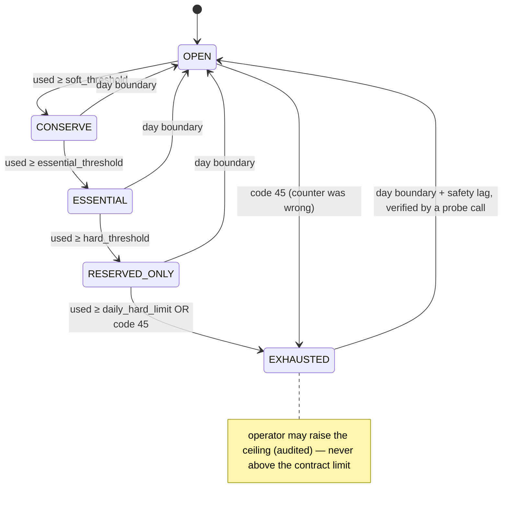
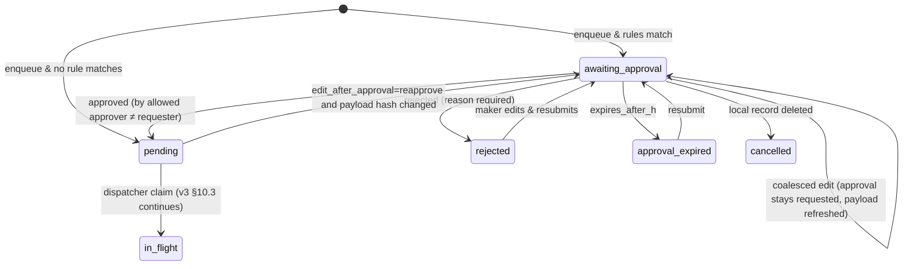
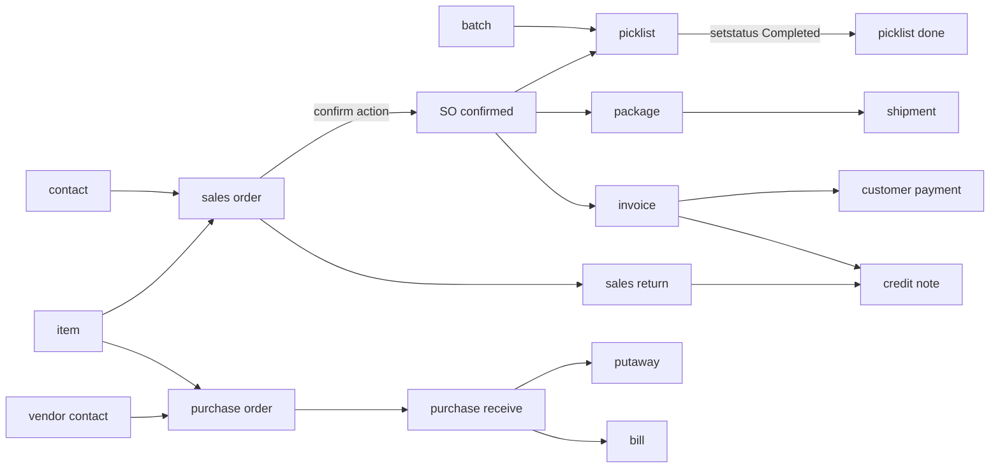
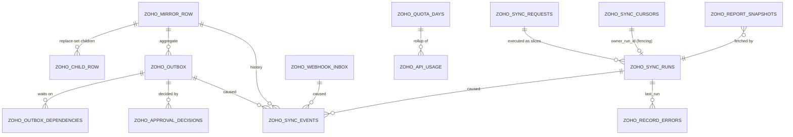

# Zoho Sync Platform — Delta v3.1

**What changes relative to [zoho-sync-platform-architecture.md](zoho-sync-platform-architecture.md) (v3, 2026‑09‑15):**
two-way sync for items, contacts, batches and credit returns; Zoho Inventory
modules; a hard **45,000 calls/day governor** that suspends and resumes
work; on-demand scopes (today / range / single / group); a maker-checker
**approval gate** before push; report pulls; a record-level sync event log
with retention policies; the mixin catalogue; and an optimisation review of
v3 itself.

| | |
|---|---|
| **Status** | design, not implemented |
| **Main doc** | updated in place where a v3 statement became wrong; each updated section carries a `v3.1` note pointing here |
| **Markers** | **[verify]** = not provable from `docs/zoho-docs-md/` or the Zoho pages fetched for this delta (§2); **⚠ scope** = deviates from an established doctrine |

---

## Table of contents

0. [Change summary](#0-change-summary)
1. [Scope: modules, directions, Books vs Inventory routing](#1-scope)
2. [New facts (fetched from Zoho's public docs)](#2-new-facts)
3. [Daily quota governor (replaces G2 + G3 + G4)](#3-daily-quota-governor)
4. [Sync scopes: today, range, single, group, push-all](#4-sync-scopes)
5. [Approval gate (maker–checker) before push](#5-approval-gate)
6. [Push expansion per module & Inventory document chains](#6-push-expansion)
7. [Reports](#7-reports)
8. [Record-level sync event log & retention policies](#8-sync-event-log--retention)
9. [The sync tables — complete picture](#9-the-sync-tables)
10. [Do we need sync mixins?](#10-mixins)
11. [Review of v3: what is improved or simplified](#11-review-of-v3)
12. [Budget model at 45,000/day](#12-budget-model-at-45000day)
13. [Config knob additions](#13-config-knob-additions)
14. [Migration plan delta](#14-migration-plan-delta)
15. [Invariants delta](#15-invariants-delta)
16. [Documentation delta](#16-documentation-delta)

---

## 0. Change summary

| Δ | Area | v3 said | v3.1 says | Why | v3 sections touched |
|---|---|---|---|---|---|
| Δ1 | Directions | items push narrow/optional; contacts owned fields; batches pull-only; credit notes "only if a local flow" | **items, contacts, batches, credit notes, sales returns, sales orders, purchase orders, purchase receives, bills, picklists, putaways, transfer orders, inventory adjustments are push-capable**; every module still has a per-field owner | new requirement | §1.2, §10.4 |
| Δ2 | APIs | Books only; Inventory "not vendored" | **Books + Inventory**, one *canonical API per resource* declared in the spec; reads and writes may route to different APIs | Inventory-only resources (picklists, putaways, batches, receives) and warehouse/bin/batch fields | §2.3, §6, §8.3 |
| Δ3 | Budget gates | three gates: G2 rate bucket, G3 daily quota (shares of `plan_daily_limit=10,000`), G4 concurrency | **one Governor** (single atomic Lua call) with a **hard configured daily ceiling (45,000)**, soft thresholds, pacing, suspension and automatic resume at the next quota day | user limit; one Redis round-trip instead of three | §5.1–§5.3, §7.3, §8.6 |
| Δ4 | Suspension | slices `yielded(quota)` and "planner defers" | durable **suspension records** for every kind of work (slices, sync requests, outbox, inbox, coalesced refreshes) and a **resume protocol** with ordering and ramp-up | resume "whatever was going" | §7.5, §10.7 |
| Δ5 | On-demand sync | operator "run once" with L4 overrides | first-class **sync requests** with scopes (`today`, `date_range`, `ids`, `filter`, `all`, `push_all`), per-module default strategy per scope, dry-run cost estimate, persisted in `zoho_sync_requests` | requirement | §7.1 L4, §14.5 |
| Δ6 | Approval | — | **maker–checker gate** before a command becomes claimable; per module/operation/rule; four-eyes; optional mapping to Zoho's native submit/approve endpoints | requirement | §10.3 |
| Δ7 | Reports | "not synced — read-through with cache" (v3 inherited) | **report lane** writing snapshots; local computation preferred when mirrors suffice; never a request-path passthrough | requirement; N11 | new |
| Δ8 | Record log | `zoho_record_errors` (failures only) + `zoho_queue_logs` narrowed | **`zoho_sync_events`**: one row per record outcome (inserted/updated/tombstoned/pushed/approved…) with changed-field diff, partitioned, **retention policy per module × event class**, archived to ClickHouse via CDC | requirement | §13.2, §13.3 |
| Δ9 | Mixins | "additions to `ZohoEntityMixin`" | split into **five composable mixins** + child-table mixin; behaviour stays in services | requirement; the old mixin mixes concerns | §13.1 |
| Δ10 | Webhooks | signature/retries [verify] | **verified**: `X-Zoho-Webhook-Signature`, HMAC-SHA256, Base64, over sorted query/form pairs + raw JSON; 5 retries by default (configurable up to 20); connect 5 s / read 10 s | fetched docs (§2.3) | §11 |
| Δ11 | Fetch cost | detail GET per changed id (bulk only for items) | **list-by-ids** where documented (`salesorder_ids` ≤ 200, `batch_ids`, `/itemdetails`) and **bulk actions** (bulk confirm/approve/submit/active) to cut calls | optimisation | §8.2, §10.6 |
| Δ12 | New gates | — | **Write-pressure gate** (Debezium slot lag / WAL) and **broker-depth gate** feed the planner | mass applies and pushes must not starve CDC or Celery | §5.1 |
| Δ13 | Fairness | priority classes only | **weighted fair scheduling across modules** inside a priority class | one module can't eat the day | §8.6 |

---

## 1. Scope

### 1.1 Module × direction matrix (replaces v3 §1.2)

"Push" always means **owned fields only** (v1 §7 write contract) — Zoho-computed
fields (totals, balances, stock, numbers when auto-generated, status reached
by Zoho workflows) are never pushed, even for fully two-way modules.

| Module | Canonical API (read / write) | Ownership | Pull | Push operations | Identity for create (§6.2) | Approval gate default |
|---|---|---|---|---|---|---|
| organizations, currencies, taxes (+groups), locations/warehouses, users, units | Books / — | O1 | ✅ | ❌ | — | — |
| **items** (+item locations, item groups later) | Inventory [verify fields parity] / Books or Inventory | O3 | ✅ + stock lane | create, update, active/inactive, custom fields | X-Upsert `cf_middleware_id` (Books doc) / `sku` fallback | configurable (off) |
| **batches** | Inventory / Inventory | O3 | ✅ lane P | create, update, active/inactive (single + bulk), delete (only if no transactions) | lookup `(item_id, batch_number)` — no upsert documented | off |
| **contacts** (+persons, addresses) | Books / Books | O3 | ✅ | create, update, delete, active/inactive, persons CRUD, addresses CRUD, custom fields, portal/reminder toggles | X-Upsert `cf_middleware_id` | **on for create** (new customer onboarding) |
| estimates | Books / Books | O2 | ✅ | create, update, status sent/accepted/declined, submit/approve | X-Upsert | configurable |
| **sales orders** | Inventory / Inventory | O2 | ✅ | create, update, confirm, void, submit/approve (single + bulk) | lookup `reference_number` [verify]; X-Upsert documented in Books `sales-order.md` | configurable |
| invoices | Books / Books | O2 | ✅ | create, update, sent, void, draft | reference lookup [verify] | configurable |
| customer payments | Books / Books | O2 | ✅ | create, update, delete, refunds | X-Upsert | on above an amount rule |
| **credit notes** ("credit returns", accounting side) | Books / Books | O2 | ✅ | create, update, void, open, apply to invoice, refund, submit/approve | X-Upsert | **on** |
| **sales returns** ("credit returns", stock side) [verify which one you mean — likely both] | Inventory / Inventory | O2 | ✅ | create, update, receive [verify endpoints] | lookup | **on** |
| purchase orders | Inventory / Inventory | O2 | ✅ | create, update, issue/cancel [verify], submit/approve | X-Upsert (Books doc) | on |
| **purchase receives** | Inventory / Inventory | O2 | ✅ | create, update, set received / in-transit (single + bulk), submit/approve/reject | lookup `(purchaseorder_id, receive number)` | configurable |
| **bills** ("purchase bills") | Books or Inventory (same org records) / one of them | O2 | ✅ | create, update, open, void, submit/approve/final/reject | X-Upsert (Books doc) | on |
| **picklists** | Inventory / Inventory | O2 | ✅ | create, update, delete, set status (`YetToStart/InProgress/OnHold/Completed`, single + bulk), advanced tracking | lookup (no upsert documented) | off |
| **putaways** | Inventory / Inventory | O2 | ✅ | create, update, delete | lookup (no upsert documented) | off |
| packages, shipment orders, transfer orders, inventory adjustments, move orders, stock counts | Inventory / Inventory | O2 | ✅ | create/update/status per module [verify each page before enabling] | lookup | adjustments **on** |
| **reports** | Books/Inventory / — | derived | ✅ report lane (§7) | ❌ | — | — |

### 1.2 Books vs Inventory: one canonical API per resource

Zoho Books and Zoho Inventory run on the **same organization**; many
resources (items, contacts, sales orders, bills, credit notes) are reachable
through both APIs. Syncing the same resource through both would double the
quota spend and create two apply streams for one row.

| Rule | Detail |
|---|---|
| One spec per resource | `ZohoModuleSpec.routes = {"read": Api.INVENTORY, "write": Api.BOOKS, "action:confirm": Api.INVENTORY}` — per operation, not per module |
| Same identity | a resource's `zoho_id` is assumed identical across both APIs **[verify with one item and one sales order]**; if not, the spec declares a single API for both read and write |
| Choosing the read API | the API whose detail document is **richest for our needs** (items/sales orders/receives → Inventory: warehouses, bins, batches, serials; contacts/invoices/credit notes/payments → Books) |
| Choosing the write API | the API whose write contract is documented for the fields we own, and which offers `X-Unique-Identifier` upsert where possible |
| Webhooks | configure the workflow rule in **one** product per resource, matching the read API |
| Quota | a resource's calls count against the governor pool of the API they hit (§3.4) |
| Registry validator | fails if two specs claim the same `(resource, read)` route |

---

## 2. New facts

Fetched 2026‑09‑15 from Zoho's public documentation. They should be vendored
into `docs/zoho-docs-md/` (as Markdown, like the Books pages) so the
guardrail "never invent an endpoint" keeps working offline.

### 2.1 Zoho Inventory API — general

| Fact | Source | Consequence |
|---|---|---|
| Root `https://www.zohoapis.{dc}/inventory/v1`; India `zohoapis.in` | Inventory API introduction | G0 transport gets a second base URL (already in `conf.py:152`, unused) |
| 100 req/min per org; daily Free 1,000 · Standard 2,000 · Professional 5,000 · Premium 10,000 · Enterprise 10,000; concurrency 5 free / 10 paid (soft); 429 codes **44 / 45 / 1070** — the same structure as Books | Inventory API introduction | one governor model covers both |
| **Your 45,000/day is not a published plan value** → it is an add-on/custom limit. Whether it is **per product (Books and Inventory separately) or shared** is unknown **[verify with Zoho account manager / by observing code 45]** | — | governor supports pools: `shared` or `per_api` (§3.4); default `shared` (safe) |
| Modules include Sales Orders, Purchase Orders, Purchase Receives, Bills, Packages, Shipment Orders, Delivery Challans, **Picklists, Putaways**, Transfer Orders, Move Orders, Inventory Adjustments, **Batches**, Serial Numbers, Bin Locations, Price Lists, Stock Counts, Sales Returns, Purchase Returns, Credit Notes, Vendor Credits, Landed Costs, Replenishment | Inventory API introduction | §1.1 |

### 2.2 Inventory endpoints relevant to this delta

| Resource | Endpoints (from docs) | List filters / sort | Upsert header | Notes |
|---|---|---|---|---|
| Picklists | `POST/GET/DELETE /picklists`, `GET/PUT/DELETE /picklists/{id}`, `POST /picklists/{id}/setstatus`, `POST /picklists/setstatus` (bulk), `PUT/GET /picklists/{id}/advancedtrackingdetails`, `GET /picklists/searchso`, `/searchsolineitems`, `/searchprlineitems` | `date`, `date_start`, `date_end`, `salesorder_number*`, `picklist_number*`, `item_id`, `location_id`, `customer_id`, `assignee_id`, `filter_by`, `search_text`, `sort_column` + `sort_order` A/D | not documented | statuses `YetToStart, InProgress, OnHold, Completed`; line items carry `storages`, `batches`, `serial_numbers` |
| Putaways | `POST/GET /putaways`, `GET/PUT/DELETE /putaways/{id}`, attachments, `GET /settings/putaways` | `date`, `warehouse_id`, `location_id`, `putaway_number`, `filter_by`, `sort_column`, `sort_order` | not documented | line items: `batch_id` or new batch, serials, `storages` (bins); `ignore_auto_number_generation` |
| Batches | `POST/GET/DELETE /items/batches`, `GET/PUT/DELETE /items/batches/{id}`, `POST /items/batches/{id}/active|inactive`, `POST /items/batches/active|inactive` (bulk) | `item_id` **required**, `batch_ids`, `warehouse_id`, `location_id`, `include_empty_batches`, `status`, `filter_by`, `search_text`, `sort_column`, `sort_order` | not documented | cannot delete with transactions; fields `batch_number`, `manufacturer_batch_number`, `manufactured_date`, `expiry_date`, `balance_quantity`, `batch_custom_fields` |
| Purchase receives | `POST/GET/DELETE(≤25) /purchasereceives`, `GET/PUT/DELETE /purchasereceives/{id}`, `/submit`, `/approve`, `/reject`, `/setstatusasreceived`, `/setstatusasintransit` (+ bulk) | `status`, `vendor_id`, `location_id`, `warehouse_id`, `receive_date_*`, `search_text`, **`sort_column` includes `last_modified_time`** | not documented | line items: `batches`, `serial_numbers`, `storages`, `bill_line_items` |
| Sales orders | `POST/GET/DELETE /salesorders`, `GET/PUT/DELETE /salesorders/{id}`, `/status/confirmed`, `/status/void`, `POST /salesorders/status/confirmed` (bulk), `/submit`, `/approve`, `/approve/final`, `/reject`, bulk submit/approve | **`salesorder_ids`** (comma-separated, ≤ 200); other filters not shown on the Inventory page — the Books page documents `sort_column=last_modified_time` and a `last_modified_time` param | Books page: yes | list-by-ids enables cheap group refresh (Δ11) |
| Bills | `POST/GET /bills`, `GET/PUT/DELETE /bills/{id}`, `PUT /bill/{id}/customfields`, `/status/open`, `/status/void`, `/submit`, `/approve`, `/approve/final`, `/reject`, bulk submit/approve | page/per_page shown; Books page documents `last_modified_time` filter | Books page: yes | `receive_line_items` maps bills to receives |

### 2.3 Webhooks (resolves v3 V9 partially)

| Fact | Source |
|---|---|
| Header `X-Zoho-Webhook-Signature` | Zoho Books help: Webhooks |
| Algorithm: HMAC-SHA256 with the secret token, **Base64** encoded | same |
| String to sign: query-string and form key–value pairs **sorted by key**, concatenated with no separators, then the **raw JSON body appended** | same |
| Secret token: alphanumeric, 12–50 chars, cannot be viewed or edited after creation | same |
| Failure = any non-2xx (including 3xx), connect timeout **5 s**, read timeout **10 s** | same |
| Retries: **5 by default**, configurable up to 20 with fixed / additive / multiplicative backoff | same |
| Webhooks per day are **plan-limited** | same |

Consequences: the ingress must answer well under 10 s (v3 target p99 < 200 ms
holds); returning 503 when the inbox insert fails is correct because Zoho
retries; the verifier must sign **raw bytes + sorted params** exactly as
above and still be locked to a captured fixture (Inventory's behaviour
**[verify]** it matches Books); webhooks remain hints (daily webhook caps
mean silence ≠ no change).

### 2.4 Reports

Zoho's public API references for Books v3 and Inventory v1 do **not**
document report endpoints in the pages checked; third-party directories list
paths like `/reports/profitandloss`. Treat every report endpoint as
**[verify — undocumented, may change without notice]** and isolate it behind
a `ReportSpec` (§7) whose contract test runs nightly.

---

## 3. Daily quota governor

Replaces v3 gates **G2 (rate bucket), G3 (daily quota) and G4 (concurrency)**
with one component, `ZohoGovernor` (`app/modules/zoho/core/governor.py` +
`lua/governor_acquire.lua`). Every Zoho call — pull, push, webhook refresh,
reports, operator actions — acquires from it. There is no call path that
skips it.

### 3.1 Why one component

| v3 | Problem | v3.1 |
|---|---|---|
| three Redis round-trips per call (bucket, quota, semaphore) | latency + partial failure between steps (quota reserved, then rate refused → leaked reservation) | **one Lua script** checks day ceiling, thresholds, minute rate, concurrency and priority reserve atomically, returns a lease |
| shares as soft fractions of a 10,000 plan | no hard stop; no resume semantics | **hard ceiling** (`daily_hard_limit`, e.g. 45,000) plus thresholds that progressively restrict priorities, and a durable suspend/resume protocol |

### 3.2 Counting rules

| Rule | Detail |
|---|---|
| What counts | every HTTP attempt **sent** to `zohoapis.*` (retries count; 429 responses count — Zoho's own counter is attempts **[verify 429s count]**) |
| What doesn't | OAuth calls to `accounts.zoho.*` (separate throttle, G1); calls refused locally before sending |
| When it counts | reserve on acquire (so concurrent workers can't overshoot), **commit** when the request is sent, **release** if refused before sending |
| Day boundary | `quota_day_timezone` (default `Asia/Kolkata`) and `quota_day_start` (default `00:00`) **[verify Zoho's actual reset]**; until verified, `quota_day_safety_lag_min` (default 30) delays resume past the boundary |
| Authority | Zoho's **code 45** overrides our counter: on the first code 45 the pool is marked `EXHAUSTED` regardless of the count, and the counter is corrected upward (`observed_ceiling`) |
| Durability | Redis key `zoho:gov:{pool}:{day}` (hash: `used`, `reserved`, per-priority counts); every planner tick (30 s) flushes deltas into PG `zoho_quota_days` (source of truth after a Redis loss) |
| Redis loss | load `used` from PG + a safety margin of `ticks_since_flush × max_calls_per_tick`; run in `RESERVED_ONLY` mode until the next flush confirms |

### 3.3 Thresholds and governor states

All thresholds are **absolute numbers or percentages of `daily_hard_limit`**,
configurable per pool.

| State | Entered when `used ≥` | Allowed priorities | Effect on work |
|---|---|---|---|
| `OPEN` | — | all | normal |
| `CONSERVE` | `soft_threshold` (default 80 % = 36,000) | INTERACTIVE, PUSH, REFRESH, INCREMENTAL | reconcile, backfill and report lanes **suspend** |
| `ESSENTIAL` | `essential_threshold` (default 93 % = 41,850) | INTERACTIVE, PUSH (approved commands only), REFRESH for webhook ids | change feeds suspend; sync requests suspend |
| `RESERVED_ONLY` | `hard_threshold` (default 97.8 % = **44,000**, your "stop at threshold") | INTERACTIVE and commands flagged `critical` (e.g. invoice for a delivery in progress) — up to `reserve_calls` (default 1,000) | everything else suspended |
| `EXHAUSTED` | `daily_hard_limit` (45,000) **or** Zoho code 45 | none | all Zoho calls refused locally (`QUOTA_EXHAUSTED`) |
| back to `OPEN` | quota day boundary (+ safety lag) | — | **resume protocol** (§3.6) |

If you want the literal "stop everything at 45,000", set
`hard_threshold = daily_hard_limit` and `reserve_calls = 0`; the
defaults keep a small reserve so a field agent can still get an invoice
number at 23:00.



### 3.4 Pools

| Setting | Meaning |
|---|---|
| `quota_pools = {"zoho": {"apis": ["books","inventory"], "daily_hard_limit": 45000}}` | **default: shared** — safe if Zoho counts both products together |
| `quota_pools = {"books": {...: 45000}, "inventory": {...: 45000}}` | only after Phase‑0 proves separate counters |
| per-minute limit and concurrency | always per organization across both APIs (both docs state "per organization") → one minute bucket and one concurrency set per org, independent of pool layout |

### 3.5 Pacing — not spending 45,000 by 11:00

A hard ceiling alone lets a morning backfill starve the evening. The
governor applies an **allowance curve**: at time *t* of the quota day the
cumulative background allowance is `A(t) = hard_threshold × curve(t)`.
Background priorities (INCREMENTAL, RECONCILE, report, sync requests) may
only acquire while `used_background < A(t) + carry`; PUSH, REFRESH and
INTERACTIVE ignore the curve (they only obey states).

| `pacing_curve` | `curve(t)` | Use |
|---|---|---|
| `none` | 1 | small modules / tests |
| `linear` | fraction of day elapsed | 24 h operations |
| `business` (default) | 70 % of the allowance spread over `business_hours` (e.g. 07:00–21:00), 30 % over the night | FSA/DLP daytime usage, heavy reconcile at night |
| `custom` | list of `(hour, cumulative_pct)` points | seasonal / month-end |

`carry` (default 5 % of the day) lets short bursts through. The planner
reads `A(t)` before enqueuing and reports `deferred(pacing)`.

Inside a priority class, work is shared by **weighted fair queuing across
modules** (`module_weight`, default 1; e.g. items stock 3, invoices 2,
reports 0.5), so a large reconcile of one module can't consume a class
alone (Δ13).

### 3.6 Suspension and resume — "continue whatever was going"

Every unit of work that the governor refuses records **where it stopped**
in Postgres, never only in Redis or Celery.

| Work type | What is persisted on suspension | Resume action at day boundary |
|---|---|---|
| lane slice (change feed, window, reconcile, stock, fan-out, report) | run row `status=suspended`, `stop_reason=quota_state:<state>`; cursor (`next_page`, `scan_id`, watermark) untouched | planner re-enqueues the lane from its cursor; reconcile resumes the **same** `scan_id` if younger than `scan_max_age_h` (default 36), else restarts the scan (seen-set would be stale) |
| sync request (§4) | request `status=suspended`, per-scope progress (`ids_done`, `page`, `window`) | request resumed first-in-first-out within its priority |
| outbox command | `status` unchanged (`pending`/`retry_scheduled`), `next_attempt_at = day_start`, `throttle_deferrals + 1` (not an attempt) | normal claim ordering |
| webhook inbox rows | stay `received`; drain stops | drain resumes oldest first; duplicate ids coalesce |
| coalesced refresh set | Redis set kept (TTL 48 h) **and** mirrored to `zoho_refresh_backlog` on suspension | flushed in bulk chunks |
| record-error retries | `next_retry_at = day_start` | normal |
| operator interactive request | refused with `503 zoho_quota_exhausted` + `resets_at` | — |

**Resume ordering** (first minutes of the new day), each step bounded by
`resume_ramp` (default: 20 % of the minute rate for 10 min, then normal):

1. health probe call (`GET /organizations`) — confirms Zoho accepts calls (if code 45 again, stay `EXHAUSTED`, retry every 15 min, alert);
2. outbox commands deferred by quota (oldest first; they carry user intent);
3. webhook inbox backlog → coalesced refreshes;
4. suspended change-feed/window slices (freshness);
5. suspended sync requests;
6. reconcile / backfill / reports — subject to the pacing curve.

No catch-up of *missed schedules*: a lane that was due 40 times while
suspended runs once (its cursor already covers the gap).

### 3.7 Acquire (atomic)

```lua
-- KEYS: day hash, minute bucket, inflight zset, state hash
-- ARGV: now_ms, priority, module, cost, limits(json), lease_ttl_ms, lease_id
-- 1. state gate: priority allowed in current state?            -> {0,"state",state}
-- 2. day gate:   used+reserved+cost <= threshold for priority?  -> {0,"quota",resets_at}
-- 3. pacing:     background && used_bg+cost > allowance(now)?   -> {0,"pacing",retry_at}
-- 4. rate:       token bucket (refill, capacity, priority reserve) -> {0,"rate",wait_ms}
-- 5. concurrency: purge expired leases; ZCARD < limit?           -> {0,"concurrency",wait_ms}
-- 6. commit reservation: HINCRBY reserved; ZADD lease; bucket -= 1
-- 7. derive state transitions from new totals (write state hash)
return {1, lease_id, state}
-- release(lease_id, sent: bool): ZREM lease; HINCRBY reserved -cost; if sent then HINCRBY used +cost
```

The script is loaded with `SCRIPT LOAD` and called via `EVALSHA` (fallback
`EVAL` on `NOSCRIPT`), per the master-prompt rate-limiting doctrine. Because
the redis-py client retries on timeout (v3 N13), `acquire` is **idempotent
by `lease_id`** (a replay finds the existing lease and returns it).

### 3.8 Failure modes

| Failure | Behaviour |
|---|---|
| Redis down | local per-process fallback: minute rate `limit / expected_processes`, concurrency `limit / expected_processes`, day counter seeded from PG + safety margin, state forced to at least `ESSENTIAL` |
| Postgres down | Redis continues counting; flush retried; if both down, only INTERACTIVE with local fallback |
| Clock skew between workers | day key computed from Redis `TIME`, not the worker clock |
| Counter drift vs Zoho | code 45 correction (§3.2); nightly reconciliation compares `zoho_quota_days.used` with observed 429s, emits `zoho_quota_counter_drift` |
| Operator raises ceiling | `PUT /admin/governor/{pool}` with reason; audited; bounded by `contract_daily_limit` (env, not DB) |

### 3.9 Governor observability

| Metric / event | Alert |
|---|---|
| `zoho_quota_used{pool,priority}`, `zoho_quota_state{pool}` (0 OPEN … 4 EXHAUSTED), `zoho_quota_allowance{pool}`, `zoho_quota_deferred_total{pool,reason,module}` | `ZohoQuotaConserve` (info → Slack), `ZohoQuotaEssential` (warning), `ZohoQuotaReservedOnly` (critical), `ZohoQuotaExhausted` (critical) |
| `zoho_quota_projected_end_of_day{pool}` (linear extrapolation of the last hour) | `ZohoQuotaBurnFast` when projection > `hard_threshold` before 18:00 |
| `zoho.governor.state_changed {from,to,used,threshold}` (INFO/WARNING/CRITICAL by target state) | log-based |
| `zoho.governor.resumed {pool, suspended_items: {slices, requests, commands, inbox}}` | — |
| admin `GET /api/zoho/admin/governor` | state, used, reserved, thresholds, allowance curve, top 10 modules by spend today, suspended work counts, `resets_at` |

---

## 4. Sync scopes

### 4.1 The request model

An on-demand sync is a **sync request**: a persisted, auditable, resumable
unit that the planner executes as slices through the same gates as
scheduled lanes. It replaces v3's L4 "run once" overrides.

| Field | Values |
|---|---|
| `module` | any registered module |
| `direction` | `pull` · `push` |
| `scope` | `today` · `date_range{from,to}` · `ids{zoho_ids[] ≤ ids_max}` · `local_ids{ids[] ≤ ids_max}` · `filter{status, customer_id, location_id, …}` · `all` · `push_all{states[]}` |
| `strategy` | `auto` (use the module's default for this scope) or an explicit allowed strategy (§4.3) |
| `mode` | `apply` · `dry_run` (estimate only) |
| `budget` | `max_api_calls` (required for `all`/`push_all`), `priority` (`REFRESH` for ids, `INCREMENTAL` for today/range, `RECONCILE` for all) |
| `options` | `force_detail` (ignore list-row diff), `include_inactive`, `respect_approval` (push, always true unless role `zoho_approver`) |
| lifecycle | `estimating → awaiting_confirmation (if estimate > confirm_threshold) → queued → running ⇄ suspended → succeeded / partially_failed / failed / cancelled` |

### 4.2 What "today" means per module

"Today" is the **quota-day date in `org_timezone`**. Zoho does not offer the
same filters for every resource, so the meaning is explicit per strategy.

| Strategy | Catches | Misses | Cost |
|---|---|---|---|
| `modified_since_midnight` (needs a verified modified filter or modified sort) | anything created **or edited** today, regardless of document date | nothing | ⌈changed/200⌉ + changed details |
| `document_date_today` (`date=today` / `date_start=date_end=today`) | documents **dated** today | edits today to documents dated earlier; back-dated creates | ⌈docs today/200⌉ + changed |
| `created_today` (sort `created_time` D, stop at yesterday) | new records | edits to old records | ≈ 1 page + details |
| `list_diff_all` | anything whose list row changed (if list rows carry `last_modified_time` [verify]) | nothing except deletes | ⌈N/200⌉ + changed |
| `webhook_window` (inbox rows received today → refresh) | everything Zoho notified today | anything without a webhook | refreshes only |

### 4.3 Default strategy per scope (configurable per module)

Spec (L2) declares allowed strategies and defaults; operators change the
default at L3 (`zoho.<module>.scopes.<scope>.strategy`). Strategies whose
capability is unverified are rejected by the validator.

| Module | `today` default | `today` allowed | `date_range` default | `ids` default | `all` default |
|---|---|---|---|---|---|
| contacts | `modified_since_midnight` (sort by `last_modified_time`, documented) | + `created_today`, `webhook_window` | `modified_since` | `detail` (≤ 10) / `detail_concurrent` | reconcile scan |
| items | `list_diff_all` [verify list rows] | + `webhook_window` | — (no date) | **bulk `/itemdetails`** | reconcile scan (`filter_by=Status.All`) |
| batches | per item: `item_changed_today → list batches` | + `ids` via `batch_ids` | — | **list by `batch_ids`** (item_id required) | fan-out over batch-tracked items |
| sales orders | `modified_since_midnight` if verified, else `document_date_today` + `webhook_window` | both | `document_date_range` | **list by `salesorder_ids` (≤ 200 per call)** | reconcile |
| invoices, estimates, credit notes, payments | `document_date_today` + `webhook_window` | + `modified_since_midnight` once verified | `document_date_range` | `detail` | reconcile |
| purchase receives | `modified_since_midnight` (sort `last_modified_time` documented) | + `document_date_today` (`receive_date`) | `receive_date_range` | `detail` | reconcile |
| picklists, putaways | `document_date_today` (`date`) | + `webhook_window` | `date_start/date_end` | `detail` | reconcile |
| bills | `modified_since_midnight` (Books doc lists `last_modified_time` filter; semantics [verify]) | + `document_date_today` | `date_range` | `detail` | reconcile |
| reports | `report_period=today` | — | `report_period=range` | — | — |

### 4.4 Group and single-record fetch optimisation (Δ11)

| Resource capability | Calls for 500 ids | Used for |
|---|---|---|
| list-by-ids (`salesorder_ids`, `batch_ids`) | ⌈500/200⌉ = 3 (list rows; + details only if the list row lacks needed fields) | sales orders, batches |
| bulk detail (`/itemdetails?item_ids=`) | ⌈500/chunk⌉ [verify chunk] | items |
| detail GET per id | 500 | everything else — `ids_max` default 200, larger groups must use `filter`/`date_range` |
| filter that matches the group (e.g. `customer_id`) | ⌈matches/200⌉ + details | "all invoices of customer X" |

The request estimator picks the cheapest applicable path and shows it in the
dry run.

### 4.5 Push scopes

| Scope | Selects local rows | Guard |
|---|---|---|
| `local_ids` | explicit rows | per-row approval rules still apply |
| `push_all{states}` (e.g. `never_pushed`, `failed`, `dead`, `conflict_resolved`) | all rows of the module in those states | mandatory dry run; confirmation if > `confirm_threshold` (default 200); enqueues **commands in batches of 500** inside short transactions; respects approval gate (commands land in `awaiting_approval` when required) |
| `resync_zoho_from_local{fields}` (force) | rows in state `synced` | role `zoho_integration_admin` + reason; builds update commands for owned fields only; dry run shows field-level diff vs mirror |

### 4.6 Dry-run estimate

`POST …/sync-requests {mode:"dry_run"}` returns: strategy chosen and why,
estimated pages and detail calls (from mirror counts, `zoho_api_usage`
history, and for `today` the last 7 days' change rate), estimated calls vs
**remaining governor allowance** and the state the pool would reach, and for
push the command count by operation and how many need approval.

### 4.7 API

| Method & path | Effect |
|---|---|
| `POST /api/zoho/admin/modules/{m}/sync-requests` | create (dry run or apply) |
| `POST /api/zoho/admin/sync-requests/{id}/confirm` · `/cancel` · `/resume` | lifecycle |
| `GET /api/zoho/admin/sync-requests?module&status` · `/{id}` | progress per scope, calls spent, events link (§8) |
| `POST /api/zoho/modules/{m}/records/{local_id}/sync` | app-facing single-record *pull refresh* or *push retry* (role-checked, priority REFRESH/PUSH, rate-limited per user) |

---

## 5. Approval gate

### 5.1 Pattern

**Maker–checker (four-eyes)**: the maker's change is committed locally and
its outbox command is created in `awaiting_approval`; it is invisible to the
dispatcher until a checker with the right role approves. The local record is
fully usable in the app (with a visible "Pending approval" state). This is a
gate *in front of* the outbox — not a second queue.

### 5.2 Configuration (`zoho.<module>.push.approval.*`, validated)

| Knob | Example | Meaning |
|---|---|---|
| `enabled` | `true` | module uses the gate |
| `operations` | `["create","delete","action:void"]` | which command operations need approval |
| `rules` | `[{"when":"always"}]` · `[{"field":"total","op":">","value":50000}]` · `[{"field":"is_new_customer","op":"==","value":true}]` | evaluated on the command payload + local row at enqueue time; any match → approval required. Rules are declarative data (no code in settings) |
| `approver_groups` | `["zoho_approver_sales"]` | Authentik groups allowed to approve this module |
| `four_eyes` | `true` | requester cannot approve their own command |
| `expires_after_h` | `72` | unapproved commands → `approval_expired` (local row flagged, requester notified) |
| `edit_after_approval` | `reapprove` · `allow_owned_minor` | an edit to an approved-but-not-yet-sent command either returns it to `awaiting_approval` (default) or is allowed when only whitelisted fields change |
| `zoho_native_approval` | `none` · `submit_after_push` · `approve_after_push` | also drive Zoho's own workflow (`/submit`, `/approve` exist for sales orders, purchase receives, bills, estimates, credit notes) after the create succeeds |
| `critical_bypass` | `false` | allow `critical` commands (§3.3) to skip the gate — only for modules where delivery would otherwise be blocked; audited |

### 5.3 States (extends v3 §10.3)



### 5.4 Interactions

| Situation | Behaviour |
|---|---|
| Updates made while a create awaits approval | coalesced into the create's payload; one approval covers the merged create (the approver sees the current payload and the change history) |
| Estimate for a contact whose create awaits approval | estimate command gets `blocked_dependency` (visible); approving the contact unblocks it; rejecting the contact **rejects dependents** with reason `dependency_rejected` |
| Local delete of a never-approved record | commands cancelled, no Zoho call |
| Approval of a command whose data became invalid (e.g. item deactivated locally) | dispatcher precheck still runs; Zoho validation errors → `dead` as usual |
| Bulk approve | `POST /approvals/approve {command_ids[] ≤ 200}` — each checked individually for four-eyes and group; partial success reported |
| Governor `ESSENTIAL` state | approved commands still dispatch (PUSH allowed); awaiting commands obviously don't |
| Audit | every decision: `zoho_approval_decisions` row + `activity` entry + `zoho_sync_events` (`approval_requested/approved/rejected/expired`) |
| Notification | CDC on `zoho_outbox.status` → Soketi consumer → approver channel (`private-approvals.{group}`) and requester channel; optional email via the emails module |

### 5.5 Tables

| Table / column | Purpose |
|---|---|
| `zoho_outbox.approval_status` (`not_required · awaiting · approved · rejected · expired`), `approval_required_reason jsonb` (matched rules), `approval_due_at`, `payload_hash` | gate state on the command |
| `zoho_approval_decisions(id, command_id, decision, decided_by, decided_at, reason, payload_hash_at_decision, rules_snapshot jsonb, ip)` | immutable decision log (never updated) |
| mirror row `sync_state = 'awaiting_approval'` (added to the v3 enum) | app UI badge |

---

## 6. Push expansion

### 6.1 Field ownership per newly pushed module

| Module | App owns (pushed) | Zoho owns (never pushed) | Sub-resource writes preferred |
|---|---|---|---|
| items | name, sku, description, rate, purchase_rate, unit, hsn_or_sac, tax preferences, product_type, item_type, reorder_level, vendor_id, account ids, custom fields, active/inactive, batch/serial tracking flags on create **[verify updatable]** | stock (`stock_on_hand`, available, per location), `item_id`, computed accounting | `PUT /item/{id}/customfields`, `POST /items/{id}/active|inactive` |
| contacts | everything in the documented create/update arguments: names, company, type, GST/tax fields, payment terms, currency, price book, credit limit, addresses, contact persons, custom fields, portal & reminder flags, notes, owner | receivables/payables, unused credits, `has_transaction`, portal status results | contact persons endpoints; `/contacts/{id}/address/{address_id}`; `/active|inactive`; custom-field upsert |
| batches | batch_number, manufacturer_batch_number, manufactured_date, expiry_date, custom fields, active/inactive, location association on create | `balance_quantity` (moves only through transactions) | bulk active/inactive |
| credit notes | customer, line items (with batch/serial where required), reference, notes, reason, place of supply/GST | totals, balance, applied amounts computed | `/status/void`, `/status/open`, apply-to-invoice, refunds |
| sales returns | sales order link, line items, reason, warehouse | receive status | [verify endpoints] |
| sales orders | customer, dates, line items (item, qty, rate, discount, tax, warehouse), reference, notes, salesperson, custom fields | number (unless `ignore_auto_number_generation`), totals, invoiced/shipped status | `/status/confirmed`, `/status/void`, bulk confirm |
| purchase orders / receives / bills | vendor, lines, warehouse, receive quantities with `batches`/`serial_numbers`/`storages`, bill ↔ receive mapping | totals, billed status | receive `setstatusasreceived`, bill `/status/open` |
| picklists | sales-order lines to pick, assignee, location, storages/batches picked | — | `POST /picklists/{id}/setstatus`, bulk setstatus, advanced tracking details |
| putaways | receive lines, bins (`storages`), batch refs | — | — |
| inventory adjustments, transfer orders | lines, reason, locations | — | [verify each page] |

### 6.2 Identity for creates without an upsert header

Picklists, putaways, batches, purchase receives and (per vendored docs)
invoices document no `X-Unique-Identifier`. v3 §10.4's `REFERENCE_LOOKUP` /
`NATURAL_KEY` apply, refined:

| Module | Correlation written on create | Lookup after ambiguous outcome |
|---|---|---|
| batches | `(item_id, batch_number)` is naturally unique per item | `GET /items/batches?item_id=…&search_text=<batch_number>` → exact match |
| picklists | `notes`/custom field carries `mw:<public_id>` [verify a writable free-text or custom field] | list by `salesorder_number` + `date` → match by marker in detail |
| putaways | same | list by `date` + `warehouse_id` → match marker |
| purchase receives | same; `purchaseorder_id` narrows the search | list by `search_text=<PO number>` → match marker |
| no marker possible | — | `create_lookup=NONE` → ambiguous ⇒ `dead` with operator task (unchanged doctrine: correctness over automation) |

### 6.3 Document chains (dependencies generalised)

Inventory documents form chains. The outbox dependency predicate (v3 §10.6)
already blocks a command until its dependencies succeed; v3.1 declares the
chains in specs so builders add dependencies automatically.



| Rule | Detail |
|---|---|
| Declared in spec | `depends_on_fields = {"customer_id": "contacts", "line_items[].item_id": "items", "salesorder_id": "sales_orders"}` — the builder resolves local FKs to commands/zoho_ids and records `zoho_outbox_dependencies` |
| Actions are commands too | "confirm SO" is a separate command that depends on the SO create |
| Rejection/death propagates | a dependency in `dead`/`rejected` moves dependents to `blocked_dependency` with the root cause; operators can re-point or cancel |
| Stock side effects | commands flagged `stock_affecting` (receive, putaway, picklist completion, adjustment, shipment, sales return) enqueue a coalesced **bulk item refresh** of their item ids after success (v2 E6 extended to push) |
| Bulk actions | the dispatcher groups ready commands of the same bulk-capable action (confirm SOs, set picklist status, batch active/inactive, bulk submit/approve) into one call up to the documented limit; per-command outcome is derived from the response [verify response shape per bulk endpoint] |

---

## 7. Reports

### 7.1 Decision rule

| Question | If yes | If no |
|---|---|---|
| Can the report be computed from mirrored tables with acceptable accuracy (sales by item/customer/salesperson, stock by warehouse, picklist throughput, collections)? | **compute locally** (SQL views / materialised views / ClickHouse) — zero quota, real-time via CDC | pull from Zoho |
| Is it Zoho-computed accounting (P&L, balance sheet, receivables aging, GST returns, inventory valuation)? | pull a **snapshot** from Zoho | — |

### 7.2 Report lane

| Element | Design |
|---|---|
| `ReportSpec` (in `app/modules/reports/zoho/spec.py`, a feature module of its own) | `report_key`, `api`, `path` **[verify — undocumented]**, `params` template (`from_date`, `to_date`, `filter_by`, grouping), `pagination` (page_context or none), `root_key`, `period` generator (`today`, `mtd`, `last_n_days`, `month_closed`), `schedule`, `priority=RECONCILE`, `max_api_calls` |
| Storage | `zoho_report_snapshots(id, report_key, params_hash, period_start, period_end, fetched_at, run_id, status, row_count, payload jsonb, payload_hash)`; optional typed table per report populated from `payload` by a projection (same apply idea: new snapshot only when `payload_hash` changes) |
| Freshness | closed periods fetched once and frozen; open periods (today/MTD) refreshed on schedule; identical payload → no new row |
| Serving | app APIs read snapshots/typed tables; the old `GET /api/zoho/items` passthrough pattern is forbidden for reports too |
| Contract | nightly contract test calls each report with a tiny period; failure disables the report lane and alerts (undocumented endpoints change silently) |
| Governor | reports suspend at `CONSERVE`; pacing curve applies |

---

## 8. Sync event log & retention

### 8.1 What gets logged

One row in **`zoho_sync_events`** per record-level outcome. This is the
queryable answer to "what happened to record XYZ, when, why, and what
changed". Logs (Loki) keep the forensic trail; this table is the product
feature (admin UI record history).

| `event_type` | Emitted by | Default on? |
|---|---|---|
| `inserted`, `updated`, `resurrected` | apply gate | ✅ |
| `unchanged` | apply gate (hash no-op) | ❌ (sample 1 %; volume) |
| `stale_ignored` | apply gate | ✅ |
| `tombstoned` | deletion guard / webhook 404 | ✅ |
| `children_replaced` (count added/removed/changed) | children replace-set | ✅ (summary on the parent event, not one row per line item) |
| `conflict_detected`, `conflict_resolved` | apply gate / dispatcher | ✅ |
| `push_enqueued`, `push_coalesced`, `push_succeeded`, `push_failed_retrying`, `push_dead`, `push_cancelled`, `push_resolved_by_lookup` | outbox | ✅ (`push_failed_retrying` sampled after the 3rd attempt) |
| `approval_requested`, `approval_approved`, `approval_rejected`, `approval_expired` | approval gate | ✅ |
| `record_error` (first occurrence per fingerprint) | lanes | ✅ |
| `webhook_received` (linked to refresh outcome) | inbox drain | ❌ (inbox table already holds it) |

### 8.2 Schema

| Column | Type | Notes |
|---|---|---|
| `id` | bigint identity | |
| `occurred_at` | timestamptz | partition key |
| `module` | text | |
| `local_id` | bigint | nullable (pull of unknown record) |
| `zoho_id` | text | nullable (never-pushed record) |
| `public_id` | uuid | |
| `event_type` | text | §8.1 |
| `direction` | text | `pull` · `push` · `local` |
| `source` | text | lane / `webhook` / `sync_request` / `push_writeback` / `operator` |
| `run_id` / `sync_request_id` / `command_id` / `inbox_id` | uuid/bigint | whichever caused it |
| `changed_fields` | text[] | mapped column names whose value changed |
| `diff` | jsonb | `{field: [old, new]}` for **mapped columns only**, values truncated (500 chars), PII fields masked per `redaction` policy (e.g. phone → last 4) |
| `zoho_last_modified_time` | timestamptz | version applied |
| `actor_user_id` | bigint | maker/approver/operator when human-initiated |
| `request_id`, `trace_id` | text | correlation |
| `error_category`, `error_fingerprint`, `message` | text | failures |

Partitioning: `pg_partman` **daily** partitions on `occurred_at`. Indexes
per partition: `(module, local_id, occurred_at DESC)`, `(module, zoho_id,
occurred_at DESC)`, `(run_id)`, `(command_id)`, BRIN on `occurred_at`.
Writes are batched: the apply gate returns outcomes for the page and one
multi-row `INSERT` runs in the **same transaction** as the page (an event
exists iff the change committed).

Never stored: `zoho_raw` copies, full payloads, secrets. History of full
documents already exists via Debezium → ClickHouse (v2 §1.5).

### 8.3 Retention policies (configurable)

`zoho_retention_policies` (edited through the admin API, validated, audited;
defaults seeded by migration):

| Column | Meaning |
|---|---|
| `table_name` | `zoho_sync_events` · `zoho_webhook_inbox` · `zoho_sync_runs` · `zoho_outbox` (terminal only) · `zoho_record_errors` (resolved only) · `zoho_api_usage` · `zoho_report_snapshots` · `zoho_approval_decisions` |
| `module` | `*` or a module name |
| `event_class` | `*` · `success` (inserted/updated/pushed) · `failure` · `approval` · `conflict` |
| `keep_days` | e.g. success 30, failure 180, approval 2555 (7 y, audit) |
| `archive` | `none` · `clickhouse` (keep forever in ClickHouse via CDC; PG purge only after the Kafka consumer offset has passed the partition's max id — checked by the purge job) |
| `enabled` | bool |

| Mechanism | Detail |
|---|---|
| Partition drop | pg_partman `retention` = **maximum** `keep_days` across policies for the table → whole old partitions dropped (cheap) |
| Finer policies | `zoho.maintenance.retention` task (pg_cron-triggered or Beat nightly) deletes rows older than a shorter policy in batches of 10,000 with `SKIP LOCKED` and a time budget — never one huge DELETE |
| Legal hold | `zoho_retention_holds(module, local_id | zoho_id, reason, until)` excludes rows from purge |
| Precedence | most specific `(table, module, event_class)` wins |
| Visibility | `GET /api/zoho/admin/retention` shows policy, rows per partition, next purge |

### 8.4 Record history API

`GET /api/zoho/admin/records/{module}/{local_id|zoho_id}/history` → merged
timeline of `zoho_sync_events`, outbox commands (with approval decisions),
record errors, and links to runs/requests and Tempo traces.
App-facing slim version for FSA/DLP: last sync state + last 20 events for the
record owner.

### 8.5 CDC

`zoho_sync_events` **is** added to Debezium (append-only, no updates) →
ClickHouse `zoho_sync_events` MergeTree with a long TTL. `zoho_queue_logs`
leaves CDC (v3 N15) as planned.

---

## 9. The sync tables

### 9.1 Relationship overview



### 9.2 Table inventory (v3 §13.2 + v3.1)

| Table | New/changed in v3.1 | Grain | Partitioning / retention | CDC |
|---|---|---|---|---|
| mirror tables (`zoho_contacts`, `zoho_items`, `zoho_batches`, `zoho_sales_orders`, `zoho_picklists`, …) | new modules; mixin split (§10) | one row per Zoho record or local draft | none; soft delete + `remote_deleted_at` | ✅ (search, ClickHouse, Soketi) |
| child tables (`zoho_sales_order_line_items`, `zoho_picklist_lines`, `zoho_line_batches`, `zoho_line_storages`, `zoho_contact_persons`, `zoho_contact_addresses`, `zoho_item_locations`) | new | one row per sub-entity | cascade with parent | selective |
| `zoho_sync_runs` | + `sync_request_id`, `suspended_at`, `resumed_at`, `stop_reason` values `quota_state:*`, `pacing` | one per slice | monthly, 90 d (policy) | ✅ |
| `zoho_sync_cursors` | + `scan_started_at` age check for resume | one per module × lane | — | ❌ |
| **`zoho_sync_requests`** | new | one per on-demand request | policy (default 180 d) | ✅ |
| `zoho_outbox` | + `approval_status`, `approval_required_reason`, `approval_due_at`, `payload_hash`, `critical`, `bulk_group_key`, `stock_affecting`, `route_api` | one per command | terminal purge by policy | status columns only |
| `zoho_outbox_dependencies` | + `dep_command_id`, `kind` (`create`/`action`) | edge | with command | ❌ |
| **`zoho_approval_decisions`** | new | one per decision (immutable) | policy (default 7 y) | ✅ |
| `zoho_webhook_inbox` | + `api` (books/inventory), `signature_scheme` | one per delivery | daily, 30 d | ❌ |
| `zoho_record_errors` | unchanged | one per record × stage × fingerprint | resolved purge | ❌ |
| **`zoho_sync_events`** | new (§8) | one per record outcome | daily, policy-driven | ✅ |
| **`zoho_retention_policies`**, **`zoho_retention_holds`** | new | config | — | ❌ |
| **`zoho_quota_days`** | new — replaces the implicit Redis-only day counter | one per pool × quota day: `used`, `reserved_peak`, `by_priority jsonb`, `state_transitions jsonb`, `code45_at`, `observed_ceiling` | 400 d | ✅ |
| `zoho_api_usage` | + `pool`, `api` | hour × module × lane × priority × outcome | monthly, 180 d | ✅ |
| **`zoho_refresh_backlog`** | new | pending coalesced refresh ids persisted on suspension | deleted on flush | ❌ |
| **`zoho_report_snapshots`** | new (§7) | one per report × params × period version | policy | ✅ |
| `zoho_oauth_credentials` | + `api_scopes` for Inventory (`ZohoInventory.*`) | one per org | — | ❌ never |
| `zoho_sync_stats` | kept as summary | one per module | — | ✅ |
| `zoho_queue_logs` | frozen then dropped (Phase 9) | — | — | removed |

### 9.3 `zoho_sync_requests`

| Column | Type | Notes |
|---|---|---|
| `id` | uuid | |
| `module`, `direction`, `scope` | text | §4.1 |
| `scope_params` | jsonb | ids, range, filters (validated) |
| `strategy_requested`, `strategy_resolved`, `strategy_reason` | text | auto-resolution recorded |
| `mode` | text | `apply` · `dry_run` |
| `estimate` | jsonb | pages, calls, governor state after, approvals needed |
| `status` | text | lifecycle §4.1 |
| `priority`, `max_api_calls` | text, int | |
| `progress` | jsonb | per-scope cursor (`ids_done`, `page`, `window`) |
| `api_calls`, `inserted`, `updated`, `unchanged`, `failed`, `commands_enqueued`, `commands_awaiting_approval` | int | |
| `requested_by`, `confirmed_by` | bigint | |
| `requested_at`, `started_at`, `suspended_at`, `finished_at` | timestamptz | |
| `request_id`, `trace_id` | text | |
| index | `(module, status, requested_at DESC)`; partial `(status) WHERE status IN ('queued','running','suspended')` | |

---

## 10. Mixins

### 10.1 Answer

**Yes — but as *column contracts* only**, following the rule already written in
`app/database/mixins.py` ("columns are mixins; behaviour is a
utility/service"). No mixin gets sync methods, event listeners, or
relationships that trigger Zoho logic. The existing `ZohoEntityMixin` bundles
five concerns and ten presentation flags (`is_featured`, `is_sponsored`, …)
that are meaningless on documents and line items; v3.1 splits it into
composable pieces and keeps `ZohoEntityMixin` as a **compatibility alias**
(composition of the new mixins + the legacy flags) so `zoho_organizations`
needs no migration.

### 10.2 Catalogue

| Mixin | Columns | Use on | Indexes each model must declare |
|---|---|---|---|
| `ZohoIdentityMixin` | `zoho_id varchar(50)`, `public_id uuid` | every mirror & pushable table | partial unique live `zoho_id`; unique `public_id` |
| `ZohoMirrorMixin` | `zoho_raw jsonb`, `zoho_raw_hash bytea`, `zoho_raw_synced_at`, `zoho_last_modified_time`, `synced_at`, `sync_source`, `sync_version bigint`, `remote_deleted_at`, `custom_fields hstore` | every table fed by pull | `(zoho_last_modified_time DESC)` |
| `ZohoPushableMixin` | `sync_state varchar(20)` (`local_only · awaiting_approval · pending · synced · conflict · failed · deleting`), `pending_command_id bigint`, `last_pushed_at`, `last_push_error text` | tables with push capability | partial `(sync_state) WHERE sync_state <> 'synced'` |
| `ZohoApprovalMixin` | `approval_status`, `approval_requested_by`, `approval_requested_at`, `approved_by`, `approved_at`, `rejection_reason` (denormalised latest decision for list screens; `zoho_approval_decisions` is the truth) | modules with the approval gate | partial `(approval_status) WHERE approval_status = 'awaiting'` |
| `ZohoWarehouseScopedMixin` | `location_zoho_id`, `warehouse_zoho_id`, `location_id`, `warehouse_id` (local FKs resolved lazily) | Inventory documents (SO, picklist, putaway, receive, adjustment, transfer) | `(warehouse_id, date)` where queried |
| `ZohoChildMixin` | `parent_id bigint`, `zoho_sub_id varchar(50)` (e.g. `line_item_id`), `position int`, `zoho_raw jsonb` (the sub-document), `local_only jsonb` (snapshot enrichments) | child tables | unique `(parent_id, position)`; partial unique `(parent_id, zoho_sub_id) WHERE zoho_sub_id IS NOT NULL` |
| `ZohoEntityMixin` (legacy alias) | Identity + Mirror + Pushable(`sync_status/sync_error/sync_attempt_count/sync_logs` legacy names) + flags + `code` + `metadata` | `zoho_organizations` only | existing |

Composition example (MRO most-specific first, `Base` last — table-building doctrine):

```python
class ZohoPicklist(IntPKMixin, TimestampMixin, SoftDeleteFilteredMixin,
                   ZohoApprovalMixin, ZohoPushableMixin, ZohoWarehouseScopedMixin,
                   ZohoMirrorMixin, ZohoIdentityMixin, Base):
    __tablename__ = "zoho_picklists"
    picklist_number: Mapped[str | None] = mapped_column(String(50), index=True)
    status: Mapped[str | None] = mapped_column(String(20), index=True)   # YetToStart | InProgress | OnHold | Completed
    date: Mapped[date | None] = mapped_column(Date, index=True)
    assignee_zoho_id: Mapped[str | None] = mapped_column(String(50))
    lines: Mapped[list["ZohoPicklistLine"]] = relationship(lazy="raise_on_sql")   # selectinload in crud (N+1 doctrine)
    __table_args__ = (
        Index("uq_zoho_picklists_zoho_id_live", "zoho_id", unique=True,
              postgresql_where=text("deleted_at IS NULL AND zoho_id IS NOT NULL")),
        Index("uq_zoho_picklists_public_id", "public_id", unique=True),
    )
```

A registry validator test asserts that every spec's model composes the
mixins its capabilities require (pull ⇒ Mirror, push ⇒ Pushable,
approval enabled ⇒ Approval, Inventory warehouse fields ⇒ WarehouseScoped).

---

## 11. Review of v3

Re-reading v3 against the new requirements and the fetched Zoho facts.

| # | v3 element | Issue found on review | Change in v3.1 | Effect |
|---|---|---|---|---|
| R1 | G2/G3/G4 as separate gates | 3 Redis round-trips; reservation leaks between steps; no suspend/resume; "shares" too soft for a contractual ceiling | single Governor (§3) | −2 round-trips per call; hard stop; resumable |
| R2 | 21 gates in one table | too many named components for a small team to own | grouped into **5 subsystems**: *Call path* (G0 transport, G1 token, Governor, G6 breaker, G16 policy, G15 redaction), *Control* (G5 switches, G7 config, G8 planner, G9 leases, G10 cursors, G20 health), *Data* (G11 apply, G18 deletion, event log), *Push* (G12 outbox, G17 identity, approval gate, dependencies), *Ingress* (G13 inbox, G14 coalescer, G21 API idempotency) | same guarantees, clearer ownership |
| R3 | detail GET per changed id | quota waste where Zoho offers list-by-ids | list-by-ids / bulk detail first (§4.4) | e.g. 500 SOs: 500 → 3 calls |
| R4 | one action per command | bulk endpoints exist (SO confirm, picklist setstatus, batch active/inactive, bulk submit/approve) | dispatcher bulk grouping (§6.3) | fewer calls at month-end |
| R5 | Books-only routing | same resource through two APIs would double spend | canonical route per operation (§1.2) | no duplicate streams |
| R6 | webhook security [verify] | now documented | exact verifier (§2.3); keep path token as defence in depth | V9 mostly closed |
| R7 | planner priorities only | a module can monopolise a class | weighted fair queuing (§3.5) | predictable per-module freshness |
| R8 | no back-pressure from our own infrastructure | a 50k reconcile writes 50k rows → WAL + Debezium slot lag → search/Soketi latency; Celery broker depth can grow under bursts | **write-pressure gate**: planner reads `pg_replication_slots` lag (Alloy exporter) and `celery` queue depth; above thresholds background lanes yield (`deferred(write_pressure)`) | protects CDC consumers and the broker |
| R9 | hash no-op only for identical payloads | Zoho changes volatile keys (e.g. `*_formatted` timestamps, `last_modified_time` on unrelated sub-objects) → hash differs → UPDATE + CDC event for no business change | hash computed over the payload **minus a per-module `volatile_keys` list** (starting with `*_formatted`, `page_context`, `instrumentation`); `zoho_raw` still stores the full document | less WAL/CDC churn, fewer `updated` events |
| R10 | precheck GET before every update | at 45k/day still meaningful spend | skip when mirror `zoho_last_modified_time == base` and fresh (already in v3) **plus** when a webhook for the record has not been received since the base was captured (webhook-covered modules only) | fewer prechecks |
| R11 | `ZohoEntityMixin` extended in place | mixes concerns, bloats child/document tables | mixin split (§10) | leaner tables |
| R12 | `zoho_record_errors` + narrowed `zoho_queue_logs` | no success history per record; operators asked "was XYZ updated?" | `zoho_sync_events` + retention policies (§8) | record history feature |
| R13 | L4 per-run overrides | not persisted, not resumable, no dry run | sync requests (§4) | auditable on-demand sync |
| R14 | quota day boundary assumed | unknown reset time could resume into a still-exhausted day | probe-call resume + safety lag (§3.6) | no code-45 storm at midnight |
| R15 | single `critical` notion absent | quota stop could block a delivery | `critical` commands + `reserve_calls` (§3.3) | business continuity |
| R16 | reconcile resumes "from cursor" | a scan suspended overnight has a stale seen-set → false deletion suspects | `scan_max_age_h`: restart scans older than 36 h; deletion guard requires both scans complete within age | no false tombstones after suspension |

Unchanged and re-confirmed: outbox in Postgres (not Kafka), fetch-on-notify
webhooks, provenance + monotonic fence, planner + leases + fencing, lanes by
verified capability, per-process event loop in Celery (ADR‑3).

---

## 12. Budget model at 45,000/day

Pool `shared`, `daily_hard_limit = 45,000`, `hard_threshold = 44,000`,
`reserve_calls = 1,000`. Illustrative volumes (replace after Phase‑0 counts).

| Workload | Assumption | Calls/day |
|---|---|---|
| Contacts pull (C 15 min in business hours + F nightly) | 6,000 contacts, 150 changed | 230 |
| Contacts push | 120 creates, 400 updates, persons/addresses 300 | 820 |
| Items pull (L hourly + S 10 min + F nightly + R bulk) | 5,000 items | 2,300 |
| Items push | 50 creates, 300 updates, custom fields | 350 |
| Batches (P over changed items + R by `batch_ids`) | 2,000 tracked items, 300 changed | 600 |
| Batches push | 200 creates/updates | 250 |
| Sales orders pull (W/C + list-by-ids refresh) | 400 SOs/day | 700 |
| Sales orders push (create + confirm, bulk confirm) | 400 | 500 |
| Picklists + putaways (pull W + push create/setstatus) | 400 picklists, 80 putaways | 1,600 |
| Purchase orders / receives / bills (pull + push) | 60 POs, 80 receives, 80 bills | 900 |
| Invoices, payments, credit notes, sales returns (pull W + webhooks + push) | 400 invoices, 300 payments, 40 returns | 3,000 |
| Stock refresh after stock-affecting pushes/webhooks (bulk) | ~1,200 transactions | 600 |
| Webhook-driven refreshes (coalesced) | 1,500 events | 1,200 |
| Weekly reconciles (÷7) across document modules | 150k docs total | 150 |
| Reports (P&L, aging, GST snapshots) | 20 reports, daily open periods | 200 |
| On-demand sync requests (operators) | — | 1,000 |
| Retries, prechecks, identity lookups | ~10 % of push | 400 |
| **Total** | | **≈ 14,800** |

Headroom is large, so the governor's job at this volume is protection
against runaway work (a mis-configured sweep, a bulk push of all contacts, a
backfill), not rationing. Example: `push_all` of 6,000 contacts = 6,000
calls → the dry run shows the pool would reach `CONSERVE` by ~15:00 with
pacing, and the planner spreads it; without pacing it would still stop
cleanly at 44,000 and resume at midnight.

---

## 13. Config knob additions

| Key (`zoho.…`) | Default | Bounds |
|---|---|---|
| `governor.pools` | `{"zoho": {"apis": ["books","inventory"], "daily_hard_limit": 45000}}` | `daily_hard_limit ≤ ZOHO_CONTRACT_DAILY_LIMIT` (env) |
| `governor.{pool}.soft_threshold` / `essential_threshold` / `hard_threshold` | 36000 / 41850 / 44000 | strictly increasing, ≤ limit |
| `governor.{pool}.reserve_calls` | 1000 | ≤ limit − hard_threshold |
| `governor.quota_day_timezone` / `quota_day_start` / `quota_day_safety_lag_min` | `Asia/Kolkata` / `00:00` / 30 | |
| `governor.pacing_curve` / `business_hours` / `carry_pct` | `business` / `07:00–21:00` / 0.05 | |
| `governor.resume_ramp_pct` / `resume_ramp_min` | 0.2 / 10 | |
| `governor.module_weights.{module}` | 1 | 0.1–10 |
| `planner.write_pressure.max_slot_lag_mb` / `max_broker_depth` | 512 / 5000 | |
| `{module}.routes.{operation}` | from spec | `books` · `inventory` |
| `{module}.scopes.{scope}.strategy` | from spec | allowed list |
| `{module}.scopes.ids_max` / `confirm_threshold` | 200 / 200 | |
| `{module}.push.operations` | from spec | subset of capabilities |
| `{module}.push.approval.*` | §5.2 | |
| `{module}.push.critical_rules` | `[]` | declarative rules |
| `{module}.events.sample_unchanged` | 0.01 | 0–1 |
| `{module}.hash.volatile_keys` | `["*_formatted"]` | |
| `retention.*` | `zoho_retention_policies` rows | `keep_days ≥ 1`; approval class ≥ 365 |
| env `ZOHO_CONTRACT_DAILY_LIMIT` | 45000 | the ceiling no DB override can exceed |
| env `ZOHO_INVENTORY_API_BASE_URL` | `https://www.zohoapis.in/inventory/v1` | |
| env `ZOHO_SCOPE` | add `ZohoInventory.fullaccess.all` (or least-privilege list per module) | re-consent required |

---

## 14. Migration plan delta

| v3 phase | v3.1 change |
|---|---|
| 0 Verify | **add**: V14 45k limit shared or per product; V15 quota reset time (observe code 45 → first success); V16 same `zoho_id` across Books and Inventory for items/SOs/bills; V17 Inventory items write contract vs Books (batch/serial tracking flags); V18 marker field for picklists/putaways/receives identity; V19 bulk endpoint response shapes; V20 report endpoints for the reports you need; V21 `ZohoInventory.*` scopes on the existing connected app (re-consent plan). V9 reduced to "capture one Books and one Inventory signed delivery as fixtures" |
| 1 Stop the bleeding | unchanged |
| 2 Gates | **Governor replaces G2/G3/G4 work**; add `zoho_quota_days`; pacing + suspension protocol; resume probe |
| 3 Infra | + Inventory base URL/scopes; Debezium adds `zoho_sync_events`, `zoho_sync_requests`, `zoho_approval_decisions`, `zoho_quota_days`; pg_partman configs for events |
| 4 Control plane + apply | + mixin split (§10) with `ZohoEntityMixin` alias; + `zoho_sync_events` writes in apply; + retention policies & purge job; + write-pressure gate; + volatile-key hashing |
| 5 Package-by-feature + O1 | + canonical routing in specs; + `sync_requests` API (pull scopes) |
| 6 O3 pull | + batches (lane P, list by `batch_ids`) |
| 7 O2 pull | + Inventory documents: sales orders, picklists, putaways, receives, bills, returns; document chains for dependencies |
| 8 Push | reordered: **contacts → items → batches → sales orders (+confirm) → picklists/putaways → purchase receives/bills → invoices/payments → credit notes/sales returns**; approval gate ships **before** the first push module is enabled; push scopes (`push_all`) after single-record push is proven |
| **8b Reports (new)** | ReportSpec + snapshots for the Zoho-computed reports only; local SQL views for the rest |
| 9 Decommission | + drop `zoho_queue_logs` from CDC and schema |

New tests: governor state transitions and pacing (property tests over a
simulated day), suspension/resume of every work type across a fake day
boundary, code‑45 correction, bulk-action outcome mapping, approval four-eyes
and dependency rejection propagation, retention purge honouring holds and
ClickHouse archive offsets, sync-request strategy resolution per module
capability.

---

## 15. Invariants delta

Replace v3 invariant 1–2 and add 15–20:

1. **Every Zoho call acquires from the Governor** (switches → breaker → governor → token); nothing reaches `zohoapis.*` without a lease.
2. **The daily hard limit is never exceeded by our counter, and Zoho's code 45 overrides our counter.** Per-minute and concurrency limits fail closed when Redis is down.
15. **Suspended work is persisted where it stopped** and resumes automatically after the quota day boundary, in priority order, without replaying missed schedules.
16. **No command reaches Zoho without passing the approval gate** configured for its module and operation; approvals are four-eyes and immutable.
17. **Each resource has one canonical API per operation**; the same resource is never pulled through both Books and Inventory.
18. **Every committed record change and push outcome writes a sync event in the same transaction**, subject only to the declared sampling of `unchanged`.
19. **Retention is policy-driven and auditable**; purges are batched, respect legal holds, and never drop rows the ClickHouse archive hasn't consumed when archiving is enabled.
20. **Reports are snapshots or local computations — never request-path passthroughs.**

---

## 16. Documentation delta

| Document | Change |
|---|---|
| `docs/zoho-sync-platform-architecture.md` (v3) | header gains a v3.1 pointer; §1.2 marked superseded by this doc §1.1; §2.3 webhook row marked resolved; §5.1 G2/G3/G4 rows marked replaced by the Governor; §5.3 priority/shares table marked superseded by §3.3–§3.5; §7.3 `plan_daily_limit` default replaced; §8.6 budget superseded by §12; §13.1 superseded by §10; §13.2 extended by §9.2; §17 invariants 1–2 replaced |
| `docs/zoho-docs-md/` | vendor Inventory pages used here: `inventory-introduction.md`, `picklists.md`, `putaways.md`, `batches.md`, `purchase-receives.md`, `inventory-sales-orders.md`, `inventory-bills.md`, plus the Books webhooks help page as `webhooks.md` |
| `docs/ZOHO_SYNC_ENGINE.md` | governor, scopes, approvals, event log, mixin catalogue in the module recipe |
| `docs/REDIS_ARCHITECTURE.md` | governor keys `zoho:gov:*`, idempotent acquire, failure policy |
| `docs/MODULES.md` / `docs/PROJECT_STRUCTURE.md` | `reports` feature module, Inventory feature modules, retention tables |
| `docs/architecture-prompts/master-prompt.md` | `<rate_limiting_doctrine>` → governor (single Lua script covering day ceiling + minute bucket + concurrency); `<table_building_doctrine>` → new mixin catalogue; `<observability_doctrine>` → `zoho_sync_events` replaces per-record `zoho_queue_logs` |
| `deployment/config/debezium/zoho-mirror-connector.json` | include-list changes (§14) |

---

### Sources (fetched 2026‑09‑15)

- [Zoho Inventory API — Introduction (limits, modules)](https://www.zoho.com/inventory/api/v1/introduction/)
- [Zoho Inventory API — Picklists](https://www.zoho.com/inventory/api/v1/picklists/)
- [Zoho Inventory API — Putaways](https://www.zoho.com/inventory/api/v1/putaways/)
- [Zoho Inventory API — Batches](https://www.zoho.com/inventory/api/v1/batches/)
- [Zoho Inventory API — Purchase Receives](https://www.zoho.com/inventory/api/v1/purchasereceives/)
- [Zoho Inventory API — Sales Orders](https://www.zoho.com/inventory/api/v1/salesorders/)
- [Zoho Inventory API — Bills](https://www.zoho.com/inventory/api/v1/bills/)
- [Zoho Books Help — Webhooks (signature, retries)](https://www.zoho.com/bh/books/help/settings/automation/workflow-actions/webhooks.html)
- [Zoho Books API v3 — Introduction](https://www.zoho.com/books/api/v3/introduction/)