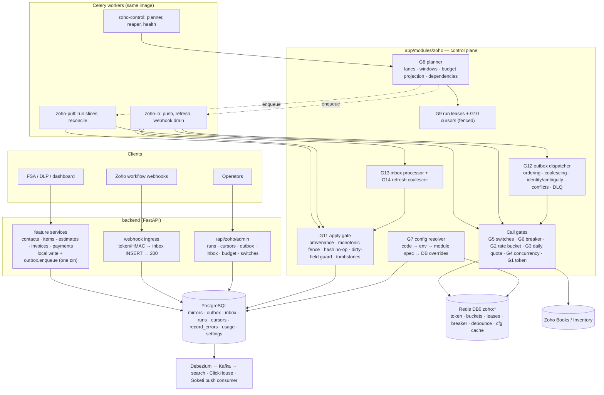
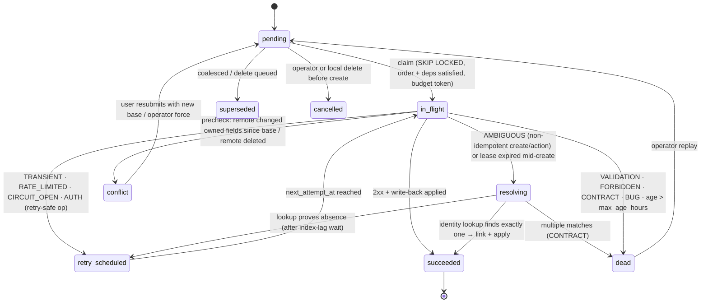

# Zoho Sync Platform Architecture (v3)

**The control plane: global gates, budgets, leases, lanes, outbox, inbox and
package-by-feature configuration — verified against the backend code and the
vendored Zoho docs on 2026‑09‑15.**

| | |
|---|---|
| **Builds on (unchanged, still law)** | [zoho-architecture-decision-framework.md](zoho-architecture-decision-framework.md) (v1: typed projection over `zoho_raw`, field taxonomy, ownership classes O1/O2/O3, write contract ≠ read document) · [zoho-realtime-sync-architecture.md](zoho-realtime-sync-architecture.md) (v2: payload provenance E1, monotonic fence E2, fetch-on-notify webhooks, stock lanes, line-item snapshots) |
| **Supersedes** | The *scheduling, retry, rate-limit, outbox and module-layout* parts of [ZOHO_SYNC_ENGINE.md](ZOHO_SYNC_ENGINE.md) and the crude "Target Architecture" draft; the per-minute-only budget math in v2 §4.2 (see §2.3 — the **daily** quota is the binding constraint) |
| **Inputs read** | every file under `apps/core-platform/backend/` (app, tasks, config, alembic, tests), `deployment/docker-compose*.yml`, Debezium/Prometheus/Alloy configs, all of `docs/zoho-docs-md/`, `docs/architecture-prompts/master-prompt.md`, the Laravel as-built reference |
| **Marker** | **[verify]** = not provable from `docs/zoho-docs-md/`; scheduled for the Phase‑0 spike (§15). Every design has a fallback if the answer is "no". |
| **Marker** | **⚠ scope** = deviates from an established doctrine in master-prompt.md; stated deliberately with the reason, not silently adopted |
| **v3.1 delta** | [zoho-sync-platform-architecture-delta-v3.1.md](zoho-sync-platform-architecture-delta-v3.1.md) — Zoho Inventory, push for items/contacts/batches/credit returns, 45,000/day Governor with suspend/resume, sync scopes, approval gate, reports, sync event log & retention, mixin split. Sections below marked **v3.1** are superseded or extended there. |

---

## Table of contents

1. [Verdict — is push + pull a good idea?](#1-verdict)
2. [Ground truth: what the code and the Zoho docs actually say](#2-ground-truth)
3. [Tooling decision matrix (what each compose service is for)](#3-tooling-decision-matrix)
4. [Target architecture overview](#4-target-architecture-overview)
5. [The global gates & managers catalogue](#5-global-gates--managers)
6. [Package-by-feature layout](#6-package-by-feature-layout)
7. [Configuration: layers, knobs, "when to stop"](#7-configuration)
8. [Pull lanes (replacing Batch/Index/Full/Incremental/Hybrid)](#8-pull-lanes)
9. [Apply gate — the single write path](#9-apply-gate)
10. [Push — outbox v2](#10-push--outbox-v2)
11. [Webhook inbox](#11-webhook-inbox)
12. [Error model & retry layers](#12-error-model--retry-layers)
13. [Data model: mirror additions & control tables](#13-data-model)
14. [Observability, alerting, operator API](#14-observability-alerting-operator-api)
15. [Migration plan from the current code](#15-migration-plan)
16. [ADRs & rejected alternatives](#16-adrs--rejected-alternatives)
17. [Invariants](#17-invariants)

---

## 1. Verdict

### 1.1 Short answer

**Yes — both directions are required, but never symmetrically and never
"whole-record".** The business context (master-prompt `<business_context>`)
makes Postgres the source of truth for FSA/DLP and Zoho the system of record
for accounting. That forces:

- **pull** (Zoho → Postgres): accountants and Zoho itself author data (numbers,
  totals, status, stock, payments applied);
- **push** (Postgres → Zoho): field agents author estimates, invoices,
  payments, contacts offline-first.

What made the Laravel engine fail was not "having both" — it was *how*:
inline dual writes, full re-download every cycle, errors turned into empty
pages, webhook bodies upserted as truth, TTL locks. What makes two-way sync
safe is **one writer per field**, **durable intent**, **one apply path**, and
**budgeted, change-driven reads**.

### 1.2 Direction per module (recommendation)

> **v3.1:** superseded by [delta §1.1](zoho-sync-platform-architecture-delta-v3.1.md#1-scope) — items, contacts, batches, credit notes, sales returns and Inventory documents are push-capable; Books vs Inventory routing per operation.

| Module | Ownership (v1 §6) | Pull | Push | Rationale |
|---|---|---|---|---|
| organizations, taxes (+groups), currencies (+exchange rates), locations, users | O1 | ✅ | ❌ (admin-only, off by default) | Zoho authors; they are Class‑C reference targets |
| items | O3 (narrow) | ✅ + stock lane | ⚠ only `description`, `custom_fields`, active/inactive — if the business decides the app edits the catalogue | stock/accounting links are Zoho-owned |
| contacts (+addresses, persons) | O3 | ✅ | ✅ owned fields only | FSA creates/edits customers; Zoho computes receivables |
| estimates, sales orders | O2 | ✅ | ✅ create/update + status actions | born local |
| invoices | O2 | ✅ | ✅ create + actions (`status/sent`, `void`) | ⚠ no documented upsert-by-custom-field for invoices (§2.2) → ambiguity resolution needed |
| customer payments | O2 | ✅ | ✅ create (DLP collections) | apply-to-invoice is a child mapping |
| credit notes | O2/O1 | ✅ | ⚠ only if a local flow creates returns | |
| price books, categories, brands, batches | O1 | ✅ **[verify]** endpoints (not in vendored Books docs — Inventory API) | ❌ | no vendored contract → cannot design outbound |
| bills, POs, vendor-*, journals, expenses, bank-* | O1 mirror | later, as features need | ❌ | |

---

## 2. Ground truth

### 2.1 Your P1–P9 checked against the current code

| # | Claim | Status | Evidence (paths relative to `apps/core-platform/backend/`) |
|---|---|---|---|
| P1 | `request()` retries POST on 5xx/transport | **Confirmed** (async *and* sync client) | `app/modules/zoho/core/client.py:136-141,169-178`; `sync_client.py:163-195` |
| P2 | 429 counts as breaker failure | **Confirmed** | `client.py:161` |
| P3 | half-open → every caller is a trial | **Partly stale.** A probe NX lock exists (`circuit_breaker.py:70`). Residual defects: (a) *any* in-flight success closes the circuit — `record_success` checks state, not probe ownership (`:78-80`); (b) probe TTL 15 s < HTTP timeout 30 s → a second probe can start; (c) a probe ending in a business error (400/404) neither closes nor reopens → 15 s blind spot | `circuit_breaker.py:41,63-89` |
| P4 | lock release `DEL` without owner | **Confirmed**, worse: lock TTL 30 s == HTTP timeout 30 s, so the lock can expire mid-refresh | `token_manager.py:41,56-67`; `sync_client.py:52-57` |
| P5 | per-process `asyncio.Semaphore` | **Confirmed**: `ZOHO_MAX_CONCURRENT_REQUESTS=8` *per process* × 4 uvicorn workers × 4 Celery processes = up to 64 concurrent vs Zoho's 10 (code 1070). The semaphore is also **held while sleeping** for the next minute window (up to 90 s) | `rate_limiter.py:30-63`; `conf.py:136` |
| P6 | duplicate sync client, long `time.sleep` | **Confirmed**, plus: sync client has **no circuit breaker**, uses `settings.ZOHO_REFRESH_TOKEN` only (ignores a token rotated via the OAuth callback → Celery auth outage while API works) | `sync_client.py:66-96,100-114,220-224` |
| P7 | Redis `allkeys-lru` shared by broker/locks/tokens | **Confirmed** | `deployment/docker-compose.yml:286` |
| P8 | emails routed to an unconsumed queue | **Stale** — emails route to `integrations`, which is consumed. The trap remains for any new queue | `app/tasks/celery_app.py:53-57`; compose `celery-worker -Q default,integrations,documents` |
| P9 | overlapping scans, no singleton | **Confirmed** and worse: `sync_items` (*/15) and `sync_contacts` (2 h) **only count rows** — pure API-budget burn; dispatcher (*/5) has no "already running" guard | `celery_app.py:63-90`; `app/tasks/zoho.py:28-55`; `app/tasks/zoho_sync.py:116-147` |

### 2.2 New findings (not in your list)

Severity: **C** critical · **H** high · **M** medium.

| ID | Sev | Finding | Evidence | Fix (section) |
|---|---|---|---|---|
| N1 | C | **Incremental sync is built on an undocumented filter.** The engine sends `last_modified_time=<cursor>&sort_column=last_modified_time`. For contacts, items, invoices, estimates, customer payments, credit notes and taxes the vendored docs document **no** modified-since filter; only bills, purchase orders, vendor credits, vendor payments, journals, base-currency adjustments and sales orders list a `last_modified_time` parameter ("Filter by…" — equality vs ≥ unknown). If Zoho ignores it → every 15‑min "incremental" is a full scan; if it is an equality filter → incremental silently returns nothing. Both are silent. | `app/modules/zoho/sync/config.py:120-121`; `engine.py:264-269`; `docs/zoho-docs-md/{contact,items,invoices,estimate,customer-payments,credit-note}.md` list sections | §8.2 capability matrix, §15 Phase 0 |
| N2 | C | **The daily quota is the binding constraint, not 100/min.** Premium/Elite/Ultimate = 10,000 requests/**day**; Standard 2,000; Professional 5,000. Current beat alone: `sync_items` 96×⌈N/200⌉/day (5k items → 2,400 = 24 % of a 10k plan) for nothing. v2 §4.2's "every 60 s = 25/min" = 36,000/day = 3.6× the cap. | `docs/zoho-docs-md/introduction.md` "API Call Limit" | §5.3, §8.6 |
| N3 | C | **Exceeding 100/min blocks the organization** (code 44: *"For security reasons your organization has been blocked"*) — including humans in Zoho's web UI. The per-minute limiter is a safety gate, not a performance knob; it must degrade *closed* when Redis is down. | `introduction.md` | §5.2 G2 |
| N4 | C | **OAuth secrets leak into Tempo.** Zoho requires token params in the query string; `HTTPXClientInstrumentor().instrument()` records full URLs, so `client_secret`, `refresh_token` and authorization `code` land in spans. | `app/core/observability.py:43`; `token_manager.py:178-186`; `auth/service.py:66-75,116-121` | §5.2 G15 |
| N5 | C | **Refresh token persisted to the audit table and evictable.** `store_tokens` → `set_setting` writes `old_value/new_value` into `setting_audit_logs` (plaintext). The Redis copy `zoho:refresh_token` has no TTL under `allkeys-lru`; DB persistence defaults to **off** → eviction + empty env = auth outage. | `system/service.py:129-130`; `token_manager.py:103-127`; `conf.py:162` | §5.2 G1 |
| N6 | H | **A whole sync run is one DB transaction.** `_run` commits once at the end: 50k upserts in one txn (identity-map memory growth, one giant WAL/CDC burst, locks held), and any late failure rolls back *all* progress and the stats row; the retry restarts at page 1. `task_time_limit=600` kills long runs mid-transaction. | `app/tasks/zoho_sync.py:50-69`; `celery_app.py:47-48` | §8.4, §9 |
| N7 | H | **Cursor advances past failures.** `max_modified` is taken from every listed row including failed and *queued* detail rows, so a record whose detail fetch later fails is behind the cursor forever (until the weekly full). | `engine.py:280-298,315-325` | §8.3 |
| N8 | H | **Celery messages published before commit.** `fetch_detail.delay` / `push_outbound.apply_async` run inside the open transaction; a rollback leaves orphan tasks; a lost broker message (see P7) loses the push forever — there is no relay scanning the journal, so it is not a real outbox. | `engine.py:320-323`; `outbox.py:59-66` | §10 |
| N9 | H | **Push duplicates:** `update` escalates to `create` when `zoho_id` is NULL while the original `create` may be in flight/ambiguous; creates are retried on 5xx (P1); no per-aggregate ordering; payload is the full row (`map_outbound`), not dirty owned fields. | `outbox.py:117-141` | §10 |
| N10 | H | **`soft_delete_missing` is unsafe**: (a) `NOT IN (:seen)` with >32,767 ids exceeds asyncpg's bind-parameter limit; (b) items list returns **active items only** by default, so inactive items would be soft-deleted; (c) a run that ended because `page_context` was missing is treated as complete; (d) local user soft-delete and Zoho deletion share one column. | `engine.py:301-302,342-357`; `client.py:93-95`; `items.md` "List items" | §8.5, §13.1 |
| N11 | H | **Request path calls Zoho.** `GET /api/zoho/items[/{id}]` proxies Zoho per page (120 s cache) — violates "Zoho is never a synchronous dependency" and spends quota per field rep. | `app/modules/zoho/service.py:39-63` | §15 Phase 1 |
| N12 | H | **Loop-bound singletons under `asyncio.run`.** The module-level `asyncio.Semaphore` and `redis_client` outlive each task's loop; the `redis_client.aclose()` workaround doesn't cover the semaphore (Python 3.12 raises "bound to a different event loop" once contended). | `rate_limiter.py:66`; `tasks/zoho_sync.py:65-67` | §16 ADR‑3 ⚠ scope |
| N13 | M | Redis client `retry_on_timeout=True` can re-execute non-idempotent commands (`INCR`, `SET NX` lock → caller sees `False` for a lock it holds). | `app/database/redis.py:343-352` | §5.2 G2/G1 |
| N14 | M | `ZohoEntityMixin.code` is a plain `unique=True` (doctrine requires partial unique on soft-deletable tables); mixin `zoho_id` is only `index=True` (each model must remember its partial unique index). | `sync/mixins.py:46-51` | §13.1 |
| N15 | M | Debezium CDCs `zoho_queue_logs` (per-record churn) — the journal will dominate Kafka volume once modules scale. | `deployment/config/debezium/zoho-mirror-connector.json` | §3, §13.3 |
| N16 | M | Weekly forced full + 5‑min dispatcher both enqueue `sync_module` without a running check; two full runs of the same module can overlap on Sunday. | `celery_app.py:79-90` | §5.2 G8 |
| N17 | M | Webhook secret setting exists (`ZOHO_WEBHOOK_KEY_INCOMING`) but no ingress route; Inventory base URL setting exists but the client only knows the Books base URL. | `conf.py:151,161`; `client.py:54-57` | §11, §5.2 G0 |
| N18 | M | `system` settings values are `String(500)` and every `get_setting` hits the DB with no cache — unusable as-is for a hot per-call config read. | `system/model.py:80`; `system/service.py:12-50` | §7.4 |

### 2.3 Zoho API facts that shape the design (from `docs/zoho-docs-md/`)

| Fact | Source | Design consequence |
|---|---|---|
| 100 req/min per org; exceeding → 429 code **44**, org **blocked** | `introduction.md` | G2 per-minute bucket is fail-closed; target ≤ 80/min |
| Daily caps: Free 1,000 · Standard 2,000 · Professional 5,000 · Premium/Elite/Ultimate 10,000; exceeding → 429 code **45** | `introduction.md` | G3 daily quota ledger + planner projection; code 45 ⇒ stop all non-interactive work until reset. Reset boundary/timezone **[verify]** |
| Concurrent calls: Free 5, paid 10 (soft); exceeding → 429 code **1070** | `introduction.md` | G4 distributed semaphore, default 6 |
| Errors: `code` ≠ 0; 1000 internal error; 1002 does not exist | `http-methods.md` | error policy table (§12.1) |
| Pagination `page`/`per_page` (max 200), `page_context.has_more_page` | `http-methods.md`, `invoices.md` | only `has_more_page=false` ends a scan |
| Access token 1 h; ≤10 tokens per refresh token per 10 min; ≤15 active tokens; ≤20 refresh tokens per user (21st invalidates oldest); token params **must be query string** | `oauth-zoho.md` | G1 single-flight + throttle; one shared refresh token; never re-consent casually; URL redaction (N4) |
| Refresh token deleted when revoked / password changed with session removal → `invalid_code` | `oauth-zoho.md` | `AUTH_REVOKED` ⇒ engine auth-pause |
| `X-Unique-Identifier-Key/Value` + `X-Upsert` (PUT by unique custom field) documented for **contacts, items, estimates, credit notes, customer payments, sales orders**, bills, POs, projects, expenses, recurring-*, vendor payments, debit notes — **not invoices** | `contact.md:139-163`, `items.md:177-227`, `estimate.md:141`, `credit-note.md:134`, `customer-payments.md:126` | idempotent creates for those modules (§10.4); invoices need lookup-based ambiguity resolution |
| `GET /itemdetails?item_ids=…` bulk detail (max ids **[verify]**) | `items.md:292-328` | bulk refresh (§8.2 lane R) |
| List sort columns: contacts incl. `last_modified_time`; sales orders incl. `last_modified_time`; estimates `created_time` (no modified); items `name/rate/tax_name`; invoices "customer_name, invoice_number, date, total, etc." | list sections of each doc | change-feed capability per module (§8.2) |
| `filter_by=Status.All` exists for contacts, items, estimates, sales orders; items default = **active only** | `items.md:233,249` | reconcile must request the complete population |
| Document lists filter by transaction `date_start/_end/_before/_after` | `invoices.md:141`, `estimate.md:191`, `sales-order.md` | "recent window" lane for modules without a modified feed |
| Invoices with payments/credits cannot be deleted; items in transactions cannot be deleted | `invoices.md:247`, `items.md:424` | push `delete` → `VALIDATION` → dead + local restore (§10.7) |
| **Webhooks are not documented at all** in the vendored set (signature header/algorithm, retry policy, IP ranges) | grep of `docs/zoho-docs-md/` | §11: path token mandatory, HMAC **[verify]**, fetch-on-notify. **v3.1:** resolved from Zoho's help page — `X-Zoho-Webhook-Signature`, HMAC-SHA256 Base64 over sorted params + raw JSON, 5 retries, 5 s/10 s timeouts ([delta §2.3](zoho-sync-platform-architecture-delta-v3.1.md#23-webhooks-resolves-v3-v9-partially)) |
| Price books, categories, brands, batches (Inventory) are **not** in the vendored docs | directory listing | no endpoint may be invented (master-prompt guardrail) — spec gated on Phase 0 |

---

## 3. Tooling decision matrix

The Laravel engine had supervisord + Redis queues only, so it built locks,
schedules and progress out of Redis TTLs. This stack has better primitives;
the rule is **each concern lives in the tool whose failure semantics match it**.

### 3.1 Per compose service

| Service | Strengths for this problem | Weaknesses / traps here | Role in the Zoho platform | Not used for |
|---|---|---|---|---|
| **PostgreSQL 18** (`FOR UPDATE SKIP LOCKED`, partial/unique indexes, advisory locks, `pg_partman`, `pg_cron`, logical WAL) | Durable, transactional with the business write, queryable by operators, crash-safe | Hot-row contention if used as a high-frequency counter; per-task NullPool connects cost ~ms | **All durable state**: mirror tables, outbox, webhook inbox, run leases, cursors, record errors, API-usage rollups, runtime config (system settings) | per-request token buckets, sub-second counters |
| **Redis 7.4** (single instance, AOF, `allkeys-lru`, DB0 cache / DB1 Authentik / DB2 broker / DB3 results) | Atomic Lua, microsecond latency, TTLs, shared by API + workers | **Eviction can drop broker messages, locks, buckets (P7)**; single node; retries on timeout (N13) | **Ephemeral coordination only**: access-token cache, token bucket, concurrency leases, breaker windows, debounce/coalescing keys, config cache, planner snapshot. Anything whose loss is survivable. Keys under DB 0 with prefix `zoho:` | outbox, cursors, run exclusion, refresh-token storage |
| **Celery 5 + Redis broker** | Existing executor, retries, routing, Flower, celery-exporter | Redis visibility-timeout redelivery; `eta` tasks beyond visibility timeout duplicate; prefork + asyncio friction (N12); message loss under eviction | **Executor of bounded units of work** (a run slice, a dispatcher batch, an inbox drain, a bulk refresh). Never the source of truth — every task re-derives work from Postgres | long-lived loops, durable queues, delayed retries > minutes (use `next_attempt_at` rows) |
| **Celery Beat** (single replica) | Simple, already deployed | If it dies nothing runs; schedule file in `/tmp` | **One heartbeat task** (`zoho.planner.tick`, 30–60 s) + maintenance ticks. Planner decides everything else from config | per-module cron entries (doctrine: never) |
| **Kafka (KRaft, single broker, RF 1) + Debezium** | WAL-based fan-out with no dual writes; replay; multiple consumers | RF 1 = not durable against disk loss; no delayed delivery/retry scheduling; no per-message ack visibility for operators | **Facts after commit**: mirror-table changes → search-indexer, ClickHouse, the Soketi push consumer (sync-state/conflict notifications to FSA/DLP), usage rollups to ClickHouse | Zoho commands (push), rate-limited work queues, anything needing per-record retry state |
| **FastStream** | Declarative consumers, `AckPolicy.ACK`, `TestKafkaBroker` | — | Soketi push consumer (`zoho.sync_state_changed`, `item.stock_changed`) | calling Zoho |
| **Soketi** | Pusher protocol already routed | — | Push `sync_state` transitions and conflicts to the user who authored the change | — |
| **ClickHouse** | Cheap long history | Not transactional | History of mirror rows (v2 §1.5), API-usage analytics, run history beyond PG retention | operational decisions |
| **Meilisearch** | — | — | Derived search only (unchanged) | — |
| **Prometheus / Alloy / Loki / Tempo / Grafana** | Existing pipelines, alerting | Celery prefork metrics need multiprocess mode; OTel URL capture leaks secrets (N4) | Metrics (§14.1), logs (§14.2), traces (§14.3), alert rules + dashboards | metrics via OTLP (doctrine: Prometheus scrapes) |
| **Traefik** | Middlewares (IP allowlist, rate limit, body buffering limits) | Catch-all priorities | Webhook route hardening (§11.2), admin API allowlist | — |
| **Authentik** | Groups | — | `zoho_integration_admin` group → operator API RBAC | — |
| **pg_cron / pg_partman** | In-DB maintenance without workers | Needs DB superuser grants | Partition creation/drop for inbox, usage ledger, run history; purge of terminal outbox rows | business logic |

### 3.2 Why not Kafka for push (the obvious question)

| Requirement of Zoho push | Postgres outbox + Celery | Debezium outbox → Kafka → consumer |
|---|---|---|
| Durable intent in the same txn as the user write | ✅ | ✅ |
| Strict per-aggregate order **and** cross-aggregate dependency (contact before estimate) | ✅ SQL predicate at claim time | ⚠ per-partition order only; dependencies need a second store |
| Retry *later* (15 s → 1 h, age-bounded) without blocking the partition | ✅ `next_attempt_at` | ❌ head-of-line blocking or a retry-topic ladder |
| Operator states: `resolving`, `conflict`, `dead`, replay, cancel, coalesce pending updates | ✅ UPDATE a row | ❌ immutable log; needs a side table anyway |
| Global Zoho budget gating before dequeue | ✅ claim only when a token is available | ⚠ consumer pause/resume dance |
| Durability of the transport | ✅ PG backups | ⚠ RF 1 broker |

Kafka remains the right tool for *what happened*; the outbox is the right
tool for *what we still owe Zoho*.

---

## 4. Target architecture overview

### 4.1 Components



### 4.2 The four flows

| Flow | Trigger | Path | Guarantee |
|---|---|---|---|
| **Refresh** (one record) | webhook, push write-back, conflict, operator, record-error retry | coalesce `(module,id)` → bulk/detail GET → apply | at-least-once; stale results rejected by fence |
| **Change feed** (incremental) | planner per lane schedule | list pages (cheapest documented ordering) → diff vs local → targeted detail/bulk → apply → fenced cursor advance | no change lost across runs; bounded by run budget |
| **Reconcile** (truth) | planner cron (nightly/weekly) | complete list scan (`filter_by=Status.All`) → seen-set → mismatches refreshed → deletion suspects verified by 404 | drift and deletions converge within one cycle; mass-delete guard |
| **Push** | user write | txn(local row + outbox row) → dispatcher claim → identity/conflict precheck → Zoho write → write-back apply | no lost intent; no duplicate creates; every command reaches a terminal state |

---

## 5. Global gates & managers

These are the platform services every module gets for free. **No feature
module may reimplement any of them** (master-prompt directive 2). They
replace, in place, the primitives in `app/modules/zoho/core/` — callers keep
one client entry point.

### 5.1 Catalogue

> **v3.1:** G2 (rate bucket), G3 (daily quota) and G4 (concurrency) are replaced by one **Governor** with a hard daily ceiling, thresholds, pacing and suspend/resume ([delta §3](zoho-sync-platform-architecture-delta-v3.1.md#3-daily-quota-governor)); a write-pressure gate is added and the gates are grouped into five subsystems ([delta §11](zoho-sync-platform-architecture-delta-v3.1.md#11-review-of-v3) R2, R8).

| ID | Gate / manager | Question it answers | State lives in | Algorithm | If Redis is down | If Postgres is down | Replaces / fixes |
|---|---|---|---|---|---|---|---|
| **G0** | `ZohoTransport` (single async client, Books + Inventory base URLs) | *How is a call made?* | — | one `httpx.AsyncClient` per process loop; per-call connect 5 s / read 30 s; `X-Request-Id`; response-size cap | — | — | `client.py`, deletes `sync_client.py` (P6, N17) |
| **G1** | `TokenManager` | *Do we hold a valid access token?* | Redis `zoho:{org}:oauth:access` (TTL = expires_in − margin); refresh token in PG (encrypted) | single-flight: `SET lock <uuid> NX PX 45000`; Lua compare-and-delete; waiters poll with jitter ≤ 20 s; refresh counter ≤ 8/10 min; `invalidate(token)` only if cache still holds *that* token | fall back to `pg_try_advisory_lock(hash('zoho_refresh'))` for single-flight; token cached in process memory until expiry | refresh token cached in process memory; no refresh possible if never loaded → `AUTH` pause | P4, N5, N13 |
| **G2** | `RateBucket` (per-minute) | *May a call start now without risking code 44?* | Redis hash `zoho:{org}:bucket` | Lua token bucket, capacity = burst (10), refill = `rate_per_min/60`; **priority reserve** (§5.3); AIMD penalty on 429 code 44 | **fail closed-degraded**: per-process local bucket at `rate / expected_processes` | — | P5, N3 |
| **G3** | `DailyQuota` | *Will this call push the org over its plan's day cap?* | Redis counters `zoho:{org}:quota:{day}:{priority}` + PG `zoho_api_usage` hourly rollup (source for restarts) | reserve-then-spend per priority class against `plan_daily_limit × share`; code 45 ⇒ `quota_exhausted` switch until reset | local counter seeded from last PG rollup; conservative 50 % of remaining share | counters continue in Redis; rollup flush retried | N2 |
| **G4** | `ConcurrencyGate` | *Are fewer than N calls in flight org-wide?* | Redis ZSET `zoho:{org}:inflight` (member = lease id, score = expiry) | Lua: purge expired → `ZCARD < limit` → `ZADD`; lease TTL = read timeout + 5 s; release `ZREM`; 1070 ⇒ temporarily lower limit | local semaphore `limit / expected_processes` | — | P5 |
| **G5** | `EngineSwitches` | *Is this kind of work allowed right now?* | PG system settings `zoho.control.*` (audited) → Redis cache 10 s | hierarchical: global pause › auth-pause › quota-exhausted › direction (pull/push/webhook) › module › lane › maintenance window; interactive reads only blocked by auth/quota-hard | last cached value (≤ 10 s) then **fail closed** for background, open for interactive | cached value | new |
| **G6** | `CircuitBreaker` | *Is Zoho (this resource group) failing?* | Redis ZSET window per `(api, group)` | sliding window of 5xx/transport/timeout only (never 429/4xx); trip on count ≥ min and ratio ≥ threshold; OPEN → single **owned** probe (`probe_id`), only the probe's outcome closes/reopens; probe TTL > read timeout; recovery doubles to a cap | **fail open** (log once/min) | — | P2, P3 residuals |
| **G7** | `ConfigResolver` | *What are the effective knobs for module × lane?* | code defaults, `conf.py`, `feature/zoho/spec.py`, PG system settings overrides; Redis cache keyed by `zoho:cfg:version` | merge → validate with the same Pydantic model (`extra="forbid"`, bounds) → cache; writes via admin API validate *before* persist | read PG directly | last good cached config per process | N18, parallel-config doctrine |
| **G8** | `Planner` | *What should run next, and can we afford it?* | reads cursors, runs, outbox/inbox depth, usage; writes nothing but task enqueues + snapshot | one Beat tick; per lane: enabled? window? due (interval/cron + jitter)? no active lease? dependencies satisfied? projected cost fits lane budget? → enqueue one bounded slice | runs; buckets degrade as above | tick skipped (logged), Beat retries next tick | P9, N16, D24/D25 |
| **G9** | `RunLeaseManager` | *Is exactly one worker running `module × lane`?* | PG `zoho_sync_runs` + partial unique index `WHERE status='running'` | insert-or-steal-expired; heartbeat extends lease; **fencing token** (`run_id`) required on cursor writes; bounded slice (time/pages/records/calls) | unaffected | run cannot start | P9, N6, Laravel D16/D23 |
| **G10** | `CursorStore` | *Where does the next slice resume?* | PG `zoho_sync_cursors` | `UPDATE … WHERE owner_run_id=:run_id` in the **same txn** as the page's applies | unaffected | — | N7 |
| **G11** | `ApplyGate` | *May this Zoho payload change this row?* | PG mirror row | provenance (v2 E1) · monotonic fence (E2) · `zoho_raw_hash` no-op · dirty-owned-field protection (conflict) · tombstone/resurrect · `INSERT … ON CONFLICT` | unaffected | — | N6, v1 G2 |
| **G12** | `OutboxDispatcher` | *What do we still owe Zoho, in what order?* | PG `zoho_outbox` | `SKIP LOCKED` claim with aggregate-order + dependency predicates, lease (`locked_until`), coalescing, identity/ambiguity resolver, conflict precheck, age-bounded retry, dead letters | wake-ups lost → 5 s poll still drains | dispatch stops; nothing lost | N8, N9 |
| **G13** | `WebhookInbox` | *Did Zoho tell us something, and was it authentic?* | PG `zoho_webhook_inbox` (partitioned) | constant-time path token + HMAC [verify] → dedupe key → insert → 200; drain task claims `SKIP LOCKED` | debounce lost → duplicate refreshes only | ingress returns 503 (Zoho may retry [verify]); reconcile is the floor | N17 |
| **G14** | `RefreshCoalescer` | *Can N refresh requests become one call?* | Redis `zoho:refresh:{module}` set + `…:scheduled` NX key | add id to set; first adder schedules a flush after `debounce_s`; flush pops ≤ chunk ids → bulk endpoint when spec has one, else bounded detail GETs | fail open (immediate per-id refresh task) | — | v2 E5/E6 |
| **G15** | `Redactor` | *Can this value leave the process?* | code | key redaction (existing) + value patterns (`1000\.[0-9a-f]{32}\.[0-9a-f]{32}`, `Zoho-oauthtoken …`) + **OTel httpx `request_hook` stripping query strings for `accounts.zoho.*`** + `http_path_template` in logs | — | — | N4 |
| **G16** | `ErrorPolicy` | *What does this failure mean and what happens next?* | code (pure functions) | `(method, retry_safe, http_status, zoho_code, exception)` → `ErrorCategory` → decision (§12) | — | — | P1, Laravel D20 |
| **G17** | `IdentityRegistry` | *How do we find the Zoho record we might have created?* | mirror `public_id` + spec `identity` strategy | `X-Unique-Identifier` upsert (where documented) / reference_number lookup / natural key; decides retry-safety of creates | — | — | N9 |
| **G18** | `DeletionGuard` | *Is it safe to tombstone?* | PG cursor state (suspect counts) | complete-population scan + ≥ 2 consecutive misses + verifying GET 404; abort if missing > max(abs, pct) | — | — | N10 |
| **G19** | `UsageMeter` | *Who spent the quota?* | Redis counters → PG `zoho_api_usage` (hourly, by module × lane × priority × outcome) | flushed by planner tick; CDC → ClickHouse optional | counters lost for the gap (G3 uses conservative fallback) | flush retried | N2 forensics |
| **G20** | `HealthMonitor` | *Is the engine healthy?* | planner snapshot in Redis `zoho:health` | computes gauges (lag, oldest pending, inbox lag, token TTL, breaker states, quota burn) once per tick; `/metrics` collector reads snapshot | gauges stale → `ZohoPlannerSnapshotStale` alert | — | observability |
| **G21** | `ApiIdempotency` (inbound, FSA/DLP) | *Is this offline retry the same user action?* | PG unique `public_id` (client-generated UUID) on create endpoints | `INSERT … ON CONFLICT (public_id) DO NOTHING RETURNING` → return existing row | — | — | flaky rural networks double-submit |

### 5.2 The call pipeline (order matters)

```mermaid
sequenceDiagram
  participant C as caller (lane / dispatcher / API)
  participant S as G5 switches
  participant B as G6 breaker
  participant Q as G3 daily quota
  participant R as G2 rate bucket
  participant K as G4 concurrency
  participant T as G1 token
  participant Z as Zoho
  participant P as G16 policy
  C->>S: allowed(priority, module, direction)?
  C->>B: allow(api, group)?  (OPEN → CircuitOpen, no quota spent)
  C->>Q: reserve(priority, cost=1)  (exhausted → BudgetExhausted)
  C->>R: take(priority)  (wait ≤ min(deadline, lane max_wait))
  C->>K: acquire lease  (wait ≤ deadline)
  C->>T: token()
  C->>Z: HTTP  (connect 5 s, read 30 s, X-Request-Id)
  Z-->>C: response / transport error
  C->>K: release
  C->>P: classify → decision
  P-->>C: RETURN | RETRY_AFTER(d) | RAISE(category)
  Note over C,Q: quota is consumed on send (Zoho counts attempts); reservation released if nothing was sent
  Note over C,B: breaker records only 5xx/transport/timeouts
```

Ordering rationale: cheap local refusals first (switch, breaker) so a
paused or failing engine burns neither quota nor rate tokens; quota before
rate so a day-capped org doesn't consume minute tokens; concurrency last so a
lease is never held while waiting for rate tokens (the current code holds its
semaphore while sleeping — P5).

### 5.3 Priority classes and reserves (G2 + G3)

> **v3.1:** shares of a 10,000 plan are superseded by Governor states (`OPEN → CONSERVE → ESSENTIAL → RESERVED_ONLY → EXHAUSTED`), a pacing curve and weighted fair queuing across modules ([delta §3.3–§3.5](zoho-sync-platform-architecture-delta-v3.1.md#33-thresholds-and-governor-states)). Priority classes below remain.

| Priority | Callers | Minute-bucket reserve it may **not** dip into | Daily-share it may use | Max wait before giving up | On refusal |
|---|---|---|---|---|---|
| `INTERACTIVE` | operator "refresh now", optional push fast-path (§10.8) | 0 | whole remaining allowance | 2 s | 503 `zoho_busy` (request path never blocks longer) |
| `PUSH` | outbox dispatcher | 10 % | `push_share` (default 25 %) + unused interactive | 10 s | command → `retry_scheduled` (not an attempt) |
| `REFRESH` | webhook/write-back/record-error refreshes | 20 % | `refresh_share` (25 %) | 5 s | re-coalesce with delay |
| `INCREMENTAL` | change-feed slices | 35 % | `incremental_share` (30 %) | 5 s | slice ends `yielded(budget)`, cursor kept |
| `RECONCILE` | reconcile/backfill slices | 50 % | `reconcile_share` (20 %) | 0 s | slice ends `yielded(budget)`; planner defers |

Defaults are knobs (§7.3). `plan_daily_limit` is configured per environment
(e.g. 10,000 for Premium) and `engine_daily_share` (default 0.8) leaves
headroom for anything else using the same org (Zoho integrations, Zoho Flow,
people exporting). Shares are **soft ceilings, not hard partitions**: the
planner lends unused share of higher classes to lower classes after 18:00
org time (configurable), never the reverse.

**AIMD on 429**: code 44 → effective rate × 0.5 for 60 s, +10 %/min recovery;
code 1070 → concurrency limit − 2 for 120 s; code 45 → `quota_exhausted`
switch on, all non-interactive lanes stop, CRITICAL alert, auto-clear at the
next quota day boundary **[verify reset time]**.

### 5.4 Token manager specifics (G1)

| Concern | Design |
|---|---|
| Refresh-token storage | PG, encrypted with `pgcrypto` (`pgp_sym_encrypt`, key from env `ZOHO_TOKEN_ENCRYPTION_KEY`) in a dedicated `zoho_oauth_credentials` row — **not** `system` settings (their audit log would store the secret, N5). Env `ZOHO_REFRESH_TOKEN` is only a bootstrap seed |
| Access token | Redis only; value + `expires_at`; per-process memory copy as Redis-outage fallback |
| Rotation | OAuth callback stores the new refresh token, bumps `credential_version`; every process reloads when its cached version is older |
| Revocation | refresh returns `invalid_code`/`invalid_grant` → `AUTH_REVOKED` → switch `auth_paused` → planner/dispatcher idle, CRITICAL alert, runbook |
| Throttle | Redis counter ≤ 8 per 10 min (Zoho: 10); exceeding raises `AUTH_THROTTLED` (CRITICAL: indicates a caching bug) |
| DC validation | `api_domain` from the token response must match the configured base URLs, else refuse to start |
| Secrets in telemetry | G15 URL scrubbing; never log bodies of `/oauth/v2/token` responses |

---

## 6. Package-by-feature layout

⚠ **scope**: the established layout nests entity packages under
`app/modules/zoho/<entity>/` (`organizations`). You asked for feature modules
that own their Zoho adapter. That is a deliberate structural change; it is
worth it because a feature (invoices) owns far more than its Zoho mapping
(local-only columns, FSA APIs, PDF, search registry), and "invoice knowledge"
spread across `zoho/` and a feature package would drift. The integration core
keeps **zero entity knowledge**.

### 6.1 Tree

```
backend/app/
├── modules/
│   ├── zoho/                                # integration platform (no entity knowledge)
│   │   ├── core/                            # the call path
│   │   │   ├── transport.py                 # G0 ZohoClient (async only; Books + Inventory)
│   │   │   ├── auth.py                      # G1 TokenManager (replaces token_manager.py)
│   │   │   ├── gates/
│   │   │   │   ├── rate_bucket.py           # G2 (replaces rate_limiter.py counting primitive)
│   │   │   │   ├── quota.py                 # G3
│   │   │   │   ├── concurrency.py           # G4
│   │   │   │   └── breaker.py               # G6 (evolves circuit_breaker.py)
│   │   │   ├── lua/                         # *.lua loaded via SCRIPT LOAD + EVALSHA
│   │   │   ├── policy.py                    # G16 classification + decisions (pure)
│   │   │   ├── errors.py                    # exception hierarchy (evolves exceptions.py)
│   │   │   ├── schemas.py                   # ZohoResponse, ZohoPage, ZohoOp
│   │   │   └── redact.py                    # G15
│   │   ├── control/
│   │   │   ├── switches.py                  # G5
│   │   │   ├── config.py                    # G7 platform defaults + resolver + knob models
│   │   │   ├── planner.py                   # G8
│   │   │   ├── leases.py                    # G9
│   │   │   ├── cursors.py                   # G10
│   │   │   ├── usage.py                     # G19
│   │   │   └── health.py                    # G20
│   │   ├── sync/                            # the engine (keeps its name — docs/tests refer to it)
│   │   │   ├── spec.py                      # ZohoModuleSpec, LaneSpec, capability enums
│   │   │   ├── registry.py                  # autodiscovery of app.modules.*.zoho
│   │   │   ├── mixins.py                    # ZohoEntityMixin (+ §13.1 columns)
│   │   │   ├── mapper.py                    # FieldMapping engine (unchanged API)
│   │   │   ├── children.py                  # ChildCollectionRule replace-set (v2 E7)
│   │   │   ├── apply.py                     # G11 ApplyGate + tombstones
│   │   │   └── lanes/
│   │   │       ├── change_feed.py           # lane C (sorted-modified)
│   │   │       ├── window_scan.py           # lane W (date window)
│   │   │       ├── list_diff.py             # lane L
│   │   │       ├── reconcile.py             # lane F + G18 DeletionGuard
│   │   │       ├── stock_sweep.py           # lane S
│   │   │       ├── fanout.py                # lane P (parent fan-out)
│   │   │       └── refresh.py               # lane R + G14 coalescer
│   │   ├── outbox/                          # G12
│   │   │   ├── enqueue.py                   # the only API feature services call
│   │   │   ├── dispatcher.py
│   │   │   ├── identity.py                  # G17
│   │   │   ├── conflicts.py
│   │   │   └── dependencies.py
│   │   ├── webhooks/                        # G13
│   │   │   ├── api.py                       # POST /api/zoho/webhooks/{module}/{path_token}
│   │   │   ├── verify.py
│   │   │   └── inbox.py
│   │   ├── admin/                           # operator API (api/schema/service/crud)
│   │   ├── auth/                            # OAuth consent flow (existing)
│   │   ├── model.py                         # control tables (§13.2)
│   │   └── metrics.py
│   ├── organizations/                       # moved from zoho/organizations (O1)
│   │   ├── model.py schema.py crud.py service.py api.py
│   │   └── zoho/ spec.py fields.py
│   ├── contacts/
│   │   ├── model.py schema.py crud.py service.py api.py
│   │   └── zoho/
│   │       ├── __init__.py                  # spec registration (import side effect)
│   │       ├── spec.py                      # identity, endpoints, capabilities, lane defaults
│   │       ├── fields.py                    # FieldMapping list (the field map is law)
│   │       ├── children.py                  # addresses, contact_persons rules
│   │       ├── builders.py                  # outbound write-contract builders + actions
│   │       ├── identity.py                  # X-Unique-Identifier strategy
│   │       └── hooks.py                     # optional pre/post apply hooks
│   ├── items/ …/zoho/ (+ stock lane, /itemdetails bulk)
│   ├── estimates/ invoices/ customer_payments/ credit_notes/ taxes/ currencies/ locations/
└── tasks/
    ├── celery_app.py
    ├── _loop.py                             # per-process event loop (ADR‑3 ⚠ scope)
    └── zoho.py                              # thin wrappers only (merges zoho.py + zoho_sync.py)
config/logging/modules/zoho.yaml             # app.zoho.* (+ one file per feature namespace)
```

### 6.2 Dependency rules (enforced by an import-linter contract in CI)

| Rule | Why |
|---|---|
| `app.modules.<feature>.zoho` may import `app.modules.zoho.sync.spec`, `.mapper`, `.children`, `app.modules.zoho.outbox.enqueue` | adapters declare, platform executes |
| `app.modules.zoho.*` must **never** import `app.modules.<feature>` (except the registry's autodiscovery by string) | core stays entity-agnostic |
| Feature `service.py` may call only `outbox.enqueue()` for Zoho writes — never `core.transport` | no inline dual writes (Laravel D13) |
| Only `sync/apply.py` writes Zoho-owned mirror columns | one apply path (v2 invariant 8) |
| `app/tasks/zoho.py` contains no logic, only `run_async(platform_fn(...))` | testability without Celery |

### 6.3 Registration

`sync/registry.py` keeps an **explicit** list (import-time determinism, the
existing `_ENTITY_PACKAGES` doctrine), now of feature adapter packages:

```python
_ADAPTER_PACKAGES = [
    "app.modules.organizations.zoho",
    "app.modules.currencies.zoho",
    "app.modules.taxes.zoho",
    "app.modules.contacts.zoho",
    "app.modules.items.zoho",
    # …
]
```

A startup validator (`registry.validate()`) fails the process on: unknown
dependency, `{id}` missing in detail path, owned outbound field not in the
field map, lane enabled whose required capability is unverified
(`Capability.VERIFIED is False` in `production`), per_page > 200, share sums
> 1, cron that doesn't parse, two specs claiming the same `(api, collection)`
lane without distinct `lane` names (v2 E4 multi-lane allowed explicitly).

---

## 7. Configuration

### 7.1 Five layers (most specific wins)

| Layer | Where | Who changes it | Takes effect | Validated by | Examples |
|---|---|---|---|---|---|
| **L0 platform defaults** | `zoho/control/config.py` | engineers (PR) | deploy | Pydantic model | breaker thresholds, retry caps, priority reserves |
| **L1 environment** | `app/core/conf.py` `ZOHO_*` (single `.env` parser) | ops | restart | same | `ZOHO_PLAN_DAILY_LIMIT`, `ZOHO_RATE_LIMIT_PER_MINUTE`, base URLs, secrets |
| **L2 module spec** | `app/modules/<feature>/zoho/spec.py` | engineers (PR) | deploy | same + registry validator | endpoints, identity, capabilities, lane defaults |
| **L3 runtime overrides** | PG `system` settings, keys `zoho.<module>.<lane>.<knob>` / `zoho.control.<switch>` | operators via admin API | ≤ 10 s (config version bump) | same model **before persist**; bounds; audit log | pause invoices push; change items stock sweep to 5 min; `max_records_per_run=2000` |
| **L4 per-run overrides** | admin API "run once" request body | operators | that run only, never persisted | subset model (only stop-condition & scope knobs) | backfill with `max_api_calls=300`, `date_after=2026-01-01` |

Secrets (L1 only) are `SecretStr` and never overridable at L3. Knobs that
could cause code 44 or a daily-cap breach have **hard bounds** that no layer
can exceed (e.g. `rate_per_minute ≤ 90`, `concurrency ≤ 9`,
`engine_daily_share ≤ 0.95`).

### 7.2 The spec (L2) — typed, closed, per feature

```python
# app/modules/invoices/zoho/spec.py
from app.modules.zoho.sync.spec import (
    Api, Capability, ChangeFeed, DetailMode, IdentityStrategy, LaneSpec, PushSpec,
    Schedule, StopWhen, ZohoModuleSpec,
)
from app.modules.invoices.model import Invoice
from app.modules.invoices.zoho import builders, children, fields

SPEC = ZohoModuleSpec(
    module="invoices",
    model=Invoice,
    api=Api.BOOKS,
    collection_path="/invoices",
    detail_path="/invoices/{id}",
    id_attr="invoice_id",
    list_root="invoices",
    detail_root="invoice",
    modified_attr="last_modified_time",
    ownership="O2",
    depends_on=("contacts", "items", "taxes"),
    field_map=fields.FIELDS,
    children=children.RULES,                           # line_items replace-set
    capabilities={                                     # Phase-0 results, not assumptions
        Capability.SORT_BY_MODIFIED: Capability.unverified(),     # docs say "etc." [verify]
        Capability.DATE_WINDOW_FILTER: Capability.documented("invoices.md:141"),
        Capability.LIST_HAS_MODIFIED: Capability.unverified(),
        Capability.STATUS_ALL_FILTER: Capability.unverified(),
        Capability.UPSERT_BY_CUSTOM_FIELD: Capability.absent("not in invoices.md"),
    },
    lanes={
        "window": LaneSpec(
            kind=ChangeFeed.WINDOW_SCAN, schedule=Schedule.every(minutes=15, jitter_s=90),
            active_hours=("06:00", "22:00"), window_days=7, per_page=200,
            detail=DetailMode.CHANGED_ONLY, stop=StopWhen(max_pages=10, max_api_calls=60, max_duration_s=240),
            priority="INCREMENTAL",
        ),
        "reconcile": LaneSpec(
            kind=ChangeFeed.RECONCILE, schedule=Schedule.cron("30 1 * * 0"),       # weekly
            per_page=200, detail=DetailMode.CHANGED_ONLY,
            stop=StopWhen(max_api_calls=400, max_duration_s=240),              # slices resume
            deletion=dict(consecutive_misses=2, verify_get=True, max_missing_abs=50, max_missing_pct=0.02),
            priority="RECONCILE",
        ),
    },
    push=PushSpec(
        create=True, update=True, delete=False,
        actions={"mark_sent": builders.mark_sent, "void": builders.void},     # POST /invoices/{id}/status/*
        builders=builders.BUILDERS,
        identity=IdentityStrategy.REFERENCE_LOOKUP,     # invoices: no X-Upsert → lookup [verify filter]
        max_age_hours=72,
    ),
    webhooks={"events": ("created", "updated", "deleted"), "debounce_s": 5},
)
```

`Capability.unverified()` lanes refuse to be enabled in `production`
(validator) — this is how N1 can never recur silently.

### 7.3 Knob catalogue

**Engine-wide (L0/L1/L3 `zoho.control.*`)**

| Knob | Default | Bounds | Meaning |
|---|---|---|---|
| `engine_paused` | false | — | stop all background work (interactive allowed) |
| `pull_enabled` / `push_enabled` / `webhooks_enabled` | true / false / false | — | direction switches (push & webhooks start off until Phase 5/6) |
| `plan_daily_limit` | 10000 | ≥ 1000 | Zoho plan cap (Premium). **v3.1:** replaced by `governor.pools.*.daily_hard_limit` = 45000 bounded by env `ZOHO_CONTRACT_DAILY_LIMIT` ([delta §13](zoho-sync-platform-architecture-delta-v3.1.md#13-config-knob-additions)) |
| `engine_daily_share` | 0.8 | 0.1–0.95 | share of the plan the engine may use |
| `share.{push,refresh,incremental,reconcile}` | 0.25/0.25/0.30/0.20 | sum ≤ 1 | soft ceilings (§5.3) |
| `rate_per_minute` | 80 | 10–90 | G2 refill |
| `burst` | 10 | 1–20 | G2 capacity |
| `concurrency_limit` | 6 | 1–9 | G4 |
| `breaker.{window_s,min_calls,failure_ratio,recovery_s,recovery_max_s,probe_ttl_s}` | 60/10/0.5/30/300/45 | | G6 |
| `planner.tick_s` | 30 | 15–60 | Beat cadence |
| `planner.max_concurrent_pull_runs` | 2 | 1–4 | global slice parallelism |
| `planner.lend_after` | "18:00" | time | when unused shares are lent downward |
| `org_timezone` | from `zoho_organizations.time_zone` | — | windows, quota day **[verify]** |
| `maintenance_windows` | [] | cron ranges | no background calls (e.g. month-end close) |
| `retention.{inbox_days,runs_days,usage_days,outbox_terminal_days}` | 30/90/180/30 | | pg_cron/pg_partman |

**Per module × lane (L2 defaults, L3 `zoho.<module>.<lane>.*`)**

| Knob | Type | Meaning |
|---|---|---|
| `enabled` | bool | lane on/off |
| `schedule` | `every(minutes, jitter_s)` \| `cron(expr)` | when the planner considers it due |
| `active_hours` | (start, end) org TZ | outside → not due (e.g. no stock sweeps at night) |
| `catch_up` | `skip` \| `run_once` | after downtime: never queue a backlog of missed runs |
| `per_page` | 1–200 | list page size |
| `window_days` / `overlap_s` | int | window-scan span / change-feed overlap |
| `detail` | `none` \| `changed_only` \| `bulk` \| `always` | N+1 policy (`always` only for tiny O1 tables) |
| `detail_concurrency` | 1–4 | in-slice parallel detail GETs (G4 still global) |
| `bulk_chunk` | int [verify max] | ids per `/itemdetails` call |
| `filter_params` | dict | e.g. `{"filter_by": "Status.All"}` |
| `priority` | class | §5.3 |
| `stop.max_pages` / `stop.max_records` / `stop.max_api_calls` / `stop.max_duration_s` | int | slice budget ("when to stop", §7.5) |
| `stop.stop_on_boundary` | bool | change-feed: stop when rows older than watermark appear |
| `deletion.*` | see spec | reconcile only |
| `min_interval_floor_s` | int | hard lower bound an operator cannot go under |

**Push (L2 + L3 `zoho.<module>.push.*`)**: `enabled`, `operations`
allow-list, `max_age_hours`, `backoff_base_s` (15), `backoff_cap_s` (3600),
`max_attempts_non_throttle` (12), `fast_path_timeout_s` (0 = off),
`conflict_policy` (`reject` | `auto_rebase_independent_fields`),
`batch_size` per dispatcher claim (20).

**Webhooks (`zoho.<module>.webhooks.*`)**: `enabled`, `events`,
`debounce_s`, `max_age_days` (replay window), `optimistic_apply` (false; v2
§2.3).

### 7.4 Runtime config mechanics

| Step | Mechanism |
|---|---|
| Write | `PUT /api/zoho/admin/config/{module}/{lane}` → resolver builds candidate = L0⊕L1⊕L2⊕(current L3 + change) → validate → `system_settings_service.set_setting` (audit row with actor + IP) → `INCR zoho:cfg:version` |
| Read (hot path) | process memory cache keyed by version; version checked at most every 10 s from Redis; on Redis failure read PG every 60 s |
| Constraints on the settings module | values ≤ 500 chars (N18) → store **one knob per key**, never a JSON blob per module; `is_sensitive` defs never hold secrets (tokens live in `zoho_oauth_credentials`) |
| Visibility | `GET /api/zoho/admin/config/{module}` returns effective value + which layer supplied it |

### 7.5 "When to stop" — slice termination semantics

Every run is a **bounded slice** (≤ `max_duration_s`, default 240 s, below
`task_soft_time_limit`). A long scan is many slices resuming from a fenced
cursor; there is no task that needs a 1‑hour lease.

| Stop condition | Run status | Cursor | Planner next |
|---|---|---|---|
| `has_more_page=false` on last page (scan complete) | `succeeded` | lane-specific commit (watermark / reconcile completion) | normal schedule |
| change-feed boundary reached (`row.modified < watermark − overlap`) | `succeeded` | watermark := scan start | normal schedule |
| `max_pages` / `max_records` / `max_api_calls` / `max_duration_s` hit | `yielded(budget_slice)` | `next_page` kept | re-due immediately if lane budget remains, else next window |
| G3 share exhausted / G2 wait exceeded | `yielded(quota)` | kept | deferred until share refills / lending time |
| switch turned off mid-run | `cancelled` | kept | none until re-enabled |
| `TRANSIENT` / `RATE_LIMITED` / `CIRCUIT_OPEN` on a list or needed detail | `yielded(upstream)` | **not advanced past the failed page** | backoff (30 s → 10 min) |
| `AUTH_REVOKED` / code 45 | `failed` | kept | engine switch set; no runs |
| `CONTRACT` on a list page (missing root/page_context) | `failed` | kept | alert; lane auto-disabled after 3 consecutive |
| lease lost (fenced write updated 0 rows) | `abandoned` | untouched by zombie | the lease holder continues |

---

## 8. Pull lanes

### 8.1 From "strategies" to "lanes"

A **strategy** (Laravel, current engine) is *one algorithm per module*. A
**lane** is *one purpose per module*, and a module usually has 2–3 lanes
running at different cadences and priorities over the same table (v2 E4
generalised).

| Old name | What it really was | Fate | New lane(s) |
|---|---|---|---|
| Batch (Laravel) | page crawl + detail GET per record every cycle | **removed** — pays for size, not change | L / W + R |
| Index | list-only apply | kept for list-complete modules and stock | **I** (list apply), **S** (stock sweep) |
| Full | complete list scan | kept as the *truth check*, not the freshness mechanism | **F** reconcile (+ backfill mode) |
| Incremental | modified-since window | kept **only where Zoho documents an ordering/filter** (N1) | **C** change feed |
| Hybrid | "pick full or incremental" | becomes a **planner policy**, not an algorithm | planner chooses lanes by capability + cost projection |
| — | — | new | **W** date-window scan, **P** parent fan-out, **R** coalesced refresh |

### 8.2 Lane catalogue

| Lane | Needs capability | Algorithm (one slice) | Cost per run | Detects | Misses (covered by) |
|---|---|---|---|---|---|
| **C** change feed | `SORT_BY_MODIFIED` desc (documented: contacts, sales orders) | pages sorted by `last_modified_time` D; stop at `modified < watermark − overlap`; diff each row vs local `zoho_last_modified_time`; refresh changed ids via R; watermark := **scan start** on completion | ≈ 1 page + changed details | creates, edits | deletes (F) |
| **W** date window | `DATE_WINDOW_FILTER` (invoices, estimates, sales orders, payments `date`) | list `date_after = today − window_days`, sorted by `date`; diff list rows (modified if present, else hash of list row) vs local; refresh changed | ⌈docs in window/200⌉ | new docs + edits to recent docs | edits to docs older than the window (webhooks R, reconcile F) |
| **L** list diff | complete list, list row carries a comparable field | full list at 200/page; compare list-row modified/hash; refresh mismatches | ⌈N/200⌉ + changed | edits, creates | deletes (F) |
| **I** list apply | list row is the richest shape (currencies, locations, taxes list) | apply list rows directly (`payload_kind=list`, allowed to write `zoho_raw` per v2 §1.2) | ⌈N/200⌉ | everything but deletes | deletes (F) |
| **S** stock sweep | items list includes stock fields **[verify]** | list-only, columns `stock_on_hand/available_stock/actual_available_stock`, never `zoho_raw`; `filter_by=Status.All`? no — active only is correct for stock | ⌈N_active/200⌉ | stock moves not bumping `last_modified_time` (v2 §4.1) | per-location stock (R bulk) |
| **F** reconcile | `STATUS_ALL_FILTER` or proven complete default | full scan into seen-set; mismatches → R; on completion run G18 deletion guard; `mode=backfill` fetches every id missing locally | ⌈N/200⌉ + mismatches + suspects | drift, deletions, anything any other lane missed | — (floor) |
| **P** parent fan-out | child list per parent (Inventory batches **[verify]**) | iterate parents by `zoho_id` keyset (changed parents first, then rotating slice), list children per parent | ≈ parents touched | child creates/edits/removals | — |
| **R** refresh | detail or bulk endpoint | G14 coalesced ids → `/itemdetails` chunks or detail GETs (≤ `detail_concurrency`) → apply `payload_kind=detail`; 404 → tombstone with evidence | 1 per chunk / id | exact current version | — |

### 8.3 Capability matrix (what Phase 0 must confirm)

| Module | C sort modified | W date filter | list row has `last_modified_time` | `Status.All` | bulk detail | Default lanes (if unverified → fallback) |
|---|---|---|---|---|---|---|
| contacts | ✅ documented | — | [verify] | ✅ documented | — | C 15 min + F nightly; fallback L 60 min |
| items | ❌ (name/rate/tax_name) | — | [verify] | ✅ documented | ✅ `/itemdetails` | L 60 min + S 10 min (business hours) + R bulk + F nightly |
| invoices | [verify] ("etc.") | ✅ documented | [verify] | [verify] | — | W 15 min (7 d) + R webhooks + F weekly; C if verified |
| estimates | ❌ (created_time) | ✅ documented | [verify] | ✅ documented | — | W 15 min + R + F weekly |
| customer payments | [verify] ("Sort column.") | ✅ `date` | [verify] | ❌ (PaymentMode filters) | — | W 15 min + F weekly |
| credit notes | ❌ | ✅ `date` | [verify] | status filter only | — | W 30 min + F weekly |
| sales orders | ✅ documented | ✅ | [verify] | ✅ documented | — | C 15 min + F weekly |
| taxes, currencies, locations, users | n/a (tiny) | — | — | users ✅ | — | I daily (+ taxgroups detail) |
| organizations | n/a | — | — | — | — | I/detail every 6 h (existing) |
| price books, categories, brands, batches | not in vendored docs | | | | | disabled until specs verified |

### 8.4 Slice mechanics (shared by every lane)

```
run_slice(module, lane, run_id):
    lease = G9.acquire(module, lane)              # or exit: someone else runs it
    cfg   = G7.resolve(module, lane)              # includes L4 overrides if operator-triggered
    cur   = G10.load(module, lane)
    heartbeat every 30 s → extends lease; lost → abort (fenced)
    for page in transport.paginate(op, start=cur.next_page):      # raises on ANY error
        rows    = page.records (ZohoContractError if root missing)
        changed = lane.diff(rows)                  # ONE indexed query per page
        results = R.fetch_and_apply(changed) or apply(rows)       # detail/bulk GETs via gates
        async with db.begin():                     # one short txn per page
            apply outcomes; record_errors upsert; cursor.next_page = page+1 (fenced)
        usage/metrics per page
        if lane.boundary_reached(rows) or not page.has_more_page: lane.complete(cursor); break
        if stop_condition(cfg.stop): status = yielded; break
    release lease with status + counters
```

| Rule | Reason |
|---|---|
| HTTP never inside a DB transaction | Laravel D21; no idle-in-transaction |
| One transaction per page (≤ 200 rows); on failure retry the page per-record to isolate the poison row | N6 |
| Page not advanced if any `TRANSIENT/RATE_LIMITED/CIRCUIT_OPEN` failure affected a row of that page | N7: skipping a transient failure loses the record |
| Per-record `CONTRACT/VALIDATION/BUG` → `zoho_record_errors`, page still advances | one poison record must not stall the lane; R4 retry picks it up |
| Watermark = scan **start** time (Zoho clock via `Date` response header when present, else local − skew allowance) | records modified during the scan are caught next run |
| Enqueues to Celery happen **after commit** (`session.info["after_commit_tasks"]` + `after_commit` listener) | N8 |

### 8.5 Deletion (G18)

| Guard | Rule |
|---|---|
| Population | reconcile must scan the **complete** population (`filter_by=Status.All` where documented; items default list excludes inactive — N10) |
| Completion | seen-set used only if the scan ended with `has_more_page=false` in the same `scan_id` |
| Evidence | id missing in **2 consecutive** completed scans **and** `GET detail` → 404/1002 |
| Mass guard | missing > `max(max_missing_abs, max_missing_pct × N)` ⇒ no tombstones, CRITICAL alert |
| Storage | seen-set in `UNLOGGED` table keyed by `scan_id` (never a 32k-param `NOT IN`, N10) |
| Effect | set `remote_deleted_at` (Zoho fact) — distinct from `deleted_at` (local user soft delete); read APIs hide both; a newer snapshot resurrects (logged WARNING) |
| Status changes | void/cancelled/inactive are **status**, not deletion |

### 8.6 Budget model — daily-first

> **v3.1:** recomputed for 45,000/day including Inventory and expanded push ([delta §12](zoho-sync-platform-architecture-delta-v3.1.md#12-budget-model-at-45000day)); on-demand scopes and list-by-ids optimisations in [delta §4](zoho-sync-platform-architecture-delta-v3.1.md#4-sync-scopes).

For a Premium org: `plan_daily_limit = 10,000`, `engine_daily_share = 0.8`
→ engine 8,000/day. Illustrative volumes (replace with Phase‑0 counts):

| Lane | Volume assumption | Calls/day |
|---|---|---|
| contacts C, 15 min, 06–22 h (64 runs) | 4,000 contacts, 60 changed/day | 64 × 1 page + 60 details = **124** |
| contacts F nightly | 4,000 | 20 + ~5 suspects = **25** |
| items S, 10 min, 06–22 h (96 runs) | 3,000 active items | 96 × 15 = **1,440** |
| items L hourly (16 runs) + R bulk | 3,500 items, 40 changed | 16 × 18 + bulk ~4 = **292** |
| stock refresh via transaction webhooks (R bulk) | 300 invoices/day, bulk chunk 50 [verify] | ~**300** |
| invoices W, 15 min (64 runs, 7-day window ~400 docs) | 50,000 total | 64 × 2 + 400 changed details = **528** |
| invoices F weekly (÷7) | 50,000 | 250/7 ≈ **36** |
| estimates, payments, credit notes W + F | similar, smaller | ~**700** |
| webhook refreshes (edits to old docs) | 150/day | **150** |
| masters I daily | taxes/currencies/locations/users | ~**15** |
| push (outbox) | 400 creates + 300 updates + 200 actions + lookups | ~**1,000** |
| **Total** | | **≈ 4,600 / 8,000** |

Same org under the **current** beat: `sync_items` 96 × 18 = 1,728/day
counting rows, `sync_contacts` 12 × 20 = 240, plus the 5‑min dispatcher's
"incremental" runs that N1 may turn into full scans. Under Laravel's batch
strategy one invoices cycle alone was 60,001 calls.

The planner performs this arithmetic continuously: before enqueuing a
slice it projects `calls_remaining_today(lane)`; lanes whose projection
would exceed their share are deferred and `zoho_lane_deferred_total` is
incremented — so "why didn't items sweep at 14:10?" has an answer.

---

## 9. Apply gate

v2 E1/E2 are the foundation; the gate adds hash no-op, dirty-field
protection and tombstones, and moves from per-row ORM to one statement per
page.

### 9.1 Decision table (per incoming payload)

| # | Check | Outcome |
|---|---|---|
| 1 | `project(payload)` fails (missing id, wrong root) | `CONTRACT` → record error, raw payload sample (redacted) stored |
| 2 | row exists, `remote_deleted_at` set, incoming `modified ≤ tombstone evidence time` | `STALE_IGNORED` |
| 3 | incoming `zoho_last_modified_time < row.zoho_last_modified_time` | `STALE_IGNORED` (journal) |
| 4 | equal timestamp and `sha256(canonical payload) == row.zoho_raw_hash` | `UNCHANGED` (no UPDATE → no WAL, no CDC churn, echo suppressed) |
| 5 | row has a non-terminal outbox command touching owned field *f* and incoming value of *f* ≠ last pushed value | keep local *f*; mark command `conflict_pending_check` (dispatcher precheck decides, §10.5) |
| 6 | provenance (v2 §1.2) | `zoho_raw`/`zoho_raw_hash`/`zoho_raw_synced_at` written only by the richest class |
| 7 | children (v2 E7) | replace-set by sub-id only when the parent was inserted/updated from a detail payload |
| 8 | row missing but payload carries our correlation (`public_id` in reference/custom field) | link `UPDATE … SET zoho_id WHERE public_id=… AND zoho_id IS NULL` (push/webhook race) |
| 9 | otherwise | `INSERTED` / `UPDATED` / `RESURRECTED` |

### 9.2 Statement shape

```sql
INSERT INTO zoho_invoices AS t (zoho_id, …columns…, zoho_raw, zoho_raw_hash, zoho_raw_synced_at,
                                zoho_last_modified_time, synced_at, sync_source, sync_version)
VALUES …                                        -- up to 200 rows, one statement
ON CONFLICT (zoho_id) WHERE deleted_at IS NULL AND zoho_id IS NOT NULL  -- the live partial unique index
DO UPDATE SET …columns… = EXCLUDED.…,
     zoho_raw = CASE WHEN :detail_provenance THEN EXCLUDED.zoho_raw ELSE t.zoho_raw END,
     sync_version = t.sync_version + 1, synced_at = now(), remote_deleted_at = NULL
WHERE (t.zoho_last_modified_time IS NULL OR EXCLUDED.zoho_last_modified_time >= t.zoho_last_modified_time)
  AND (t.zoho_raw_hash IS DISTINCT FROM EXCLUDED.zoho_raw_hash OR t.remote_deleted_at IS NOT NULL)
RETURNING id, zoho_id, (xmax = 0) AS inserted;
```

Mapper "missing key ≠ NULL" is preserved by building the `SET` list per
**payload shape class** (list vs detail column sets), not per row, so batched
statements never null a column a thin payload doesn't carry.

---

## 10. Push — outbox v2

### 10.1 What changes vs the current `outbox.py`

| Current (`sync/outbox.py`) | v2 |
|---|---|
| intent journalled in `zoho_queue_logs` + Celery message published **before commit** | `zoho_outbox` row committed with the local write; wake-up published **after commit**; dispatcher polls every 5 s regardless |
| payload = whole row via `map_outbound` | payload = **dirty owned fields** + what the write contract requires (e.g. full `line_items` for invoice PUT) built by `feature/zoho/builders.py` |
| create retried on 5xx (P1) | create is `retry_safe` **only** when the module's identity strategy makes it idempotent (`X-Upsert`); otherwise ambiguous → `resolving` |
| update escalates to create when `zoho_id` is NULL | update waits behind the create (aggregate order); never escalates |
| no ordering | strict per-aggregate order + declared cross-aggregate dependencies |
| retry = Celery `max_retries=5` | age-bounded durable retry (`next_attempt_at`), throttling doesn't consume attempts |
| failure = `sync_status='error'` forever | explicit terminal states: `succeeded`, `conflict`, `dead`, `cancelled`, `superseded` + replay |

### 10.2 Enqueue API (the only thing a feature service calls)

```python
# app/modules/estimates/service.py
async def create_estimate(db: AsyncSession, data: EstimateCreate, user: User) -> Estimate:
    est = await crud.insert_idempotent(db, public_id=data.client_uuid, values=..., created_by=user.id)  # G21
    if est.created_now:
        await outbox.enqueue(
            db, module="estimates", aggregate=est, operation="create",
            payload=estimates_zoho.builders.build_create(est),   # write contract, never zoho_raw
            base_version=None, requested_by=user.id,
        )
    return est
```

| `enqueue` behaviour | Detail |
|---|---|
| Correlation | stores `request_id` and W3C `traceparent` from contextvars |
| Coalescing | pending `update` for the same aggregate → merge `dirty_fields` + payload into it (no new row) |
| Supersede | `delete` supersedes pending updates; a pending `create` + local delete → cancel both, no Zoho call |
| Dependencies | builder declares `requires=[("contacts", contact.id)]`; the claim predicate waits until those aggregates have `zoho_id` and no pending create |
| Base version | `base_zoho_last_modified_time` from the client's `If-Match`-style field (the version the user edited), not from enqueue time |
| Row state | aggregate `sync_state='pending'`, `pending_command_id` set (drives app UI + apply-gate rule 5) |
| Wake-up | `session.info["after_commit"]` → `send_task("zoho.push.dispatch")` |
| Kill switch | if push disabled for the module, the row is still written (intent is never lost) — dispatcher simply doesn't claim |

### 10.3 Command state machine



### 10.4 Identity strategies (G17) — no duplicate creates

| Strategy | Modules (per vendored docs) | Create request | Retry-safe? | Ambiguity resolution |
|---|---|---|---|---|
| `UPSERT_BY_CUSTOM_FIELD` | contacts, items, estimates, credit notes, customer payments, sales orders | `PUT /{collection}` with `X-Unique-Identifier-Key: cf_middleware_id`, `X-Unique-Identifier-Value: <public_id>`, `X-Upsert: true` | **Yes** — a replay updates the record it created | not needed; re-send |
| `REFERENCE_LOOKUP` | invoices (no X-Upsert documented) | `POST /invoices` with `reference_number=<short public_id>` **or** `cf_middleware_id` if reference numbers are business-visible | No | `GET /invoices?search_text=<ref>` / reference filter **[verify]**, exact match on `cf_middleware_id` in detail |
| `NATURAL_KEY` | items (fallback: `sku`), batches (`batch_number` per item) | normal create | No | list search then exact match |
| `NONE` | anything else | — | No | ambiguous → `dead` with operator task (correctness over automation) |

Prerequisite (Phase 0): create a **unique** custom field `cf_middleware_id`
("do not allow duplicates") on every pushed Zoho module. Without it the
`UPSERT` strategy is unavailable and the module falls back to lookup.

### 10.5 Conflict precheck (update / action)

| Step | Rule |
|---|---|
| 1 | skip precheck when the mirror row's `zoho_last_modified_time == base_version` **and** it was synced < `precheck_fresh_s` (60 s) ago — saves a GET per push |
| 2 | else `GET detail` (priority PUSH) → apply-gate it (mirror becomes current) |
| 3 | remote `last_modified_time > base_version`: diff remote vs base **only on `dirty_fields`** |
| 4 | none changed and spec declares fields independent → **auto-rebase** (send dirty fields, new base) |
| 5 | changed → `conflict` with `{field, base, remote, intended}`; `sync_state='conflict'`; Soketi notification to requester via CDC consumer |
| 6 | 404 → `conflict(remote_deleted)` for update/action; `succeeded` for delete (desired state) |
| 7 | post-write: response `last_modified_time` becomes the new fence (echo suppression) |

Residual TOCTOU (Zoho has no conditional update) is logged when the
write-back shows owned fields differing from what we sent
(`zoho.push.post_write_mismatch`, WARNING) and a refresh is enqueued.

### 10.6 Dispatcher claim & crash safety

```sql
WITH next AS (
  SELECT o.id FROM zoho_outbox o
  WHERE o.status IN ('pending','retry_scheduled') AND o.next_attempt_at <= now()
    AND o.module = ANY(:push_enabled_modules)
    AND NOT EXISTS (SELECT 1 FROM zoho_outbox x                 -- aggregate order
                    WHERE x.module=o.module AND x.aggregate_id=o.aggregate_id AND x.id < o.id
                      AND x.status NOT IN ('succeeded','cancelled','superseded'))
    AND NOT EXISTS (SELECT 1 FROM zoho_outbox_dependencies d   -- cross-aggregate deps
                    JOIN zoho_outbox y ON y.module=d.dep_module AND y.aggregate_id=d.dep_aggregate_id
                    WHERE d.command_id=o.id AND y.status NOT IN ('succeeded','cancelled','superseded'))
  ORDER BY o.priority, o.next_attempt_at, o.id
  FOR UPDATE SKIP LOCKED LIMIT :batch)
UPDATE zoho_outbox o SET status='in_flight', attempts=o.attempts+1,
       locked_by=:worker, locked_until=now()+interval '2 minutes'
FROM next WHERE o.id=next.id RETURNING o.*;
```

| Crash point | Recovery (reaper task, every 60 s) |
|---|---|
| before HTTP sent | `locked_until` passed → retry-safe op: `retry_scheduled`; create: `resolving` (cannot know) |
| after Zoho created, before commit | `resolving` → identity lookup links the record |
| during write-back apply | command stays `in_flight` until reaper → `resolving`/lookup (idempotent apply) |
| dependency dead | dependents move to `blocked_dependency` (visible) instead of spinning |

Dispatcher runs in batches (one Celery task claims up to `batch_size`
commands and processes them sequentially through the gates) — not one
Celery task per command, avoiding per-task loop/engine setup overhead.

### 10.7 Retry schedule & dead letters

| Category | Next state | Delay | Counts toward `max_attempts_non_throttle` |
|---|---|---|---|
| TRANSIENT / CIRCUIT_OPEN | `retry_scheduled` | `min(cap, base·2^(n−1)) × U(0.5,1.5)` (15 s → 1 h) | yes |
| RATE_LIMITED / BudgetExhausted | `retry_scheduled` | `max(retry_after, 60 s)` | **no** |
| AUTH | `retry_scheduled` | 5 min (engine pause handles revocation) | no |
| AMBIGUOUS | `resolving` | 30 s index-lag wait once, then lookup | — |
| CONFLICT | `conflict` | terminal until user/operator | — |
| VALIDATION (e.g. "invoice with payments cannot be deleted") | `dead`; for delete: local soft-delete reverted, requester notified | — | — |
| FORBIDDEN / CONTRACT / BUG | `dead` + alert | — | — |
| age > `max_age_hours` | `dead(expired)` | — | — |

### 10.8 Optional interactive fast path

For flows that must show Zoho's number now (print an invoice at delivery):
after commit the API may call `dispatcher.try_now(command_id,
timeout=fast_path_timeout_s)` with priority `INTERACTIVE`. Timeout → the
response returns `sync_state=pending`; the command continues in the
background. The row remains the single source of truth.

---

## 11. Webhook inbox

### 11.1 Flow (fetch-on-notify, v2 §2.2, made durable)

| Step | Where | Time budget |
|---|---|---|
| 1 Traefik router `/api/zoho/webhooks/*` with `buffering.maxRequestBodyBytes=1MB`, `ratelimit` middleware, optional `ipAllowList` **[verify Zoho IP ranges]** | Traefik | — |
| 2 constant-time compare of `{path_token}` (≥ 32 random bytes, per environment, rotatable: current + previous) → mismatch **404** | ingress | < 1 ms |
| 3 optional HMAC over **raw body bytes** when a secret is configured; header/algorithm **[verify]** with a captured delivery → mismatch 401 | ingress | < 1 ms |
| 4 extract `zoho_id`, event, modified time (spec-declared paths; fallback probe of `{id_attr}`) | ingress | < 1 ms |
| 5 `INSERT zoho_webhook_inbox … ON CONFLICT (dedupe_key, received_day) DO NOTHING` | PG | < 20 ms |
| 6 return **200** after durable insert; **503** only if the insert failed (Zoho may retry **[verify]**; reconcile is the floor) | ingress | p99 < 200 ms |
| 7 after commit: `send_task("zoho.webhook.drain")` | Celery | — |
| 8 drain claims rows `SKIP LOCKED` → G14 coalescer → lane R refresh → apply | zoho-io | seconds |
| 9 404 on refresh → tombstone with evidence `webhook_404` (still subject to resurrection by newer snapshots) | apply | — |

Access logs record `path_template`, never the token. Webhook bodies are
**never** applied to mirror columns (v2 invariant 3); they are kept in the
inbox for replay/debugging (30-day partitions).

### 11.2 Event handling

| Event class | Action |
|---|---|
| created / updated / status changed | refresh the record |
| deleted | refresh → 404 → tombstone; 200 → apply (restored meanwhile) |
| stock-affecting transaction (invoice, credit note, bill, adjustment) | refresh the document **and** push its `line_items[].item_id` into the items bulk-refresh set (v2 E6) |
| unknown module / pull disabled | store `ignored` |
| no extractable id | store `unparseable`, metric, no refresh |

---

## 12. Error model & retry layers

### 12.1 Classification (G16, pure functions, table-tested)

| HTTP / Zoho signal | Category | Breaker counts? | Client (R1) action |
|---|---|---|---|
| 2xx and `code == 0` | `SUCCESS` | success | return |
| 2xx but root key / `page_context` missing on a paginated call | `CONTRACT` | no | raise |
| 401 (`INVALID_OAUTHTOKEN`) | `AUTH_EXPIRED` | no | invalidate *this* token, retry once |
| refresh → `invalid_code` / `invalid_grant` | `AUTH_REVOKED` | no | raise; engine auth-pause |
| 429 + code 44 (per-minute) | `RATE_LIMITED` | **no** | AIMD penalty; retry within deadline if `Retry-After`/backoff fits, else raise |
| 429 + code 45 (daily cap) | `QUOTA_EXHAUSTED` | no | set switch, raise (no retry) |
| 429 + code 1070 (concurrency) | `RATE_LIMITED` | no | lower G4 limit, short retry |
| 400 | `VALIDATION` | no | raise |
| 403 | `FORBIDDEN` (scope) | no | raise |
| 404 / code 1002 | `NOT_FOUND` | no | raise |
| 405 | `BUG` (wrong method/path) | no | raise |
| 500 / code 1000, 502, 503, 504 | `TRANSIENT` if retry-safe, else `AMBIGUOUS` | **yes** | backoff retry / raise |
| connect error, connect timeout, pool timeout (request never sent) | `TRANSIENT` (even for POST) | yes | backoff retry |
| read timeout, remote protocol error (sent, outcome unknown) | `TRANSIENT` if retry-safe, else `AMBIGUOUS` | yes | backoff retry / raise |
| local breaker open | `CIRCUIT_OPEN` | — | raise (no quota spent) |
| local budget refusal | `BUDGET_EXHAUSTED` (subtype of RATE_LIMITED) | — | raise |
| unknown non-zero code | 4xx → `VALIDATION`, 5xx → `TRANSIENT`; `zoho_unknown_error_code_total{code}` | per HTTP class | — |

`retry_safe` per operation: GET/DELETE → true; PUT → true (absolute values);
`PUT` with `X-Upsert` → true; POST create → false unless identity strategy
is `UPSERT`; POST status actions (`/status/sent`, `/void`, `/active`) →
declared per action in the spec (idempotent transitions → true).

Exceptions keep subclassing `UpstreamError` (coding standards) and carry
`category`, `http_status`, `zoho_code`, `retry_after`, `module`, `zoho_id`,
`request_id`, and a `fingerprint()` (type + status + code + message with ids
and numbers normalised) used for log grouping, alerts and dead-letter triage.

### 12.2 Retry layers (each owns one time scale; none multiplies another)

| Layer | Scale | Where | Max | Backoff | Owns |
|---|---|---|---|---|---|
| **R1 in-call** | ≤ `op.deadline_s` (interactive 5 s, background 30 s) | transport | 3 retries | full jitter `U(0, min(8 s, 0.5·2ⁿ))`, `Retry-After` honoured if it fits | 401 once, short 429, transient on retry-safe ops |
| **R2 in-slice** | seconds | lane slice | page not advanced; slice yields | — | never skip a transiently failed page |
| **R3 task** | minutes | Celery `autoretry_for` on **orchestration** tasks only (planner, slice, drain) for DB/Redis/broker errors | 5 | 30 s → 10 min jitter | infrastructure hiccups |
| **R4 durable** | minutes → days | `zoho_outbox.next_attempt_at`, `zoho_record_errors.next_retry_at`, inbox attempts | age-bounded | §10.7 / §12.3 | business failures that may heal |
| **R5 reconcile** | daily/weekly | lane F | ∞ | schedule | anything R1–R4 missed |

Hard rules: no task sleeps > 10 s (P6); Celery retries never carry
per-record failures (they are rows operators can see); no layer retries a
`VALIDATION/FORBIDDEN/CONTRACT/AMBIGUOUS` blindly.

### 12.3 Pull record errors (R4)

| Category | `next_retry_at` | Give up |
|---|---|---|
| CONTRACT (projection failed) | on next deploy (`app_version` change) or 6 h | never auto; alert if open > 24 h |
| VALIDATION on apply (DB constraint) | 1 h, 6 h, 24 h | 7 days → alert, stays open |
| BUG | 1 h | alert immediately |
| TRANSIENT family | not stored — page not advanced | — |

---

## 13. Data model

### 13.1 Additions to `ZohoEntityMixin` (all nullable, per doctrine)

> **v3.1:** superseded by the mixin split — Identity, Mirror, Pushable, Approval, WarehouseScoped, Child; `ZohoEntityMixin` stays as a legacy alias ([delta §10](zoho-sync-platform-architecture-delta-v3.1.md#10-mixins)).

| Column | Type | Written by | Purpose |
|---|---|---|---|
| `public_id` | `uuid` | local create (client-generated for FSA/DLP) | G21 idempotency; `cf_middleware_id` value; correlation of echoes |
| `zoho_last_modified_time` | `timestamptz` | apply | monotonic fence (v2 E2) |
| `zoho_raw_hash` | `bytea` | apply | no-op suppression (§9.1 #4) |
| `zoho_raw_synced_at` | `timestamptz` | apply (detail provenance) | document staleness (v2 E1) |
| `sync_version` | `bigint` | apply | optimistic concurrency for local edits |
| `sync_source` | `varchar(24)` | apply | `lane_c/lane_w/…/webhook/push_writeback/conflict_resync` |
| `remote_deleted_at` | `timestamptz` | G18 tombstone | Zoho deletion ≠ local soft delete (N10) |
| `sync_state` | `varchar(16)` | outbox / apply | app-facing: `synced · pending · conflict · failed · deleting` |
| `pending_command_id` | `bigint` | outbox | apply-gate rule 5 |

Mixin fixes: `code` → partial unique (`deleted_at IS NULL AND code IS NOT
NULL`) per model (N14); `sync_logs` rolling JSON is kept but **not** written
on unchanged applies (avoids UPDATEs that defeat hash no-op).
Indexes per mirror: partial unique live `zoho_id`, unique `public_id`,
`(zoho_last_modified_time DESC)`, partial `(sync_state) WHERE sync_state <> 'synced'`.

### 13.2 Control tables (in `app/modules/zoho/model.py`)

> **v3.1:** extended with `zoho_sync_requests`, `zoho_approval_decisions`, `zoho_sync_events`, `zoho_retention_policies`/`_holds`, `zoho_quota_days`, `zoho_refresh_backlog`, `zoho_report_snapshots` and new outbox columns ([delta §9](zoho-sync-platform-architecture-delta-v3.1.md#9-the-sync-tables)).

| Table | Key columns | Indexes / constraints | Retention | CDC → Kafka |
|---|---|---|---|---|
| `zoho_sync_runs` | `id uuid`, `module`, `lane`, `trigger`, `status`, `lease_owner`, `lease_expires_at`, `heartbeat_at`, `started/finished_at`, counters (`pages, listed, fetched, inserted, updated, unchanged, stale, tombstoned, failed_records, api_calls`), `stop_reason`, `error_category/fingerprint/message`, `trace_id`, `requested_by`, `overrides jsonb` | **partial unique `(module, lane) WHERE status='running'`** | 90 d (pg_partman monthly) | ✅ (low volume; ClickHouse run history) |
| `zoho_sync_cursors` | PK `(module, lane)`, `watermark`, `scan_started_at`, `scan_id`, `next_page`, `state jsonb` (suspects), `owner_run_id` | fenced updates | permanent | ❌ |
| `zoho_reconcile_seen` (UNLOGGED) | `(scan_id, zoho_id)`, `list_modified_at`, `list_hash` | PK | truncated per scan | ❌ |
| `zoho_record_errors` | `module, zoho_id, stage, category, fingerprint, message, attempts, first/last_seen_at, next_retry_at, sample_payload jsonb (redacted), resolved_at` | unique `(module, zoho_id, stage, fingerprint)` | resolved +30 d | ❌ |
| `zoho_outbox` | `id bigint`, `command_id uuid`, `module`, `aggregate_table`, `aggregate_id`, `public_id`, `zoho_id`, `operation`, `payload jsonb`, `dirty_fields text[]`, `base_zoho_last_modified_time`, `identity_strategy`, `status`, `priority`, `attempts`, `throttle_deferrals`, `next_attempt_at`, `locked_by/until`, `last_error_*`, `last_http_status`, `last_zoho_code`, `result_zoho_id`, `result_modified_time`, `conflict jsonb`, `correlation_id`, `traceparent`, `requested_by`, timestamps | ready partial index `(priority, next_attempt_at, id) WHERE status IN ('pending','retry_scheduled')`; `(module, aggregate_id, id)`; **partial unique `(module, aggregate_id) WHERE status IN ('in_flight','resolving')`** | terminal +30 d; `dead`/`conflict` until resolved | ⚠ only status columns via a column filter → Soketi consumer (`sync_state` notifications); never `payload` |
| `zoho_outbox_dependencies` | `command_id`, `dep_module`, `dep_aggregate_id` | PK | with command | ❌ |
| `zoho_webhook_inbox` | `id`, `received_at`, `module`, `event_type`, `zoho_id`, `remote_modified_at`, `dedupe_key`, `signature_valid`, `source_ip inet`, `headers jsonb` (allowlisted), `body jsonb`, `status`, `attempts`, `processed_at`, `error`, `request_id` | `PARTITION BY RANGE (received_at)` daily; unique `(dedupe_key, received_at::date)` | 30 d (drop partitions) | ❌ |
| `zoho_api_usage` | `hour`, `module`, `lane`, `priority`, `method`, `outcome_class`, `calls`, `retries`, `throttled`, `p95_ms` | PK of dims; monthly partitions | 180 d | ✅ (quota analytics) |
| `zoho_oauth_credentials` | `org_id`, `refresh_token_enc bytea`, `scope`, `api_domain`, `credential_version`, `rotated_at`, `rotated_by` | unique `org_id` | permanent | ❌ **never** |

### 13.3 Existing tables — fate

| Table | Fate |
|---|---|
| `zoho_sync_stats` | keep as the per-module summary the admin API already serves; updated from `zoho_sync_runs` at slice end (no more lifetime counters drifting) |
| `zoho_queue_logs` | narrow to *exceptional* per-record events (webhook unparseable, operator actions); stop writing per-record success rows; **remove from Debezium `table.include.list`** (N15) once `zoho_sync_runs` + `zoho_api_usage` replace its analytics |
| `zoho_sync_state` (`app/modules/zoho/model.py`) | legacy of the pre-engine design; drop with `GET /api/zoho/sync/{entity}` after the admin API covers it |
| `setting_values` / `setting_audit_logs` | runtime config + switches (one knob per key); purge the existing `zoho_refresh_token` definition and its audit rows (N5) |

---

## 14. Observability, alerting, operator API

### 14.1 Metrics — where each signal comes from

| Source | Mechanism | Scrape | Signals |
|---|---|---|---|
| per-call counters in API **and** workers | `prometheus_client`; workers in **multiprocess mode** (`PROMETHEUS_MULTIPROC_DIR`) with an exporter started in the worker parent on `:9808x` (internal network only, no host port — new Prometheus job, flagged) | `zoho-workers` job | `zoho_api_requests_total{api,group,method,purpose,status_class,priority}`, `zoho_api_request_duration_seconds`, `zoho_api_retries_total{reason}`, `zoho_api_errors_total{category,zoho_code}`, `zoho_apply_total{module,source,outcome}`, `zoho_push_total{module,operation,outcome}`, `zoho_webhook_received_total{module,result}` |
| global state (Redis/PG) | planner writes `zoho:health` snapshot each tick (G20); a custom collector in backend `/metrics` reads **only the snapshot** (never runs SQL at scrape time) | existing `backend` job | `zoho_quota_used{priority}`, `zoho_quota_remaining`, `zoho_rate_tokens`, `zoho_rate_penalty_active`, `zoho_inflight`, `zoho_breaker_state{group}`, `zoho_token_ttl_seconds`, `zoho_switch{name}`, `zoho_lane_lag_seconds{module,lane}`, `zoho_outbox_commands{module,status}`, `zoho_outbox_oldest_pending_seconds{module}`, `zoho_record_errors_open{module,category}`, `zoho_webhook_inbox_lag_seconds`, `zoho_reconcile_drift{module,kind}`, `zoho_planner_last_tick_timestamp`, `zoho_lane_deferred_total{module,lane,reason}` |
| Celery | existing `celery-exporter` | `celery` job | queue length per `zoho.*` queue, task failures |
| Redis/PG | existing Alloy exporters | `integrations/*` | `redis_evicted_keys_total`, memory, PG replication slot lag (Debezium) |

Cardinality rule: labels never include `zoho_id`, `run_id`, `command_id`,
raw paths — those are log fields.

### 14.2 Logging (structlog, existing layered YAML)

| Rule | Implementation |
|---|---|
| Namespaces | `app.zoho.transport · .auth · .gates · .planner · .lane · .apply · .outbox · .webhook · .admin`; feature adapters log under `app.<feature>.zoho`; one `config/logging/modules/*.yaml` each |
| Event names | stable `zoho.<component>.<event>` (e.g. `zoho.transport.call_completed`, `zoho.outbox.command_dead`) — replaces free-form `zoho_api_call`, `zoho_retry` |
| Mandatory fields | `request_id`/`correlation_id`, `trace_id`, `module`, `lane` or `operation`, `run_id`/`command_id`/`inbox_id` as applicable, `http_path_template`, `http_status`, `zoho_code`, `attempt`, `duration_ms`, `priority`, `error_category`, `error_fingerprint`, `outcome` |
| Levels | DEBUG sampled (apply results 1 %); INFO lifecycle (run finished with counters, command succeeded, token refreshed; 2xx GET call logs sampled 10 %); WARNING self-healing (retry scheduled, yielded(budget), breaker half-open, conflict, resurrected, stale webhook); ERROR terminal once (`command_dead`, `run_failed`, `breaker_opened`, `contract_violation`); CRITICAL engine-stopping (`auth_revoked`, `quota_exhausted`, `mass_delete_guard`, `auth_throttled`) |
| Log once | lower layers raise enriched exceptions without logging; the deciding layer (slice, dispatcher, drain) emits one event with `exc_info` |
| No bodies | `payload_summary` (keys count, bytes, sha256) only; bodies live in `zoho_raw`/outbox/inbox under DB access control |
| Suppression | processor dedupes `(event, fingerprint)` per 60 s window → `zoho.log.suppressed{count}` |
| Redaction (G15) | extend `redact_keys` (`code`, `client_secret`, `refresh_token`, `x-zoho-webhook-signature`, PII keys: `email, phone, mobile, gst_no, billing_address, shipping_address, contact_persons`) + value patterns; unit test logs a fake `1000.<32hex>.<32hex>` token and asserts masking |
| Celery context | `before_task_publish` copies `request_id`, `run_id`, `command_id` into headers; `task_prerun` re-binds; `task_postrun` clears |

### 14.3 Tracing

| Span | Attributes | Notes |
|---|---|---|
| `zoho.slice {module, lane}` → `zoho.page {page}` → `http GET` → `zoho.apply` | counters, stop reason | run row stores `trace_id` → admin API links Tempo |
| `zoho.outbox.command {operation}` | command_id, attempt | **span link** (not parent) to the originating request `traceparent` |
| `zoho.webhook.ingest` / `zoho.webhook.process` | inbox_id | linked |
| HTTPX instrumentation | `request_hook` replaces URL with scheme+host+path template, drops query for `accounts.zoho.*` (N4) | Alloy tail sampling keeps 100 % of error spans |

### 14.4 Alerts (Grafana alerting; each links a runbook section of the admin docs)

| Alert | Condition | For | Severity |
|---|---|---|---|
| `ZohoAuthRevokedOrThrottled` | `zoho_switch{name="auth_paused"}==1` or refresh failures > 2 in 10 m | 0 | critical |
| `ZohoQuotaExhausted` | code 45 seen / `zoho_switch{name="quota_exhausted"}==1` | 0 | critical |
| `ZohoQuotaBurnFast` | projected end-of-day usage > 90 % of engine share | 15 m | warning |
| `ZohoOrgBlockRisk` | any 429 code 44 | 0 | critical (humans may be locked out of Zoho) |
| `ZohoPlannerDown` | `time() − zoho_planner_last_tick_timestamp > 120` | 1 m | critical |
| `ZohoBreakerOpen` | `zoho_breaker_state == 2` | 10 m | warning → critical 30 m |
| `ZohoLaneLagHigh` | lag > 3 × lane interval (in active hours) | 15 m | warning |
| `ZohoPushBacklogAging` | oldest pending > 30 m (critical > 4 h) | 5 m | warning |
| `ZohoDeadLetters` | increase of `outcome="dead"` | 0 | warning, grouped by fingerprint |
| `ZohoConflictSpike` | > 10 conflicts / h | 0 | warning |
| `ZohoMassDeleteGuard` | log alert on event | 0 | critical |
| `ZohoWebhookInboxLag` / `ZohoWebhookRejectedSpike` | lag > 5 m / rejects > 20 in 15 m | 5 m / 0 | warning |
| `CeleryZohoQueueNoConsumer` | queue length growing, no active consumer | 10 m | critical |
| `RedisEvictions` | `increase(redis_evicted_keys_total[5m]) > 0` | 0 | critical |

### 14.5 Operator API (`/api/zoho/admin`, Authentik group `zoho_integration_admin`, every mutation audited via `activity`)

| Read | Action |
|---|---|
| `GET /health` — switches, auth, quota, breaker, planner lag, oldest pending | `POST /engine/pause|resume`, `POST /switches/{name}` |
| `GET /modules` — spec, capabilities (verified?), lanes, effective config + source layer, cursors, last runs | `PUT /config/{module}/{lane}` (validated, versioned) |
| `GET /runs?module&lane&status` · `GET /runs/{id}` (Tempo + Loki links) | `POST /modules/{m}/lanes/{lane}/run` (L4 overrides) · `POST /runs/{id}/cancel` |
| `GET /cursors/{module}` | `POST /cursors/{module}/{lane}/reset {reason, watermark?}` |
| `GET /outbox?status&module&aggregate` · `GET /outbox/{command_id}` | `POST /outbox/{id}/replay|cancel|force` |
| `GET /record-errors?module&category&open` | `POST /record-errors/{id}/retry` |
| `GET /webhooks?status&module&since` (body redacted by role) | `POST /webhooks/{id}/replay`, `POST /webhooks/replay?since&module` |
| `GET /usage?day` — calls by module × lane × priority | `POST /modules/{m}/refresh {zoho_ids[]}` |

The existing `/api/zoho/sync-engine/*` routes become thin aliases during
migration and are then removed; `POST /api/zoho/organizations/sync` and
per-module "sync now" endpoints route through the planner (no direct task
dispatch bypassing leases).

---

## 15. Migration plan

Ordered so that every step reduces risk on its own and nothing depends on a
later step.

### 15.1 Phases

| Phase | Goal | Work items | Exit criteria |
|---|---|---|---|
| **0 — Verify (spike, read-only prod + sandbox org)** | turn every [verify] into a fact | see §15.2 | capability table (§8.3) signed off; fixtures captured |
| **1 — Stop the bleeding (days)** | remove active harm | (a) delete beat `zoho-sync-items` / `zoho-sync-contacts` and `app/tasks/zoho.py` counting tasks (P9, N2); (b) never retry POST on 5xx/read-timeout in both clients (P1); (c) stop counting 429 as breaker failure (P2); (d) owner-token lock release + lock TTL 45 s (P4); (e) OTel httpx `request_hook` URL scrubbing (N4); (f) move refresh token out of `system` settings, purge its audit rows, enable DB persistence (N5); (g) replace `GET /api/zoho/items*` passthrough with mirror reads or disable (N11); (h) disable `soft_delete_missing` everywhere until G18 exists (N10); (i) dispatcher: skip modules with a run in progress (N16) | no Zoho call path can duplicate, leak secrets, or burn quota for nothing |
| **2 — Gates (1–2 wk)** | G0–G6, G15, G16 | single async transport (delete `sync_client.py`), per-process event loop for Celery (ADR‑3), Lua bucket + quota + concurrency + owned-probe breaker, switches, error policy tables | 50-caller refresh storm test mints one token; code-44 simulation never exceeds configured rate; Redis-down degraded mode tested |
| **3 — Infra (parallel with 2)** | P7, worker topology | Redis split (§15.3), worker services, Prometheus job, Traefik webhook router (disabled), Debezium include-list change | `docker compose config --quiet`; `RedisEvictions` alert silent under load test |
| **4 — Control plane + apply (1–2 wk)** | G7–G11, control tables, mixin columns | migrations §13; planner replaces `sync_all_due` + weekly full; slices with leases/cursors; apply gate with fence + hash + provenance (v2 E1/E2) | Hypothesis test: shuffled/duplicated/stale snapshot sequences converge to newest; crash-in-slice test resumes at the right page |
| **5 — Package-by-feature + O1 masters (1 wk)** | ⚠ scope layout change | move `organizations` to `app/modules/organizations/zoho/`; add currencies, taxes (+groups), locations, users (lane I) | registry validator green; `_ENTITY_PACKAGES` → `_ADAPTER_PACKAGES` |
| **6 — O3 pull: contacts, items (2 wk)** | lanes C/L/S/R/F + G18 + children (v2 E7) | contacts addresses (PostGIS) & persons; items locations; `/itemdetails` bulk | shadow diff vs a fresh full export < 0.1 %; daily usage within projection |
| **7 — O2 pull: estimates, invoices, payments, credit notes (2 wk)** | lane W + webhooks R | line-item snapshots (v2 §5); webhook ingress G13 enabled per module | inbox p99 < 200 ms; lag alerts quiet 7 days |
| **8 — Push (2–3 wk, module by module)** | G12 + G17 + conflicts | `cf_middleware_id` created in Zoho; contacts → estimates → invoices → payments; builders + actions; Soketi `sync_state` consumer | 0 duplicates in chaos test (kill worker after POST); every command terminal; conflict UX in FSA |
| **9 — Decommission** | remove legacy | `zoho_sync_state`, `/api/zoho/sync/{entity}`, old sync-engine routes, per-record `zoho_queue_logs` writes; Laravel crawls off | docs updated (§15.5) |

### 15.2 Phase‑0 verification checklist

| # | Question | How | Decides |
|---|---|---|---|
| V1 | Does `last_modified_time=…` on list endpoints filter (≥, =) or get ignored — per module? | sandbox: edit one record, call list with the param at T−1 s, T, T+1 s | N1; lanes C vs W/L |
| V2 | Does `sort_column=last_modified_time&sort_order=D` work on invoices, items, payments, credit notes, estimates? | sandbox | lane C eligibility |
| V3 | Do list rows include `last_modified_time` per module? | prod read, 1 page | lane L diff key |
| V4 | Does `filter_by=Status.All` exist/behave for invoices, payments, credit notes? Is the default list complete? | compare counts with UI | G18 population |
| V5 | Stock fields present in `GET /items` rows? per-location? | prod read | lane S |
| V6 | `/itemdetails` max `item_ids` per call | sandbox binary search | `bulk_chunk` |
| V7 | Invoice lookup by reference/custom field (`reference_number`, `search_text`, `cf_*` filter) | sandbox | invoices identity strategy |
| V8 | `X-Upsert` with `cf_middleware_id` on contacts/estimates/payments: behaviour on replay, response shape | sandbox | G17 retry-safety |
| V9 | Webhook: header name, HMAC algorithm & string-to-sign, retry on non-2xx/timeout, source IP ranges | configure a workflow rule to a capture endpoint | G13 verify |
| V10 | Daily quota reset time/timezone; whether failed/429 calls count | usage vs `code 45` timing on sandbox (Free plan 1,000 is cheap to exhaust) | G3 day boundary |
| V11 | `Retry-After` present on 429? | sandbox | R1 wait |
| V12 | Inventory endpoints for price books, categories, brands, batches (vendor the docs into `docs/zoho-docs-md/`) | Zoho Inventory API docs | whether those modules can be specified at all |
| V13 | Org plan + real N and daily change counts per module | Zoho admin + Laravel mirror `updated_at` histograms | budget shares |

### 15.3 Infrastructure changes (all flagged per master-prompt guardrails)

| Change | Why | Flag |
|---|---|---|
| Split Redis: `redis` (broker, Zoho gates, locks, slowapi) with `--maxmemory-policy noeviction` + memory alert at 70 %; new `redis-cache` (DB 0 app caches only) with `allkeys-lru` | P7: eviction must never drop broker messages, buckets or leases | ⚠ new service (no host port, `app-backend` only); `REDIS_URL` for caches moves; Redis DB indexes unchanged. Minimum alternative if a second instance is refused: `volatile-lru` + TTL on every cache key (enforced by a lint rule on `redis_client.set` without `ex`) |
| Celery workers split: `celery-zoho-control` (`-Q zoho.control -c 1`), `celery-zoho-io` (`-Q zoho.push,zoho.refresh,zoho.webhook -c 3`), `celery-zoho-pull` (`-Q zoho.pull -c 2`); existing `celery-worker` keeps `default,integrations,documents` | isolation: a long reconcile can't delay pushes; concurrency sized under G4 | same image, no host ports; startup check: every routed queue has a consumer (P8 lesson) |
| Celery config: `broker_transport_options.visibility_timeout=3600`, `task_time_limit=330`, `task_soft_time_limit=300`, `worker_prefetch_multiplier=1`, `task_acks_late=True` | slices ≤ 240 s ≪ visibility timeout | config only |
| Prometheus job `zoho-workers` (multiprocess exporters) | worker metrics | new scrape target, internal network |
| Traefik router `zoho-webhooks` (`PathPrefix(/api/zoho/webhooks)`, priority 20, `buffering` + `ratelimit` middlewares, optional `ipAllowList`) | G13 hardening | new router on existing entrypoint |
| Debezium: remove `public.zoho_queue_logs`; add new mirror tables; add `zoho_sync_runs`, `zoho_api_usage`; `zoho_outbox` only with `column.include.list` of status columns | N15, Soketi consumer | connector re-register |
| Env: `ZOHO_PLAN_DAILY_LIMIT`, `ZOHO_TOKEN_ENCRYPTION_KEY`, `ZOHO_WEBHOOK_PATH_TOKEN(_PREVIOUS)`, `ZOHO_WEBHOOK_HMAC_SECRET` | §7.3, §5.4, §11 | placeholders in `.env.example`, quoted values |

### 15.4 Test matrix (per `<testing_doctrine>`)

| Layer | Tooling | Must prove |
|---|---|---|
| Policy (pure) | table-driven pytest | every `(method, retry_safe, status, zoho_code, exception)` → category/decision; POST never retried after send; 429 never a breaker failure; code 45 never retried |
| Gates | real Redis (scratch :56379) + fakeredis for unit | bucket math & priority reserves; quota rollover; concurrency lease expiry; single owned probe under 50 concurrent callers; degraded mode when Redis is killed mid-test |
| Token | respx + Redis | one refresh under stampede; `invalidate(token)` doesn't evict a newer token; revoked → auth switch |
| Transport/paginate | respx | every `ZohoError` subclass propagates out of `paginate()`; missing `page_context` raises; no page skipped |
| Apply gate | scratch Postgres + Hypothesis | convergence to newest snapshot; hash no-op produces no UPDATE (`xmin` unchanged); list payload never overwrites detail `zoho_raw`; children replace-set preserves local-only columns |
| Lanes | `FakeZohoClient` extended with a *mutable* dataset changing during scans | no change lost across slices; transient mid-page failure doesn't advance cursor; boundary stop; budget yield |
| Deletion guard | same | needs 2 scans + 404; partial list trips mass guard; inactive items never tombstoned |
| Outbox | Postgres + fake Zoho | ordering + dependencies; coalescing; kill after POST → `resolving` → link, no duplicate; conflict precheck; age-bounded dead letter |
| Webhooks | route tests with `dependency_overrides` | bad token 404; captured signed fixture passes; duplicate delivery inserts once; DB down → 503 |
| Planner/leases | two workers, one lease | fencing stops a zombie; no double enqueue; catch-up `skip` |
| Logging | structlog capture | secrets/PII masked; one ERROR per terminal failure; mandatory fields present |
| Contract (nightly, sandbox org) | real Zoho | Phase‑0 facts stay true |

### 15.5 Docs to update when implementing

`docs/ZOHO_SYNC_ENGINE.md` (lanes, gates, recipe for a feature adapter),
`docs/PROJECT_STRUCTURE.md` (package-by-feature tree), `docs/MODULES.md`,
`docs/LOGGING.md` (new namespaces, redaction patterns),
`docs/REDIS_ARCHITECTURE.md` (instance split, key catalogue, failure policy),
`docs/zoho-module-implementation-guide.md` (replace per-module beat recipe),
`docs/architecture-prompts/master-prompt.md` (`<existing_architecture_memory>`,
rate-limiting doctrine now includes quota/concurrency/priorities,
async-in-Celery pattern per ADR‑3), `deployment/config/debezium/zoho-mirror-connector.json`.

---

## 16. ADRs & rejected alternatives

| ADR | Decision | Alternatives rejected | Reason |
|---|---|---|---|
| 1 | **Daily-quota-first budgeting with priority classes** | per-minute limiter only (current); fixed sleeps (Laravel) | the plan's daily cap binds first (N2); per-minute breach blocks the org (N3) |
| 2 | **Planner + bounded slices + PG leases/fencing** | Celery self-chaining (Laravel); per-module beat entries; Redis TTL locks; `sync_all_due` | crash-safe without TTL guessing; visible in SQL; no overlap (P9, N16) |
| 3 | ⚠ scope **Per-process event loop in Celery workers** (`worker_process_init` creates one loop; tasks call `run_async`) | the doctrinal `asyncio.run` + NullPool + `redis_client.aclose()` per task | module-level async singletons (semaphore, Redis pool, httpx pool, gates) are loop-bound (N12); per-task engine/pool creation costs connects on every dispatcher batch. Requires updating `<async_in_celery_pattern>` |
| 4 | **Lanes by capability**, verified before enablement | one strategy per module | Zoho's list APIs differ per module (N1); unverified lanes can't be enabled in prod |
| 5 | **Postgres outbox + dispatcher** for push | Debezium outbox → Kafka consumer; Celery task per write | ordering, delayed retries, operator states, budget gating (§3.2) |
| 6 | **Identity strategies with `cf_middleware_id` + `X-Upsert`** where documented; lookup otherwise | Redis idempotency cache (Laravel); blind retry | only Zoho-side identity can prove absence/presence |
| 7 | **Webhooks: durable inbox + fetch-on-notify** | apply body; process synchronously; always-200 before persistence | bodies are admin-authored templates (v2 §2.1); persistence before ack |
| 8 | **Runtime config via existing `system` settings** (one knob per key, validated by the same models, cached) | new config table; YAML hot reload; env-only | single config system doctrine; audit trail exists |
| 9 | **Deletion = `remote_deleted_at` with 2-scan + 404 evidence and mass guard** | `soft_delete_missing` on one scan | partial lists, inactive defaults, param limits (N10) |
| 10 | **Package-by-feature adapters** (`app/modules/<feature>/zoho/`) with an entity-agnostic core | entity packages under `zoho/` | feature ownership; import-linter enforces direction |

| Considered architecture | Why not (now) | When to revisit |
|---|---|---|
| **Temporal / durable workflow engine** | best-in-class for retries, timers, sagas — but a new stateful cluster to operate alongside Celery, Kafka, Authentik on one VM | if push flows grow into multi-step sagas (e.g. invoice → payment → credit application with compensations) |
| **Dedicated `zoho-engine` asyncio daemon** (like `search-indexer`) running planner + dispatcher loops with PG leader lease | clean single event loop and persistent HTTP pool, but duplicates Celery's executor, needs its own supervision/scaling story | if ADR‑3's per-process loop proves insufficient or Celery overhead dominates latency |
| **Kafka-centric engine** (CDC outbox → Kafka → consumers call Zoho) | §3.2; RF 1 broker | never for commands; Kafka stays for facts |
| **Zoho → app streaming via Zoho Flow / Deluge functions** | moves business logic into Zoho, untestable in CI, no vendored contract | only for events Zoho can't webhook |

---

## 17. Invariants

Additions to v1 §13 and v2 §8 — the load-bearing rules of this document.

> **v3.1:** invariants 1–2 are replaced and 15–20 added ([delta §15](zoho-sync-platform-architecture-delta-v3.1.md#15-invariants-delta)).

1. **Every Zoho call passes the gate pipeline** (§5.2): switches → breaker → daily quota → rate bucket → concurrency → token. No bypass, no second client.
2. **The per-minute bucket fails closed; the breaker fails open.** Losing Redis may slow the engine, never block the organization.
3. **An error is never "no more records."** Only `has_more_page=false` in the same scan completes a scan; a transiently failed page is never skipped.
4. **Runs are bounded slices under a fenced lease.** Cursor writes without the current `run_id` update zero rows.
5. **No lane is enabled on an unverified capability in production.**
6. **All mirror writes from Zoho data go through the apply gate** (fence, provenance, hash no-op, dirty-field protection).
7. **Zoho deletion is evidence-based and guarded**; local soft delete and remote deletion are different columns.
8. **Intent before side effects**: the outbox row commits with the user's write; Celery messages are published only after commit.
9. **A create is retried only when Zoho-side identity makes it idempotent**; otherwise ambiguity is resolved by lookup.
10. **Every command ends in an explicit terminal state** visible to operators and to the app's `sync_state`.
11. **Webhook acknowledgement follows durable persistence**; bodies are triggers, never data.
12. **Secrets never enter logs, spans, audit tables, or Redis without purpose** (access token only; refresh token encrypted in PG).
13. **Configuration is one system**: code → env → module spec → audited DB overrides, one validating model, hard bounds no layer can exceed.
14. **Freshness for people comes from Postgres + CDC + Soketi; freshness from Zoho is bought with budget** — the planner, not a cron line, decides how to spend it.

*Related:* [zoho-architecture-decision-framework.md](zoho-architecture-decision-framework.md) (v1) ·
[zoho-realtime-sync-architecture.md](zoho-realtime-sync-architecture.md) (v2) ·
[ZOHO_SYNC_ENGINE.md](ZOHO_SYNC_ENGINE.md) · [REDIS_ARCHITECTURE.md](REDIS_ARCHITECTURE.md) ·
[LOGGING.md](LOGGING.md) · [zoho-docs-md/](zoho-docs-md/)
